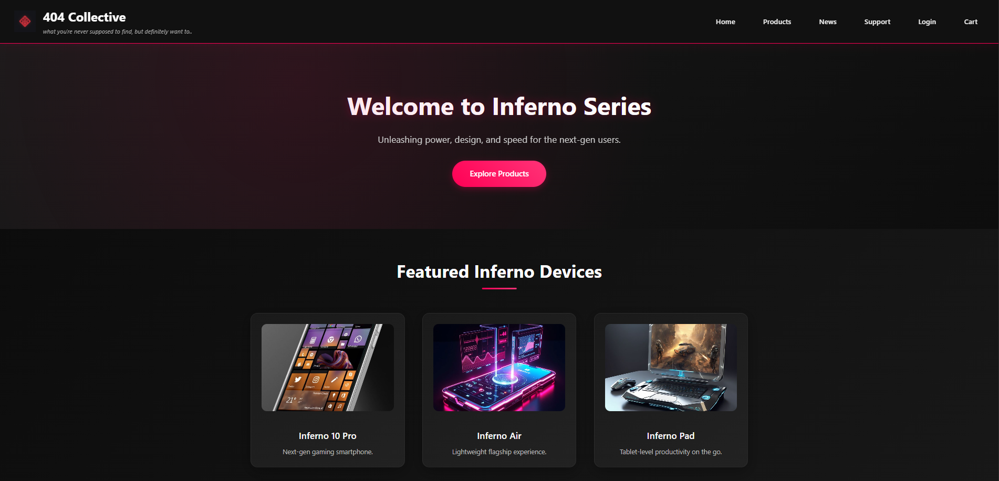
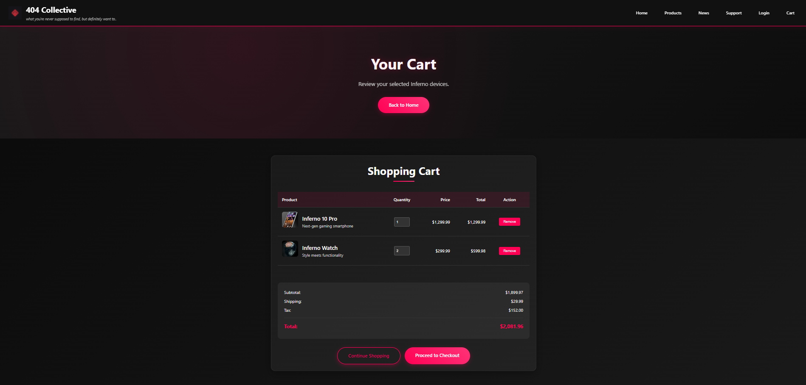
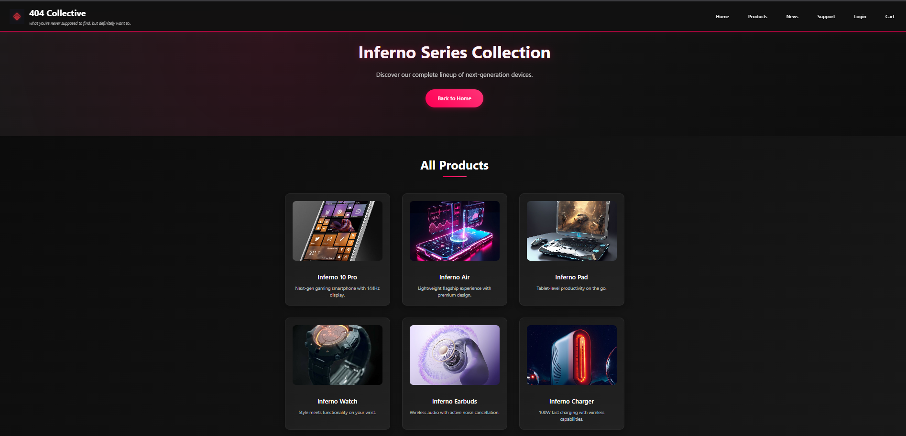
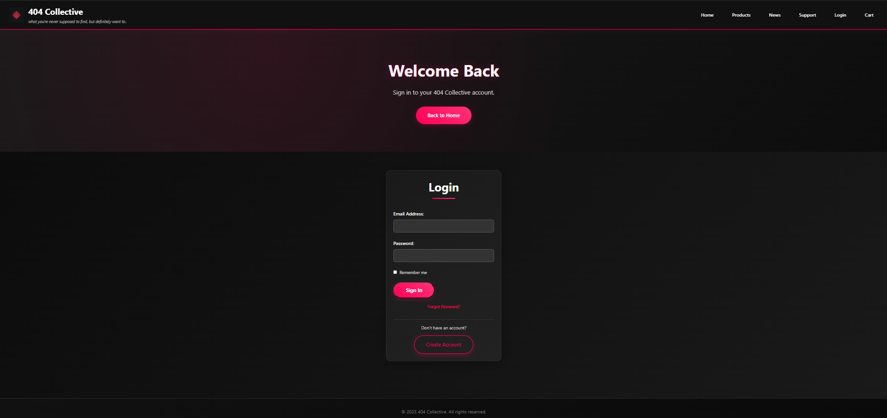
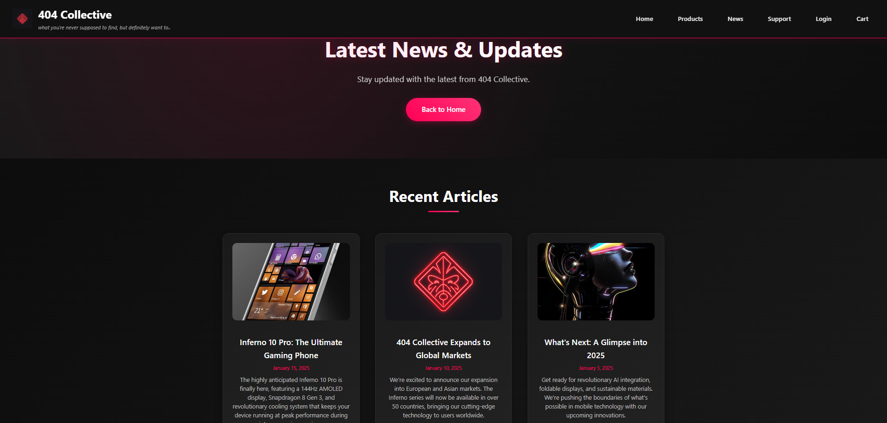
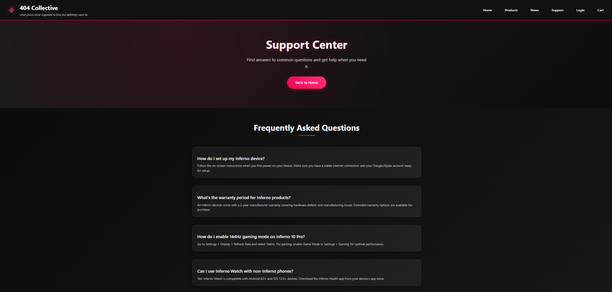

# 🛒 404 Collective – E-Commerce Shopping Cart

<div align="center">
  


</div>

---

## 🎯 Project Overview

A **cyberpunk-inspired e-commerce platform** built with pure HTML5 and CSS3. This project demonstrates advanced CSS techniques to create a fully functional shopping experience without JavaScript, featuring dark aesthetics, responsive design, and accessibility-first principles.

**Key Achievement:** Complete shopping cart functionality using only CSS pseudo-selectors and clever styling techniques.

---

## ✨ Key Features

🎨 **Cyberpunk UI** – Dark theme with neon accents and glassmorphism effects  
📱 **Mobile Responsive** – Seamless experience across all devices  
🛍️ **Product Catalog** – 8 Inferno Series tech devices  
🛒 **CSS-Only Cart** – Functional shopping cart without JavaScript  
🔐 **User Authentication** – Login/register pages with form validation styling  
♿ **Accessibility** – Semantic HTML and proper focus states  

---

## 📸 Live Preview


*Cyberpunk-inspired landing page with hero section and product showcase*


*Functional cart interface with quantity controls and price calculations*


*Responsive grid layout showcasing Inferno Series devices*

<details>
<summary>🖼️ View More Screenshots</summary>


*Clean authentication interface with focus states*


*Product announcements and company updates*


*FAQ and customer support interface*

</details>

---

## 📁 Project Structure

```
404-Collective-Shopping-Cart/
├── index.html              # Landing page
├── products.html           # Product catalog
├── cart.html               # Shopping cart
├── login.html              # User authentication
├── register.html           # User registration
├── profile.html            # User profile
├── news.html               # News & updates
├── support.html            # Customer support
├── about.html              # About page
├── contact.html            # Contact form
├── styles.css              # Main stylesheet
├── images/                 # Product images & assets
│   ├── 404-Collective-logo.png
│   ├── inferno-10-pro.jpg
│   ├── inferno-air.jpg
│   └── ... (8 product images)
└── output/                 # Screenshots
```

---

## 🚀 Quick Start

### Prerequisites
- Modern web browser
- Text editor (VS Code recommended)

### Setup Instructions

1. **Clone the repository**
   ```bash
   git clone https://github.com/bavish007/404-collective-shopping-cart.git
   cd 404-collective-shopping-cart
   ```

2. **Launch the project**
   
   **Direct Browser:**
   ```bash
   # Windows
   start index.html
   
   # macOS
   open index.html
   
   # Linux
   xdg-open index.html
   ```

   **VS Code Live Server:**
   ```bash
   code .
   # Install Live Server extension
   # Right-click index.html → "Open with Live Server"
   ```

3. **Explore the features**
   - Navigate through different sections
   - Test responsive design by resizing browser
   - Interact with CSS-only cart functionality

---

## 🧠 Technical Highlights

This project pushed the boundaries of what's possible with pure CSS:

- **CSS-Only Interactivity**: Used `:checked` pseudo-selectors and label associations to simulate JavaScript behavior
- **Advanced Layouts**: Mastered CSS Grid for complex page structures and Flexbox for component alignment
- **Mobile-First Approach**: Built responsive layouts that work seamlessly across all devices
- **Accessibility Focus**: Implemented semantic HTML with proper focus states and screen reader compatibility

The most challenging aspect was creating a functional shopping cart interface using only CSS—achieving this required creative problem-solving and deep understanding of CSS fundamentals.

---

## 📄 License

This project is licensed under the MIT License.

---

<div align="center">

[](https://github.com/bavish007)
[](https://www.linkedin.com/in/bavishreddymuske)

*Developed  by M. Bavish Reddy*

© 2025 M. Bavish Reddy. All rights reserved.

</div>
