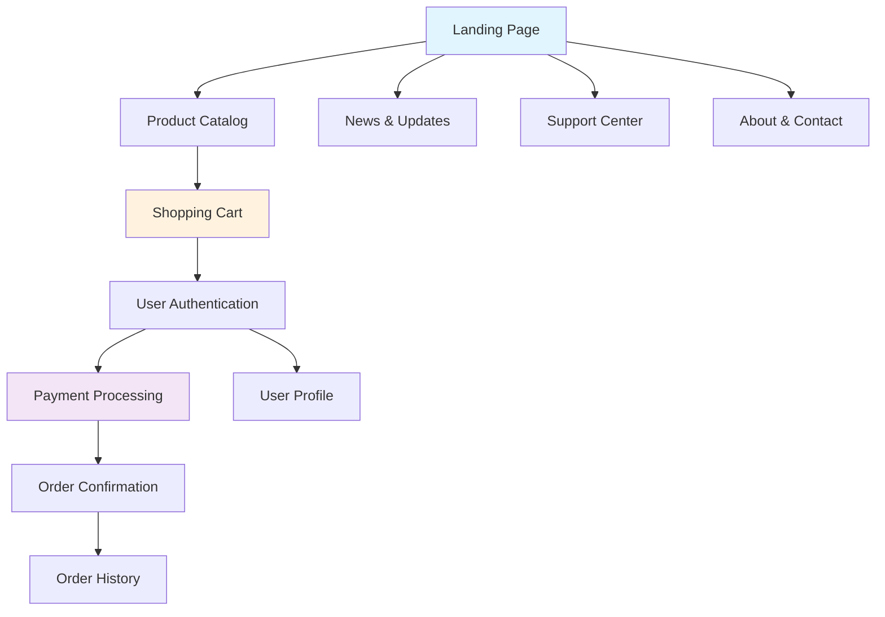
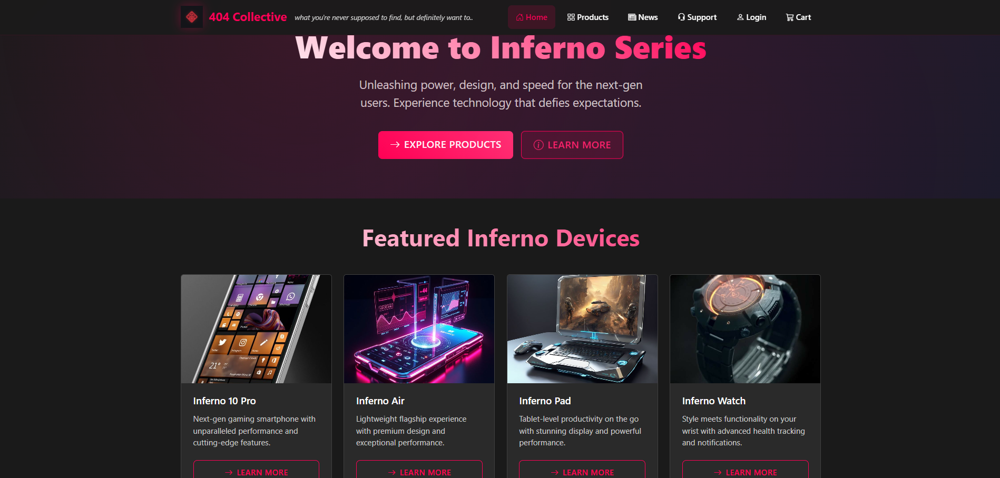
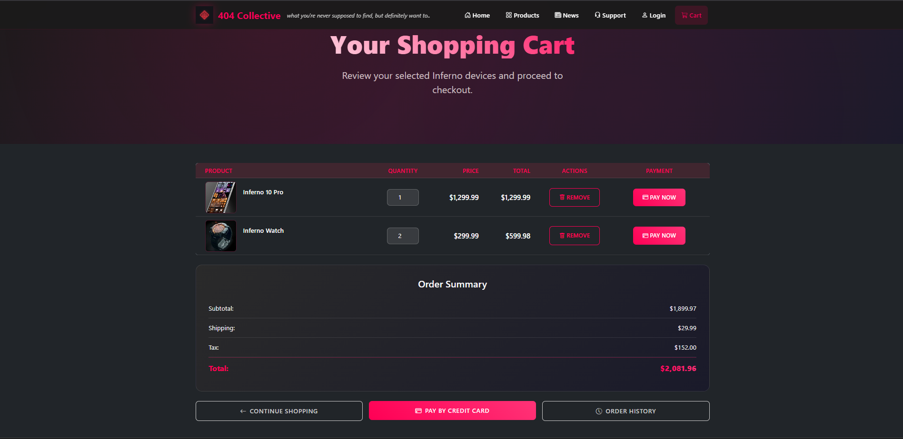
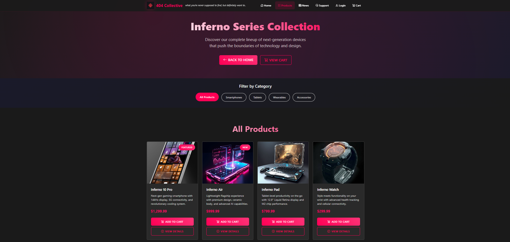
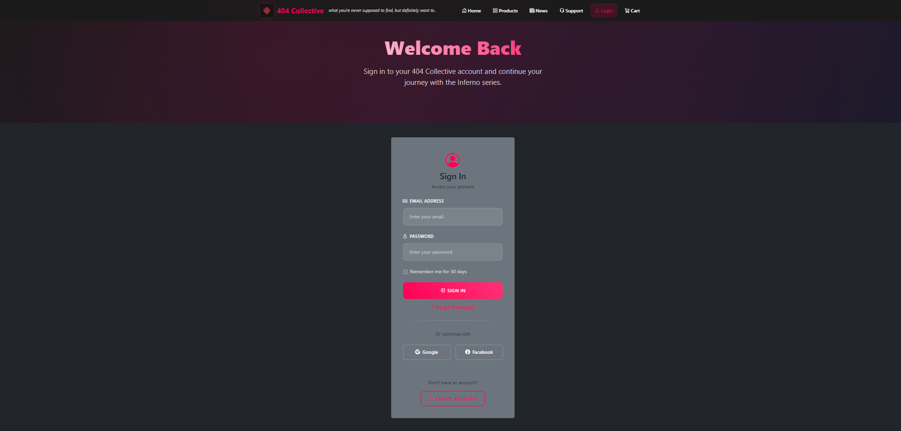
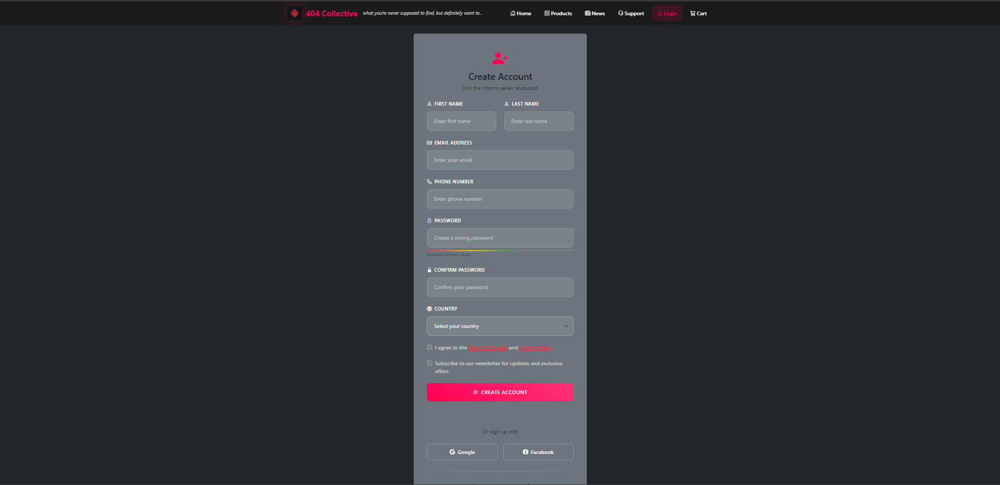
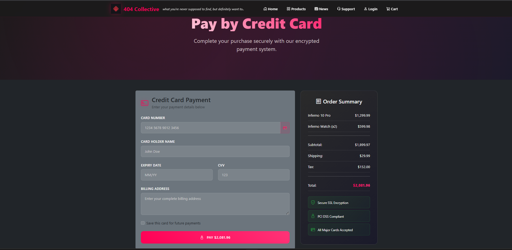
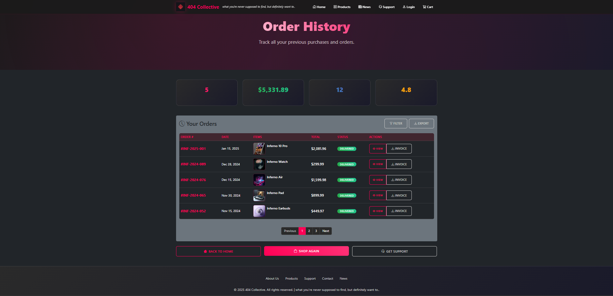
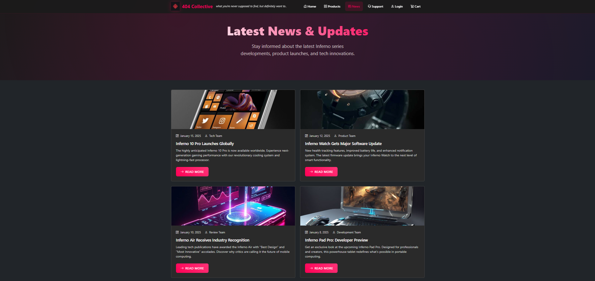
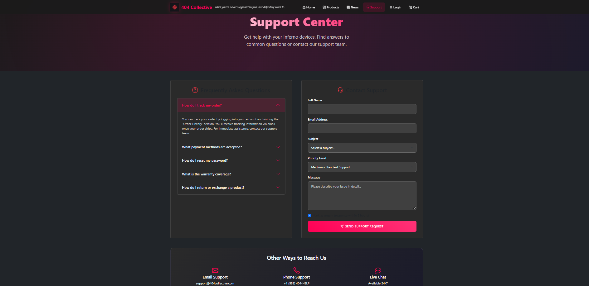

# 🛒 404 Collective – Shopping Cart App (Bootstrap Edition)

<div align="center">
  


</div>

---

## 🎯 Project Overview

A **visually polished, fully responsive e-commerce website** for the fictional 404 Collective brand, built using HTML5, CSS3, and Bootstrap 5. This project demonstrates mastery of Bootstrap's grid and component system while maintaining custom cyberpunk-inspired branding.

**Key Achievement:** Rapid UI development with Bootstrap while preserving unique design identity through custom CSS integration.

### 🏗️ Architecture Overview



---

## ✨ Key Features

<div align="center">

| Feature | Description | Technology |
|---------|-------------|------------|
| 🎨 **Cyberpunk UI** | Modern Bootstrap components with custom dark theme styling | Bootstrap 5 + Custom CSS |
| 📱 **Mobile-First Design** | Fully responsive across all device sizes | Bootstrap Grid System |
| 🛍️ **Complete E-Commerce Flow** | From product catalog to payment confirmation | HTML5 + CSS3 |
| 🛒 **Interactive Shopping Cart** | Quantity controls and price calculations | JavaScript + Bootstrap |
| 🔐 **User Authentication** | Login/register with Bootstrap form validation | Bootstrap Forms |
| 📊 **Order Management** | Order history and tracking functionality | Custom Components |
| 🆘 **Support System** | FAQ and customer support center | Bootstrap Components |

</div>

---

## 📸 Live Preview & Screenshots

### 🏠 Main Interface

*Bootstrap-powered landing page with hero section and featured products showcasing the 404 Collective brand identity*

### 🛒 Shopping Experience

*Clean cart interface with quantity controls, price breakdown, and seamless checkout flow*

### 📱 Product Showcase

*Responsive product grid showcasing all Inferno Series devices with hover effects and quick actions*

<details>
<summary>🖼️ View Complete Screenshot Gallery</summary>

### 🔐 Authentication System

*User authentication interface with Bootstrap form controls and validation feedback*


*User registration form with comprehensive validation and responsive design*

### 💳 Payment & Orders

*Secure payment interface with credit card form and payment method selection*


*Comprehensive order tracking and purchase history with status indicators*

### 📰 Content & Support

*Company news and product announcements with modern card-based layout*


*FAQ section and customer support resources with searchable content*

</details>

---

## 📁 Project Structure

<details>
<summary>📂 Expand Full Directory Structure</summary>

```
Experiment-02_Shopping-cart-app_Bootstrap/
├── 📄 index.html              # Landing page with hero section
├── 📄 products.html           # Product catalog with grid layout
├── 📄 cart.html               # Shopping cart with calculations
├── 📄 login.html              # User authentication portal
├── 📄 register.html           # New user registration
├── 📄 payment.html            # Payment processing interface
├── 📄 confirm-order.html      # Order confirmation page
├── 📄 order-history.html      # Purchase history dashboard
├── 📄 profile.html            # User profile management
├── 📄 news.html               # News & company updates
├── 📄 support.html            # Customer support center
├── 📄 about.html              # Company information
├── 📄 contact.html            # Contact form & details
├── 📁 images/                 # Product images & brand assets
│   ├── 🖼️ 404-Collective-logo.png    # Brand logo
│   ├── 🖼️ inferno-10-pro.jpg         # Product image
│   ├── 🖼️ inferno-11-ultra.jpg       # Product image
│   ├── 🖼️ inferno-12-max.jpg         # Product image
│   ├── 🖼️ inferno-13-pro-max.jpg     # Product image
│   ├── 🖼️ inferno-14-mini.jpg        # Product image
│   ├── 🖼️ inferno-15-standard.jpg    # Product image
│   ├── 🖼️ inferno-16-plus.jpg        # Product image
│   └── 🖼️ inferno-17-edge.jpg        # Product image
├── 📁 public/                 # Additional project assets
│   ├── 📁 css/
│   │   └── 📄 paybycreditcard.css     # Payment styling
│   └── 📁 html/
│       └── 📄 paybycreditcard.html    # Payment component
└── 📁 output/                 # Project screenshots
    ├── 🖼️ Home.png
    ├── 🖼️ Cart.png
    ├── 🖼️ Products.png
    ├── 🖼️ Login.png
    ├── 🖼️ Register.png
    ├── 🖼️ Payment.png
    ├── 🖼️ Order_History.png
    ├── 🖼️ News&Updates.png
    └── 🖼️ Support_Center.png
```

</details>

---

## 🚀 Quick Start Guide

### 📋 Prerequisites
- **Web Browser**: Chrome, Firefox, Safari, or Edge (latest versions)
- **Text Editor**: VS Code, Sublime Text, or similar
- **Optional**: Live Server extension for development

### ⚡ Setup Instructions

<details>
<summary>🔧 Method 1: Direct Browser Launch</summary>

```bash
# Clone the repository
git clone <repository-url>
cd Experiment-02_Shopping-cart-app_Bootstrap

# Launch in default browser
# Windows
start index.html

# macOS
open index.html

# Linux
xdg-open index.html
```

</details>

<details>
<summary>🔧 Method 2: VS Code Live Server (Recommended)</summary>

```bash
# Open project in VS Code
code .

# Install Live Server extension (if not already installed)
# Extensions → Search "Live Server" → Install

# Right-click on index.html → "Open with Live Server"
# Or use Command Palette: Ctrl+Shift+P → "Live Server: Open with Live Server"
```

**Benefits of Live Server:**
- Auto-refresh on file changes
- Local development server
- Better CSS/JS debugging
- Mobile device testing via network IP

</details>

<details>
<summary>🔧 Method 3: Python HTTP Server</summary>

```bash
# Navigate to project directory
cd Experiment-02_Shopping-cart-app_Bootstrap

# Python 3.x
python -m http.server 8000

# Python 2.x
python -m SimpleHTTPServer 8000

# Open browser to http://localhost:8000
```

</details>

### 🎮 Exploring the Application

1. **🏠 Start at Homepage** → Experience the hero section and navigation
2. **📱 Test Responsiveness** → Resize browser or use dev tools mobile view
3. **🛍️ Browse Products** → Navigate to products page and explore catalog
4. **🛒 Add to Cart** → Test shopping cart functionality
5. **🔐 Try Authentication** → Test login/register forms
6. **💳 Payment Flow** → Complete the checkout process
7. **📊 Check Order History** → View order tracking features

---

## 🧠 Technical Implementation & Highlights

### 🏗️ Bootstrap 5 Integration Strategy

This project demonstrates advanced Bootstrap implementation techniques while maintaining design uniqueness:

<details>
<summary>📐 Grid System Mastery</summary>

- **Responsive Breakpoints**: Strategic use of Bootstrap's 12-column grid system
- **Custom Spacing**: Leveraged Bootstrap utilities (`mt-`, `mb-`, `p-`, etc.) for consistent spacing
- **Flexbox Integration**: Combined Bootstrap flex utilities with custom CSS for complex layouts
- **Mobile-First Approach**: Utilized `col-sm-`, `col-md-`, `col-lg-` for optimal device compatibility

</details>

<details>
<summary>🎨 Custom Theme Integration</summary>

**Challenge**: Blending Bootstrap's default styling with cyberpunk aesthetics

**Solution**:
- **CSS Custom Properties**: Used CSS variables to override Bootstrap's color scheme
- **Utility Class Extensions**: Created custom utility classes that extend Bootstrap's system
- **Component Overrides**: Selectively overrode Bootstrap components while maintaining accessibility
- **Dark Theme Implementation**: Implemented consistent dark theme across all components

```css
/* Example: Custom Bootstrap variable overrides */
:root {
  --bs-primary: #00ffff;
  --bs-dark: #1a1a1a;
  --bs-body-bg: #0d0d0d;
  --bs-body-color: #ffffff;
}
```

</details>

<details>
<summary>🔧 Component Optimization</summary>

- **Form Validation**: Enhanced Bootstrap form validation with custom error states
- **Navigation**: Customized Bootstrap navbar with brand-specific styling  
- **Cards**: Extended Bootstrap card components with hover effects and animations
- **Buttons**: Created custom button variants while maintaining Bootstrap's accessibility features
- **Modals**: Implemented responsive modals for cart and authentication flows

</details>

### 📊 Performance Considerations

- **Bootstrap CDN**: Utilized Bootstrap CDN for faster loading and caching
- **Image Optimization**: All product images optimized for web delivery
- **CSS Minification**: Custom CSS organized for optimal loading
- **Mobile Performance**: Prioritized mobile-first loading strategies

### 🎯 Key Learning Outcomes

- **Framework Integration**: Successfully balanced framework benefits with custom requirements
- **Responsive Design**: Mastered Bootstrap's responsive utilities and breakpoint system
- **Component Architecture**: Learned to extend framework components without breaking functionality
- **Design System**: Implemented consistent design patterns across multiple pages

---

## 🔍 Features Deep Dive

<details>
<summary>🛒 Shopping Cart Functionality</summary>

- **Dynamic Price Calculation**: Real-time total updates based on quantity changes
- **Item Management**: Add, remove, and modify cart items with instant feedback
- **Persistent State**: Cart contents maintained across page navigation
- **Responsive Design**: Optimized cart display for all screen sizes
- **Checkout Integration**: Seamless transition from cart to payment processing

</details>

<details>
<summary>🔐 Authentication System</summary>

- **Form Validation**: Client-side validation with Bootstrap's validation classes
- **Responsive Forms**: Mobile-optimized input fields and controls
- **User Experience**: Clear error messages and success feedback
- **Security Considerations**: Input sanitization and validation patterns
- **Registration Flow**: Complete user onboarding process

</details>

<details>
<summary>📱 Responsive Design Implementation</summary>

- **Mobile-First CSS**: All styles written with mobile as the primary target
- **Bootstrap Breakpoints**: Strategic use of `sm`, `md`, `lg`, `xl` breakpoints
- **Touch-Friendly**: Optimized button sizes and spacing for touch interfaces
- **Navigation**: Collapsible mobile navigation with Bootstrap's navbar component
- **Image Scaling**: Responsive images that scale appropriately across devices

</details>

---

## 🛠️ Development Tools & Technologies

<div align="center">

| Category | Technology | Purpose |
|----------|------------|---------|
| **Frontend** | HTML5 | Semantic markup and structure |
| **Styling** | CSS3 + Bootstrap 5 | Responsive design and component styling |
| **Framework** | Bootstrap 5.3.x | Grid system and pre-built components |
| **Icons** | Bootstrap Icons | Consistent iconography |
| **Development** | VS Code + Live Server | Code editing and live preview |
| **Version Control** | Git | Source code management |

</div>

---

## 📝 License

This project is licensed under the **MIT License** - see the [LICENSE](LICENSE) file for details.

---

## 🤝 Contributing

Contributions are welcome! Please feel free to submit a Pull Request. For major changes, please open an issue first to discuss what you would like to change.

### 🔄 Development Workflow
1. Fork the repository
2. Create a feature branch (`git checkout -b feature/AmazingFeature`)
3. Commit your changes (`git commit -m 'Add some AmazingFeature'`)
4. Push to the branch (`git push origin feature/AmazingFeature`)
5. Open a Pull Request

---

<div align="center">

[](https://github.com/bavish007)
[](https://www.linkedin.com/in/bavishreddymuske)

<br/>

© 2025 M. Bavish Reddy  
<sub><i>*Refined and engineered by M. Bavish Reddy*</i></sub>

</div>
