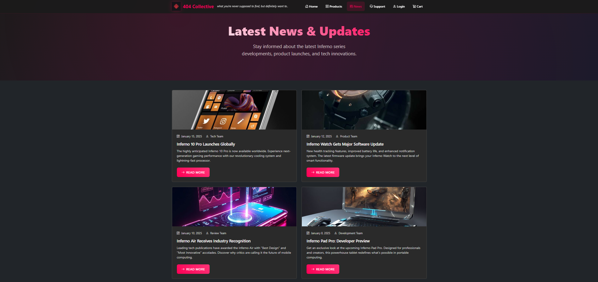

# 🛒 404 Collective – Shopping Cart App (Bootstrap Edition)

## 📖 Objective
This project delivers a visually polished, fully responsive e-commerce website for the fictional 404 Collective brand, built using HTML5, CSS3, and Bootstrap 5. The goal was to master Bootstrap's grid and component system, accelerate UI development, and create a seamless, modern shopping experience. The experiment focuses on rapid prototyping, mobile-first design, and leveraging Bootstrap utilities for professional results.

---

## 🛠️ Technologies Used
- **HTML5** (semantic markup)
- **CSS3** (custom styles)
- **Bootstrap 5** (layout, components, utilities)
- **VS Code Live Server** (for local development)

---

## 📂 Folder Structure
```text
Experiment-02_Shopping-cart-app_Bootstrap/
├── about.html
├── cart.html
├── confirm-order.html
├── contact.html
├── images/
│   ├── 404-Collective-logo.png
│   ├── inferno-10-pro.jpg
│   ├── inferno-air.jpg
│   ├── inferno-cable.jpg
│   ├── inferno-case.jpg
│   ├── inferno-charger.jpg
│   ├── inferno-earbuds.jpg
│   ├── inferno-pad.jpg
│   └── inferno-watch.jpg
├── index.html
├── login.html
├── news.html
├── order-history.html
├── output/
│   ├── Cart.png
│   ├── Home.png
│   ├── Login.png
│   ├── News & Updates.png
│   ├── Order History.png
│   ├── Payment.png
│   ├── Products.png
│   ├── Register.png
│   └── Support Center.png
├── payment.html
├── products.html
├── profile.html
├── public/
│   ├── css/
│   │   └── paybycreditcard.css
│   └── html/
│       └── paybycreditcard.html
├── register.html
├── support.html
└── README.md
```

---

## ⚙️ Setup & Usage Instructions

### 1. Clone or Download
```sh
# Using git
git clone <repo-url>
# Or download ZIP and extract
```

### 2. Navigate to Project Directory
```sh
cd Experiment-02_Shopping-cart-app_Bootstrap
```

### 3. Open in Browser
- **Windows**
  ```sh
  # Windows
  start index.html
  ```
- **macOS**
  ```sh
  # macOS
  open index.html
  ```
- **Linux**
  ```sh
  # Linux
  xdg-open index.html
  ```
- Or use **VS Code Live Server** for live preview (recommended)

---

## ✨ Key Features
- Modern, cyberpunk-inspired UI powered by Bootstrap 5
- Fully responsive layout for mobile, tablet, and desktop
- Product catalog with 8 Inferno Series devices
- Shopping cart with quantity, price summary, and checkout flow
- User authentication pages (login/register, static)
- Order history and payment confirmation pages
- Support center with FAQ and contact form
- News & updates section with visually distinct articles
- Custom CSS for branding and unique visual touches
- Accessibility: semantic HTML, focus states, and ARIA roles

---

## 📸 Output Analysis

### 🏠 Home Page

*Striking landing page with a hero section, featured products, and Bootstrap-powered navigation. Sets the visual identity for the site.*

### 🛒 Cart Page

*Shopping cart interface displaying selected products, quantity controls, and a clear price breakdown. Designed for easy review and checkout.*

### 🔑 Login Page

*User login form with Bootstrap form controls, validation, and a clean, focused layout for quick access.*

### 📰 News & Updates

*News section highlighting product launches and company updates, each styled for clarity and engagement.*

### 🛍️ Products Catalog

*Responsive product grid showcasing all Inferno Series devices with images, descriptions, and quick add-to-cart options.*

### 📝 Register Page

*User registration form with Bootstrap validation, clear input fields, and a welcoming design for new users.*

### 📦 Order History

*Order history page listing past purchases, order statuses, and quick access to details for returning customers.*

### 💳 Payment Page

*Payment interface with form fields for credit card details, styled for trust and ease of use.*

### 🆘 Support Center

*Support center with FAQ, contact form, and quick links to help resources, all organized for user confidence.*

---

## 🎓 Learning Outcomes
- Mastered Bootstrap 5 grid, utilities, and components
- Built a fully responsive, mobile-first e-commerce UI
- Practiced integrating custom CSS with Bootstrap for unique branding
- Improved rapid prototyping and layout skills
- Enhanced understanding of accessibility and semantic HTML
- Learned to structure multi-page static web apps efficiently

---

## 🧠 My Journey & Reflections
This project was my introduction to Bootstrap as a rapid UI development tool. I was amazed at how quickly I could build complex layouts and responsive components compared to writing raw CSS. The biggest challenge was balancing Bootstrap's default look with my own cyberpunk-inspired branding—custom CSS and utility overrides were key. I learned the value of prototyping, the power of Bootstrap's grid, and how to keep accessibility in mind even when using frameworks. This experiment gave me the confidence to use Bootstrap for future projects and taught me how to blend frameworks with personal design vision.

---

## 🔗 Connect with Me
- **GitHub:** [https://github.com/bavish007](https://github.com/bavish007)
- **LinkedIn:** [https://www.linkedin.com/in/bavishreddymuske]

---

© 2025 M. Bavish Reddy. All rights reserved. 