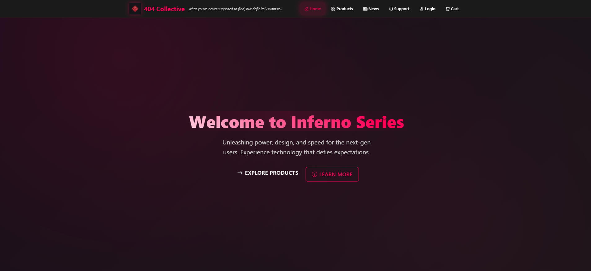
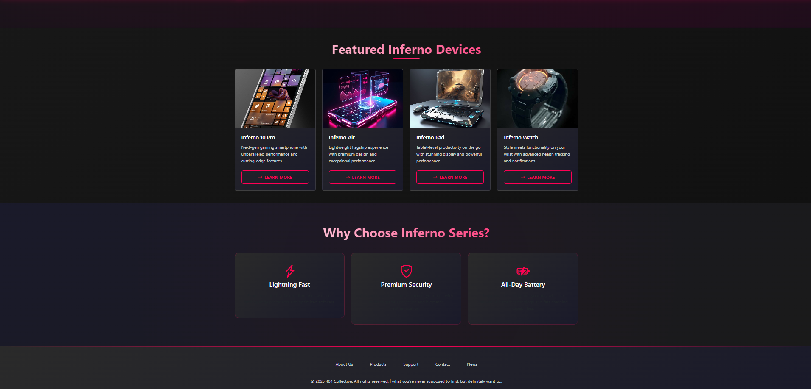
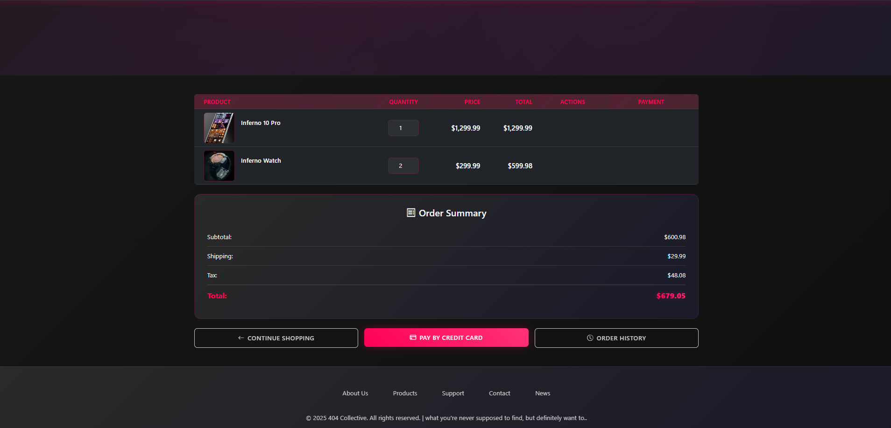
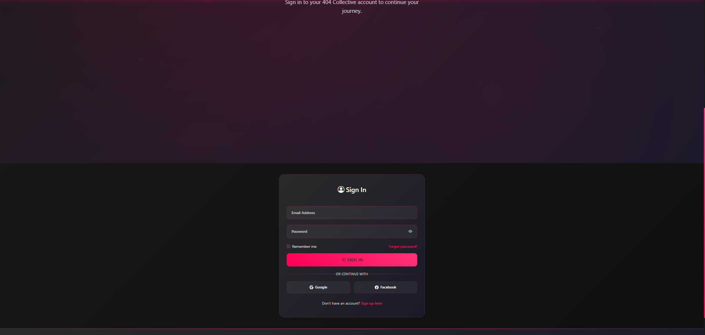
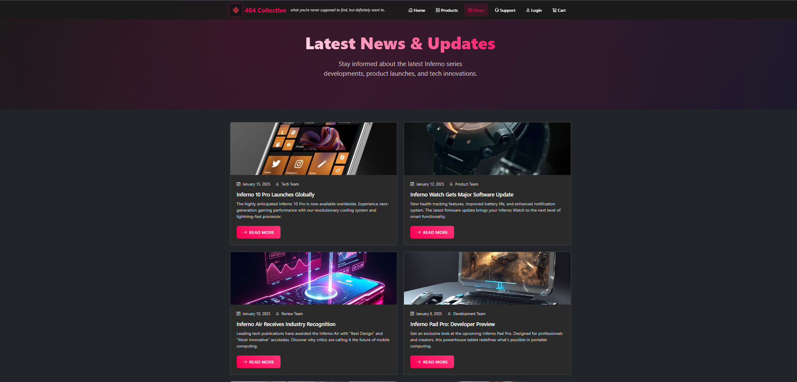
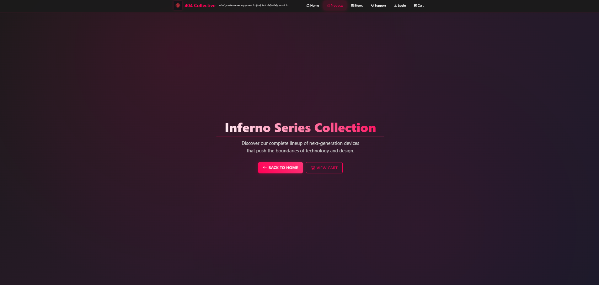
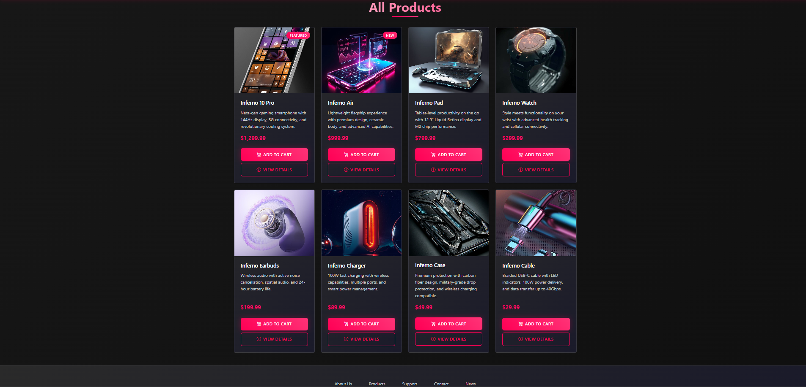
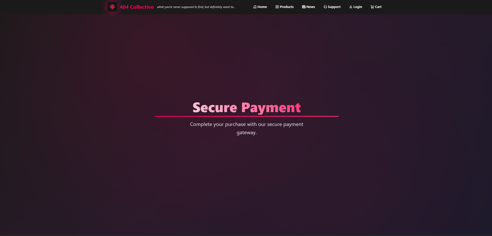
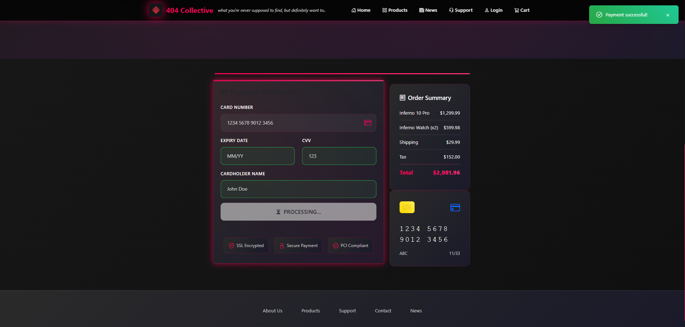
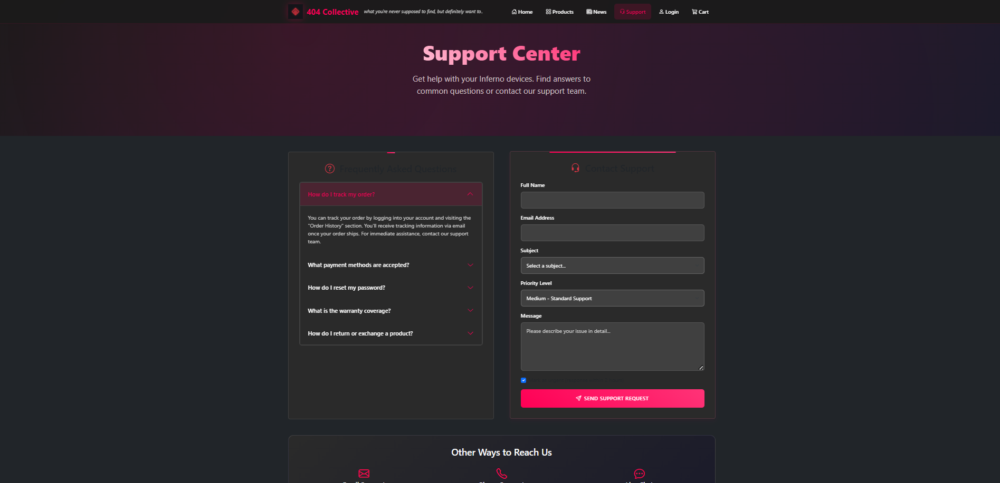

# 🛒 404 Collective – Shopping Cart App (Validation Edition)

## 📖 Objective
This project presents a robust, fully responsive e-commerce website for the fictional 404 Collective brand, now enhanced with client-side form validation using JavaScript. The goal was to master HTML5, CSS3, and JavaScript validation techniques, ensuring a seamless and error-free user experience. The experiment focuses on usability, accessibility, and the importance of validating user input in modern web applications.

---

## 🛠️ Technologies Used
- **HTML5** (semantic markup)
- **CSS3** (custom styles, responsive design)
- **JavaScript** (form validation, interactivity)
- **VS Code Live Server** (for local development)

---

## 📂 Folder Structure
```text
Experiment-03_Shopping-cart-app_validation/
├── about.html
├── cart.html
├── confirm-order.html
├── contact.html
├── images/
│   ├── 404-Collective-logo.png
│   ├── inferno-10-pro.jpg
│   ├── inferno-air.jpg
│   ├── inferno-cable.jpg
│   ├── inferno-case.jpg
│   ├── inferno-charger.jpg
│   ├── inferno-earbuds.jpg
│   ├── inferno-pad.jpg
│   └── inferno-watch.jpg
├── index.html
├── login.html
├── news.html
├── order-history.html
├── output/
│   ├── All Products.png
│   ├── Cart.png
│   ├── Home-1.png
│   ├── Home-2.png
│   ├── Login.png
│   ├── News & Updates.png
│   ├── Payment processing.png
│   ├── Payment.png
│   ├── Products.png
│   ├── Support Center.png
├── payment.html
├── products.html
├── profile.html
├── public/
│   ├── css/
│   │   └── paybycreditcard.css
│   ├── html/
│   │   └── paybycreditcard.html
│   └── js/
├── register.html
├── script.js
├── styles.css
├── support.html
└── README.md
```

---

## ⚙️ Setup & Usage Instructions

### 1. Clone or Download
```sh
# Using git
git clone <repo-url>
# Or download ZIP and extract
```

### 2. Navigate to Project Directory
```sh
cd Experiment-03_Shopping-cart-app_validation
```

### 3. Open in Browser
- **Windows**
  ```sh
  # Windows
  start index.html
  ```
- **macOS**
  ```sh
  # macOS
  open index.html
  ```
- **Linux**
  ```sh
  # Linux
  xdg-open index.html
  ```
- Or use **VS Code Live Server** for live preview (recommended)

---

## ✨ Key Features
- Modern, cyberpunk-inspired UI with validation feedback
- Fully responsive layout for all devices
- Product catalog with 8 Inferno Series devices
- Shopping cart with quantity, price summary, and checkout flow
- Client-side form validation for login, registration, and checkout
- Order history and payment confirmation pages
- Support center with FAQ and contact form
- News & updates section with visually distinct articles
- Accessibility: semantic HTML, focus states, and ARIA roles

---

## 📸 Output Analysis

### 🏠 Home Page (Variant 1)

*The main landing page with a bold hero section and featured products, setting the cyberpunk tone for the site.*

### 🏠 Home Page (Variant 2)

*Continuation view of the home page, highlighting responsive layout and dynamic product presentation.*

### 🛒 Cart Page

*Shopping cart interface showing selected products, quantity controls, and a clear price breakdown for easy review.*

### 🔑 Login Page

*User login form with real-time validation feedback, ensuring correct input before submission.*

### 📰 News & Updates

*News section featuring product launches and company updates, each styled for clarity and engagement.*

### 🛍️ Products Catalog

*Responsive product grid displaying all Inferno Series devices with images and descriptions.*

### 📦 All Products

*Comprehensive view of all available products, showcasing the full Inferno lineup.*

### 💳 Payment Page

*Payment interface with form validation for credit card details, styled for trust and ease of use.*

### 🔄 Payment Processing

*Visual feedback during payment processing, enhancing user confidence and clarity.*

### 📝 Support Center

*Support center with FAQ, contact form, and quick links to help resources, all organized for user confidence.*

---

## 🎓 Learning Outcomes
- Mastered JavaScript form validation and user feedback
- Built a fully responsive, mobile-first e-commerce UI
- Practiced integrating custom CSS and JS for unique branding
- Improved understanding of accessibility and semantic HTML
- Learned to structure multi-page static web apps efficiently

---

## 🧠 My Journey & Reflections
This project was my first deep dive into client-side validation and user experience enhancements with JavaScript. Implementing real-time feedback for forms was both challenging and rewarding, as it required careful handling of edge cases and accessibility. I learned how to balance visual design with usability, and how to use JavaScript to prevent common user errors. This experiment solidified my understanding of the importance of validation in web apps and gave me practical skills for future projects.

---

## 🔗 Connect with Me
- **GitHub:** [https://github.com/bavish007](https://github.com/bavish007)
- **LinkedIn:** [https://www.linkedin.com/in/bavishreddymuske]

---

© 2025 M. Bavish Reddy. All rights reserved. 