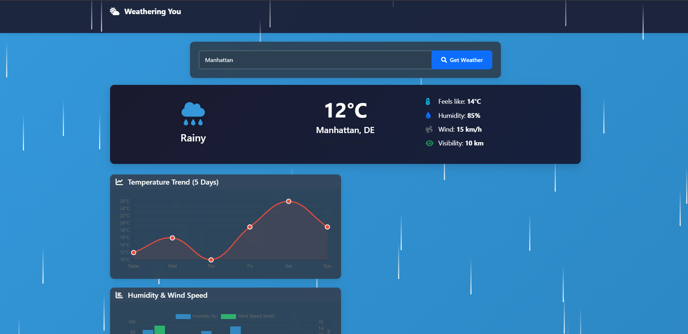
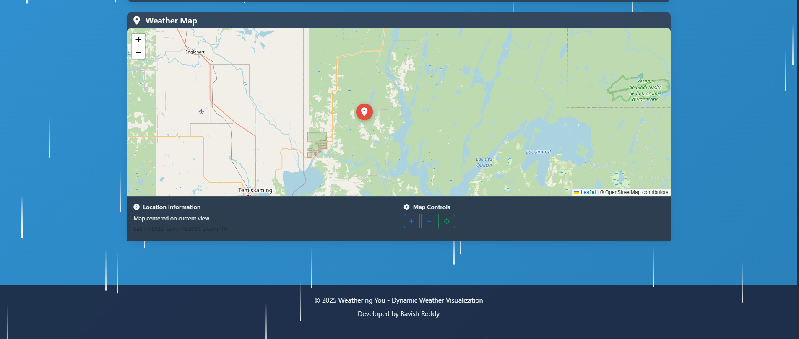

# 🌦️ Weathering You – Dynamic Weather Visualization

## 📖 Objective
This project is an interactive, visually rich weather dashboard that allows users to search for any city and view real-time weather data, 5-day forecasts, and dynamic weather visualizations. Built to master modern web APIs, data visualization, and responsive UI design, it targets skills in JavaScript, Bootstrap, Chart.js, and Leaflet.js, while focusing on user experience and accessibility.

---

## 🛠️ Technologies Used
- **HTML5** (semantic markup)
- **CSS3** (custom styles, responsive design)
- **Bootstrap 5** (UI components, layout)
- **JavaScript (ES6+)** (logic, API integration, interactivity)
- **Chart.js** (data visualization)
- **Leaflet.js** (interactive maps)
- **Font Awesome** (icons)

## 🌤️ FEATURES

### 🔌 API Integration
- **Demo Weather Data**: Currently uses simulated weather data for demonstration
- **Geolocation Support**: Automatic location detection using browser APIs
- **City Search**: Manual city input with validation
- **Data Persistence**: Local storage for last searched city

### 🎨 Dynamic Theming System
- **Time-based Themes**: Automatic day/night mode switching (7 AM - 7 PM)
- **Weather-specific Backgrounds**: 
  - Sunny/Clear: Warm gradient backgrounds
  - Rainy/Stormy: Blue gradient with rain animations
  - Cloudy: Gray gradient with cloud animations
  - Windy: Light gradient with wind effects
- **Smooth Transitions**: CSS transitions for theme changes

### 🌟 Animated Backgrounds
- **Night Mode**: Twinkling stars and glowing moon
- **Rain Effects**: Animated raindrops with intensity variations
- **Cloud Animations**: Floating clouds across the screen
- **Wind Effects**: Horizontal wind streaks
- **Sun Effects**: Glowing sun rays and lens flare effects

### 📊 Data Visualization
- **Temperature Trend Chart**: 5-day temperature forecast with Chart.js
- **Humidity & Wind Chart**: Dual-axis bar chart for weather metrics
- **Forecast Cards**: Responsive grid layout with animated cards
- **Weather Details**: Current conditions with icons and metrics

### 🗺️ Interactive Map Features
- **Leaflet.js Integration**: OpenStreetMap tiles
- **Location Markers**: Custom weather-themed markers
- **Map Controls**: Zoom in/out and locate user buttons
- **Location Info**: Coordinates and city information display

### 📱 User Experience
- **Responsive Design**: Mobile-first Bootstrap 5 layout
- **Loading States**: Spinner animations during data fetch
- **Error Handling**: User-friendly error messages
- **Toast Notifications**: Success, warning, and info notifications
- **Keyboard Support**: Enter key for search functionality

## 📁 FOLDER STRUCTURE
```
Experiment-04_Weather_information_Visualization/
├── index.html
├── output/
│   ├── Home.png
│   └── Weather Map.png
├── script.js
├── styles.css
└── README.md
```

---

## ⚙️ Setup & Usage Instructions

### 1. Clone or Download
```sh
# Using git
git clone <repo-url>
# Or download ZIP and extract
```

### 2. Navigate to Project Directory
```sh
cd Experiment-04_Weather_information_Visualization
```

### 3. Open in Browser
- **Windows**
  ```sh
  # Windows
  start index.html
  ```
- **macOS**
  ```sh
  # macOS
  open index.html
  ```
- **Linux**
  ```sh
  # Linux
  xdg-open index.html
  ```
- Or use **VS Code Live Server** for live preview (recommended)

---

## ✨ Key Features
- Search and display real-time weather for any city
- Dynamic weather animations (sun, rain, clouds, wind, night)
- 5-day forecast with interactive cards
- Responsive weather charts (temperature, humidity, wind)
- Interactive map with city location, zoom, and geolocation
- Bootstrap-powered, mobile-first UI
- Error handling, loading spinners, and toast notifications
- Accessibility: semantic HTML, ARIA roles, keyboard navigation

---

## 📸 Output Analysis

### 🏠 Home Dashboard

*The main dashboard after searching for a city: shows current weather, animated icons, detailed stats, and interactive charts for temperature and humidity/wind trends.*

### 🗺️ Weather Map

*Interactive map view displaying the searched city's location, with map controls for zoom and geolocation. Weather overlays and city info are shown for a complete spatial context.*

---

## 🎓 Learning Outcomes
- Mastered API-driven data visualization with Chart.js and Leaflet.js
- Built a fully responsive, mobile-first dashboard UI
- Practiced integrating multiple JS libraries for a seamless UX
- Improved skills in asynchronous JavaScript and error handling
- Enhanced understanding of accessibility and user-centric design

---

## 🧠 My Journey & Reflections
This project was a deep dive into real-world data visualization and interactive UI design. Integrating multiple libraries—Bootstrap, Chart.js, and Leaflet—was both challenging and rewarding, especially when synchronizing data updates and animations. I learned how to handle asynchronous API calls, manage UI state, and create engaging visual feedback for users. The biggest breakthrough was making the weather experience feel alive with custom animations and map interactivity. This experiment gave me confidence in building modern, data-driven web apps from scratch.

---

## 🔗 Connect with Me
- **GitHub:** [https://github.com/bavish007](https://github.com/bavish007)
- **LinkedIn:** [https://www.linkedin.com/in/bavishreddymuske]

---

**⭐ Star this repository if you found it helpful!**

**🔄 Last Updated**: January 2025
**📊 Version**: 1.0.0

© 2025 M. Bavish Reddy. All rights reserved. 