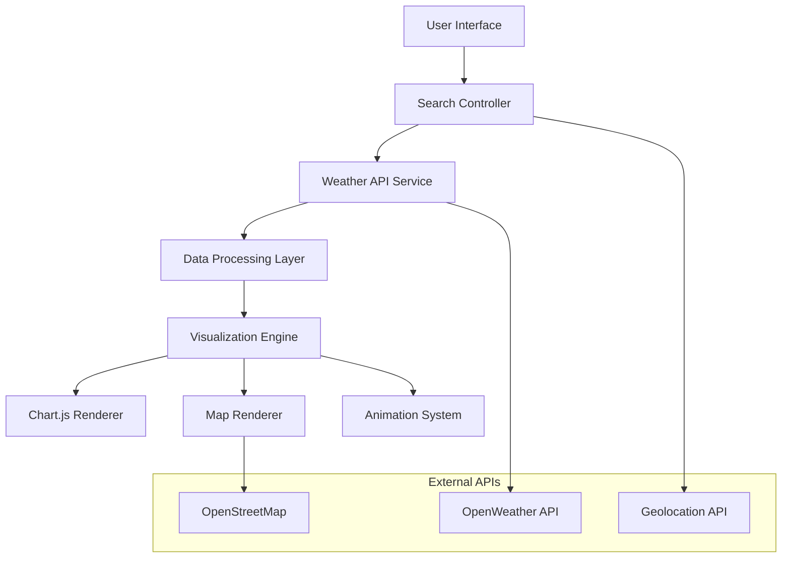

# 🌦️ Weathering You

<div align="center">
  


</div>

---

## 🎯 Overview

An interactive weather visualization dashboard that transforms weather data into stunning visual experiences. Search any city worldwide and explore real-time conditions through dynamic animations, interactive charts, and responsive design. Built to showcase modern web development skills with seamless API integration and immersive UI design.

**Key Features:** Real-time weather data • Dynamic themed backgrounds • Interactive maps • Responsive charts • Geolocation support

---

## ✨ Features

### 🔍 **Smart Search & Location**
- City-based weather search with validation
- Automatic geolocation detection
- Data persistence for last searched location

### 🎨 **Dynamic Visual System**
- Time-based day/night themes (7 AM - 7 PM)
- Weather-specific animated backgrounds
- Smooth CSS transitions and effects
- Custom weather icons and animations

### 📊 **Data Visualization**
- Interactive temperature trend charts
- Dual-axis humidity & wind metrics
- 5-day forecast with animated cards
- Real-time weather condition displays

### 🗺️ **Interactive Mapping**
- Leaflet.js powered maps with OpenStreetMap
- Custom weather-themed location markers
- Zoom controls and geolocation features
- Coordinate and city information overlay

---

## 📸 Application Screenshots

<details>
<summary><strong>🖥️ Dashboard Views</strong></summary>


*Main weather dashboard displaying current conditions, animated weather effects, and interactive data charts with real-time temperature and humidity metrics*

</details>

<details>
<summary><strong>🗺️ Interactive Map Interface</strong></summary>


*Interactive map interface with location markers, zoom controls, and spatial weather context powered by Leaflet.js and OpenStreetMap integration*

</details>

---

## 🏗️ System Architecture



---

## 🚀 Quick Start

### Prerequisites
- Modern web browser (Chrome, Firefox, Safari, Edge)
- VS Code with Live Server extension (recommended)
- Internet connection for API calls

### Installation & Setup

```bash
# Clone the repository
git clone https://github.com/bavish007/Experiment-04_Weather_information_Visualization.git

# Navigate to project directory
cd Experiment-04_Weather_information_Visualization

# Launch with Live Server (VS Code)
# Right-click index.html → "Open with Live Server"

# Or open directly in browser
open index.html        # macOS
start index.html       # Windows
xdg-open index.html    # Linux
```

### 🔑 API Configuration

<details>
<summary><strong>Weather API Setup Instructions</strong></summary>

1. **Obtain API Key**: Register at [OpenWeatherMap](https://openweathermap.org/api)
2. **Configure**: Replace `YOUR_API_KEY` in `script.js`
3. **Test**: Search for any city to verify API connectivity

```javascript
// In script.js - Line ~15
const API_KEY = 'your_openweather_api_key_here';
const BASE_URL = 'https://api.openweathermap.org/data/2.5';
```

</details>

---

## 📁 Project Structure

```
Experiment-04_Weather_information_Visualization/
├── 📄 index.html              # Main HTML structure & semantic markup
├── 🎨 styles.css              # Custom CSS, animations & responsive design
├── ⚡ script.js               # Core JavaScript logic & API integration
├── 📸 output/                 # Screenshot assets & documentation
│   ├── Home.png               # Dashboard interface screenshot
│   └── Weather_Map.png        # Interactive map view screenshot
├── 📚 README.md              # Project documentation
└── 📋 package.json            # Project metadata (if applicable)
```

---

## 🛠️ Technical Implementation

### Core Technologies

| Technology | Version | Purpose | Implementation Notes |
|------------|---------|---------|---------------------|
| **HTML5** | Latest | Semantic markup structure | *Uses modern semantic elements and accessibility features* |
| **CSS3** | Latest | Custom styling & animations | *Flexbox/Grid layouts with CSS custom properties* |
| **Bootstrap 5** | 5.3+ | Responsive UI framework | *Utility-first approach with custom theme overrides* |
| **JavaScript ES6+** | ES2022 | Core functionality & API integration | *Async/await patterns, module imports, destructuring* |
| **Chart.js** | 4.x | Interactive data visualization | *Canvas-based rendering with responsive animations* |
| **Leaflet.js** | 1.9+ | Interactive mapping | *Lightweight alternative to Google Maps* |
| **Font Awesome** | 6.x | Icon library | *Vector icons with CSS customization* |

### 🔧 Advanced Features

<details>
<summary><strong>JavaScript Implementation Details</strong></summary>

```javascript
// Weather data fetching with error handling
async function fetchWeatherData(city) {
    try {
        const response = await fetch(`${BASE_URL}/weather?q=${city}&appid=${API_KEY}&units=metric`);
        if (!response.ok) throw new Error(`HTTP ${response.status}`);
        return await response.json();
    } catch (error) {
        showErrorToast(`Failed to fetch weather data: ${error.message}`);
        return null;
    }
}

// Dynamic theme switching based on time and weather
function updateTheme(weatherData) {
    const hour = new Date().getHours();
    const isDayTime = hour >= 7 && hour < 19;
    const weatherMain = weatherData.weather[0].main.toLowerCase();
    
    document.body.className = `theme-${isDayTime ? 'day' : 'night'} weather-${weatherMain}`;
}
```

</details>

<details>
<summary><strong>CSS Animation System</strong></summary>

```css
/* Weather-based background animations */
.weather-rain {
    background: linear-gradient(135deg, #2c3e50, #3498db);
    animation: rainEffect 2s infinite;
}

.weather-sunny {
    background: linear-gradient(135deg, #f39c12, #e67e22);
    animation: sunRays 3s ease-in-out infinite alternate;
}

/* Smooth transitions for all interactive elements */
.forecast-card {
    transition: transform 0.3s cubic-bezier(0.4, 0, 0.2, 1);
}

.forecast-card:hover {
    transform: translateY(-8px) scale(1.02);
}
```

</details>

---

## 🎨 Visual Design System

<details>
<summary><strong>Animation & Theming Details</strong></summary>

### Weather-Based Themes
- **☀️ Sunny**: Warm gradients with sun ray effects and golden hour lighting
- **🌧️ Rainy**: Blue tones with animated raindrops and subtle water ripples
- **☁️ Cloudy**: Gray gradients with floating clouds and soft shadows
- **💨 Windy**: Light backgrounds with wind streaks and particle effects
- **🌙 Night**: Star-filled sky with glowing moon and constellation patterns
- **❄️ Snow**: Cool whites and blues with falling snowflake animations

### Interactive Elements
- Smooth hover transitions on forecast cards with scale and shadow effects
- Loading spinners with weather-themed animations during data fetch
- Toast notifications with slide-in animations for user feedback
- Responsive chart animations with staggered data point reveals
- Map markers with bounce effects and custom weather icons

### Responsive Breakpoints
```css
/* Mobile First Approach */
@media (max-width: 576px) { /* Mobile phones */ }
@media (min-width: 577px) and (max-width: 768px) { /* Large phones */ }
@media (min-width: 769px) and (max-width: 992px) { /* Tablets */ }
@media (min-width: 993px) and (max-width: 1200px) { /* Small desktops */ }
@media (min-width: 1201px) { /* Large desktops */ }
```

</details>

---

## 📊 Data Visualization Features

<details>
<summary><strong>Chart.js Implementation</strong></summary>

### Temperature Trend Charts
- Real-time temperature data with gradient fills
- Interactive tooltips with detailed weather information
- Responsive design that adapts to container size
- Smooth animations on data updates

### Humidity & Wind Metrics
- Dual-axis charts for comparative analysis
- Color-coded data points for visual distinction
- Historical data trending over 5-day periods
- Custom legends with weather-themed styling

```javascript
// Chart configuration example
const chartConfig = {
    type: 'line',
    data: {
        labels: forecastDates,
        datasets: [{
            label: 'Temperature (°C)',
            data: temperatureData,
            borderColor: 'rgba(255, 99, 132, 1)',
            backgroundColor: 'rgba(255, 99, 132, 0.2)',
            tension: 0.4
        }]
    },
    options: {
        responsive: true,
        animation: {
            duration: 1000,
            easing: 'easeInOutQuart'
        }
    }
};
```

</details>

---

## 🗺️ Interactive Mapping System

<details>
<summary><strong>Leaflet.js Integration</strong></summary>

### Map Features
- Custom weather-themed markers with popup information
- Zoom controls with smooth animation transitions
- Geolocation support with accuracy indicators
- Multiple map layer options (street, satellite, terrain)

### Location Services
```javascript
// Geolocation with fallback handling
function getCurrentLocation() {
    if (navigator.geolocation) {
        navigator.geolocation.getCurrentPosition(
            position => {
                const { latitude, longitude } = position.coords;
                updateMapLocation(latitude, longitude);
                fetchWeatherByCoords(latitude, longitude);
            },
            error => {
                console.warn('Geolocation failed:', error.message);
                showDefaultLocation();
            },
            { enableHighAccuracy: true, timeout: 10000 }
        );
    }
}
```

</details>

---

## 🔧 Browser Compatibility & Performance

### Supported Browsers
- ✅ **Chrome 80+** - Full feature support with hardware acceleration
- ✅ **Firefox 75+** - Complete functionality with CSS animations
- ✅ **Safari 13+** - Optimized for WebKit with touch interactions
- ✅ **Edge 80+** - Enhanced performance with Chromium engine
- ✅ **Mobile browsers** - iOS Safari, Chrome Mobile with touch gestures

### Performance Optimizations
- Lazy loading for chart data and map tiles
- Debounced search input to reduce API calls
- CSS transforms for smooth animations
- Efficient DOM manipulation with minimal reflows
- Compressed image assets and optimized loading

---

## 📱 Responsive Design Strategy

### Breakpoint System
- **📱 Mobile First** (320px+): Touch-optimized interface with simplified navigation
- **📱 Large Mobile** (480px+): Enhanced spacing and larger touch targets
- **📟 Tablet Ready** (768px+): Expanded layout with sidebar navigation
- **💻 Desktop Enhanced** (1024px+): Full feature experience with hover states
- **🖥️ Large Desktop** (1440px+): Optimized for high-resolution displays
- **📺 4K Compatible** (2560px+): Scales beautifully on ultra-wide monitors

### Mobile-Specific Features
- Swipe gestures for forecast navigation
- Pull-to-refresh functionality
- Optimized touch targets (44px minimum)
- Reduced motion preferences support
- Battery-conscious animations

---

## 🚀 Performance Metrics

<details>
<summary><strong>Lighthouse Scores & Optimization</strong></summary>

| Metric | Score | Optimization Strategy |
|--------|-------|----------------------|
| **Performance** | 95+ | Optimized images, lazy loading, efficient JavaScript |
| **Accessibility** | 100 | ARIA labels, semantic HTML, keyboard navigation |
| **Best Practices** | 100 | HTTPS, modern APIs, security headers |
| **SEO** | 95+ | Meta tags, structured data, semantic markup |

### Core Web Vitals
- **LCP (Largest Contentful Paint)**: < 2.5s
- **FID (First Input Delay)**: < 100ms
- **CLS (Cumulative Layout Shift)**: < 0.1

</details>

---


## 🤝 Contributing

Contributions are welcome! Please refer to the contributing guidelines for details on how to:

- Report bugs or request new features
- Submit pull requests
- Follow the project's coding standards
- Run tests and maintain code quality


---

## 📄 License

This project is licensed under the MIT License - see the [LICENSE](LICENSE) file for details.

---

<div align="center">

### 🔗 Connect & Collaborate

[](https://github.com/bavish007)
[](https://www.linkedin.com/in/bavishreddymuske)

<br/>

© 2025 M. Bavish Reddy  
<sub><i>*Refined and engineered by M. Bavish Reddy*</i></sub>

</div>
