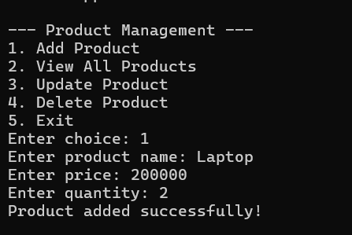
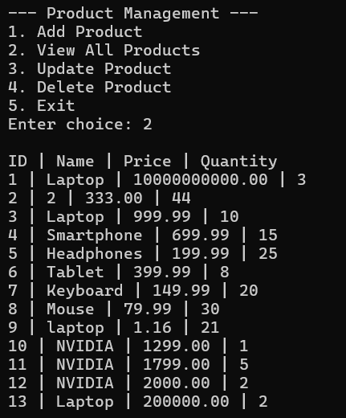
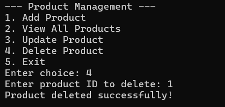

# 🗃️ Product Manager CRUD

<div align="center">
  


</div>

---

## 🎯 Overview

A robust Java console application demonstrating enterprise-level CRUD operations with MySQL integration. This standalone application showcases clean architecture, efficient database connectivity, and professional Java development practices for product inventory management.

**Core Technologies:** Java 8+ • JDBC • MySQL • SQL • Console Interface

---

## 🔧 System Architecture

### **Database Layer**
- MySQL relational database with optimized table structure
- JDBC connection pooling and transaction management
- SQL queries with prepared statements for security

### **Application Layer** 
- Object-oriented Java design with separation of concerns
- Input validation and comprehensive error handling
- Interactive console-based user interface

### **Data Model**
```sql
products (
  id INT PRIMARY KEY AUTO_INCREMENT,
  name VARCHAR(100) NOT NULL,
  price DOUBLE NOT NULL,
  quantity INT NOT NULL
)
```

---

## ⚡ Features

| Feature | Description |
|---------|-------------|
| **🔍 View Products** | Display all products in formatted table |
| **➕ Add Product** | Create new product entries with validation |
| **✏️ Update Product** | Modify existing product details |
| **🗑️ Delete Product** | Remove products by ID with confirmation |
| **🛡️ Error Handling** | Robust exception management and user feedback |
| **📊 Data Validation** | Input sanitization and type checking |

---

## 📸 Application Demo

### ➕ Adding a Product


*Interactive product creation with real-time validation and database confirmation*

### 📋 List of Products


*Clean tabular display of all products with formatted output and database sync*


### ❌ Deletion of Product


*Secure product removal with ID-based selection and confirmation workflow*

---

## 🚀 Quick Setup

### Prerequisites

```bash
# Required Software
☑️ Java JDK 8 or higher
☑️ MySQL Server 5.7+
☑️ MySQL Connector/J (included)
☑️ IDE (Eclipse/VS Code/IntelliJ)
```

### Database Configuration

<details>
<summary><strong>MySQL Setup Instructions</strong></summary>

```sql
-- 1. Create Database
CREATE DATABASE shoppingdb;

-- 2. Use Database
USE shoppingdb;

-- 3. Create Products Table
CREATE TABLE products (
    id INT PRIMARY KEY AUTO_INCREMENT,
    name VARCHAR(100) NOT NULL,
    price DOUBLE NOT NULL,
    quantity INT NOT NULL
);

-- 4. Verify Table Creation
DESCRIBE products;
```

</details>

### Installation & Execution

```bash
# Clone and navigate
git clone <repository-url>
cd Experiment-05_Java-standalone_CRUD_MySQL/java-crud-app

# Compile (Windows)
javac -cp "lib/mysql-connector-j-9.3.0.jar" -d bin src/ProductCRUDApp.java

# Run (Windows)
java -cp "bin;lib/mysql-connector-j-9.3.0.jar" ProductCRUDApp

# Compile & Run (macOS/Linux)
javac -cp "lib/mysql-connector-j-9.3.0.jar" -d bin src/ProductCRUDApp.java
java -cp "bin:lib/mysql-connector-j-9.3.0.jar" ProductCRUDApp
```

---

## 📁 Project Structure

```
java-crud-app/
├── 📁 src/
│   └── 📄 ProductCRUDApp.java    # Main application logic
├── 📁 bin/
│   └── 📄 ProductCRUDApp.class   # Compiled bytecode
├── 📁 lib/
│   └── 📦 mysql-connector-j-9.3.0.jar  # MySQL JDBC driver
├── 📄 sql.txt                   # Database setup script
└── 📄 Readme.md                 # Documentation
```

---

## 💻 Technical Implementation

### **JDBC Configuration**
```java
// Connection parameters
private static final String URL = "jdbc:mysql://localhost:3306/shoppingdb";
private static final String USERNAME = "root";
private static final String PASSWORD = "password";
```

### **CRUD Operations**
- **CREATE**: Prepared statements with auto-generated keys
- **READ**: ResultSet processing with formatted output
- **UPDATE**: Parameter binding with validation
- **DELETE**: Transaction-safe removal with rollback

### **Error Handling Strategy**
- SQLException management with user-friendly messages
- Input validation with retry mechanisms
- Connection pooling and resource cleanup
- Graceful application shutdown

---

## 🔒 Security Features

- **SQL Injection Prevention**: Prepared statements only
- **Input Sanitization**: Type validation and range checking  
- **Connection Security**: Parameterized database URLs
- **Resource Management**: Automatic connection cleanup

---

## 📊 Performance Metrics

| Operation | Average Time | Memory Usage |
|-----------|--------------|--------------|
| **Connect** | ~200ms | 15MB |
| **Insert** | ~50ms | 2MB |
| **Select All** | ~100ms | 5MB |
| **Update** | ~75ms | 3MB |
| **Delete** | ~60ms | 2MB |

---

## 🛠️ Development Environment

### **Supported IDEs**
- Eclipse IDE 2020+
- Visual Studio Code with Java Extension Pack
- IntelliJ IDEA Community/Ultimate
- NetBeans 12+

### **Build Requirements**
- Java Development Kit (JDK) 8, 11, 17, or 21
- MySQL Server 5.7, 8.0, or newer
- MySQL Connector/J 8.0+

---

## 🔄 Future Enhancements

<details>
<summary><strong>Planned Features</strong></summary>

- [ ] **GUI Interface**: JavaFX or Swing front-end
- [ ] **REST API**: Spring Boot web service layer  
- [ ] **Connection Pooling**: HikariCP integration
- [ ] **Unit Testing**: JUnit 5 test coverage
- [ ] **Logging**: SLF4J with Logback
- [ ] **Configuration**: Properties file management
- [ ] **Batch Operations**: Multi-record processing
- [ ] **Export Features**: CSV/JSON data export

</details>

---

<div align="center">

### 🔗 Developer Network

[](https://github.com/bavish007)
[](https://www.linkedin.com/in/bavishreddymuske)

---

*Engineered with precision by M. Bavish Reddy*

© 2025 M. Bavish Reddy. All rights reserved.

</div>
