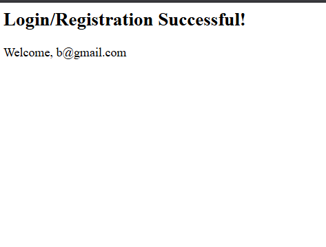

#  Java Servlet-Based Controller Demo

## 📖 Objective
This project demonstrates a simple web-based shopping portal using Java Servlets as the controller layer. Built to master the MVC pattern, servlet lifecycle, and request/response handling, it provides hands-on experience with backend web development in Java. The goal was to understand how to process form data, manage sessions, and generate dynamic responses using JSP and Servlets.

---

## 🛠️ Technologies Used
- **Java (JDK 8+)** (servlet logic)
- **Java Servlets (javax.servlet)** (controller)
- **JSP** (view rendering)
- **HTML5 & CSS3** (UI)
- **Apache Tomcat** (servlet container)
- **Eclipse/VS Code** (development environment)

---

## 📂 Folder Structure
```text
Experiment-06_Servlet-Based-Controller/
├── output/
│   ├── Error.png
│   ├── Login.png
│   ├── Start_Tomcat.png
│   ├── Successful_login.png
│   └── Tomcat.png
├── src/
│   └── ShoppingController.java
├── WebContent/
│   ├── index.html
│   ├── result.jsp
│   └── WEB-INF/
│       ├── classes/
│       │   ├── HelloServlet.class
│       │   └── ShoppingController.class
│       └── web.xml
└── README.md
```

---

## ⚙️ Setup & Usage Instructions

### 1. Prerequisites
- Java JDK 8 or higher
- Apache Tomcat (8.x or 9.x recommended)
- IDE with servlet/JSP support (Eclipse/VS Code)

### 2. Build & Deploy
- **Import the project** into your IDE as a Dynamic Web Project or manually copy files to your Tomcat webapps directory.
- **Compile the servlet** (if not auto-built by IDE).
- **Ensure `web.xml`** is correctly configured for servlet mapping.

### 3. Start Tomcat
- **Windows**
  ```sh
  # Windows
  <TOMCAT_HOME>/bin/startup.bat
  ```
- **macOS/Linux**
  ```sh
  # macOS/Linux
  <TOMCAT_HOME>/bin/startup.sh
  ```

### 4. Access the App
- Open your browser and go to:  
  `http://localhost:8080/Experiment-06_Servlet-Based-Controller/WebContent/index.html`

---

## ✨ Key Features
- Java Servlet-based controller for form processing
- Simple login form and result page (JSP)
- Error handling for invalid credentials
- Session management for user login state
- Clean separation of controller (Servlet) and view (JSP/HTML)
- Deployable on any standard servlet container (Tomcat)

---

## 📸 Output Analysis

### 🖥️ Tomcat Startup

*Tomcat server running and ready to deploy Java web applications.*

### ▶️ Start Tomcat

*The Tomcat server startup process, showing successful initialization in the terminal.*

### 🔑 Login Page

*User login form served by the servlet, prompting for credentials before accessing the portal.*

### ✅ Successful Login

*Confirmation page after a successful login, demonstrating servlet-to-JSP forwarding and session handling.*

### ❌ Error State

*Error message displayed for invalid login attempts, with user-friendly feedback and retry option.*

---

## 🎓 Learning Outcomes
- Mastered Java Servlet lifecycle and request/response handling
- Practiced MVC pattern with Servlets and JSP
- Improved skills in session management and error handling
- Learned to deploy and debug Java web apps on Tomcat
- Understood the basics of web.xml configuration and servlet mapping

---

## 🧠 My Journey & Reflections
This project was my introduction to Java web development using Servlets and JSP. Setting up Tomcat and configuring the deployment was a valuable learning experience. I faced challenges with servlet mapping and session management, but working through them deepened my understanding of backend web architecture. This experiment gave me the confidence to build more complex Java web applications and appreciate the power of the MVC pattern in real-world projects.

---

## 🔗 Connect with Me
- **GitHub:** [https://github.com/bavish007](https://github.com/bavish007)
- **LinkedIn:** [https://www.linkedin.com/in/bavishreddymuske]

---

© 2025 M. Bavish Reddy. All rights reserved. 