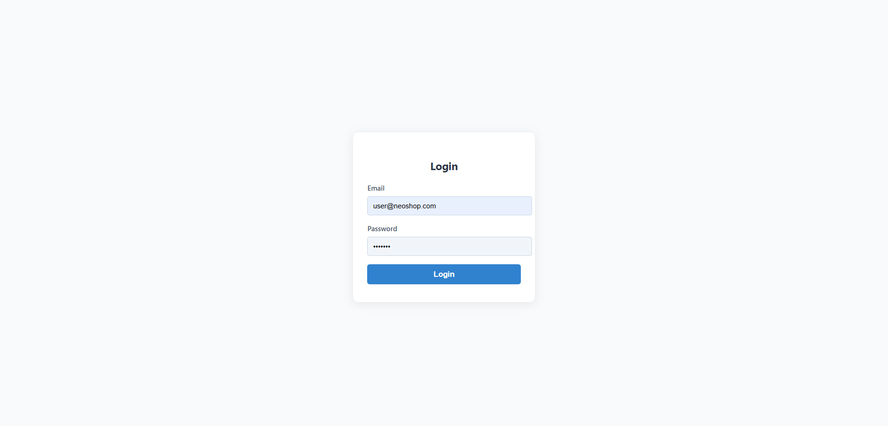
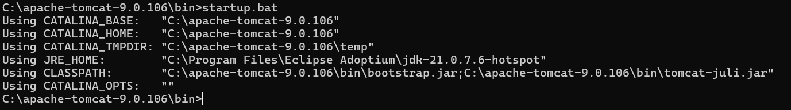
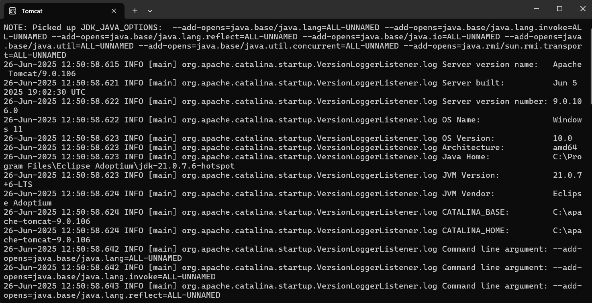
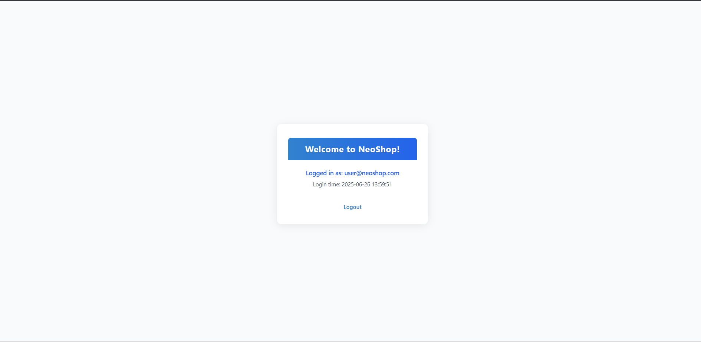

# 🔐 Secure Session Portal – Java Servlet Session Management

## 📖 Objective
This project demonstrates robust session management in a Java web application using Servlets and JSP. Built to master authentication, session tracking, and secure logout flows, it provides hands-on experience with backend web security and user state management. The goal was to understand how to protect user data, handle timeouts, and deliver a seamless login/logout experience.

---

## 🛠️ Technologies Used
- **Java (JDK 8+)** (servlet logic)
- **Java Servlets (javax.servlet)** (session management)
- **JSP** (dynamic views)
- **HTML5 & CSS3** (UI)
- **Apache Tomcat** (deployment)

---

## 📂 Folder Structure
```plaintext
Session-Management/
├── output/
│   ├── Login.png
│   ├── Start_Tomcat.png
│   ├── Tomcat.png
│   └── Welcome.png
├── src/
│   ├── LoginServlet.java
│   └── LogoutServlet.java
├── WebContent/
│   ├── error.jsp
│   ├── index.html
│   ├── register.html
│   ├── timeout.jsp
│   ├── welcome.jsp
│   └── WEB-INF/
│       ├── web.xml
│       └── classes/
│           ├── LoginServlet.class
│           └── LogoutServlet.class
```

---

## ⚙️ Setup & Usage Instructions

### 1. Prerequisites
- Java JDK 8 or higher
- Apache Tomcat 9+

### 2. Build & Deploy

#### # Windows
```sh
# Compile servlets
javac -d WebContent/WEB-INF/classes src/*.java
# Deploy WebContent to Tomcat's webapps directory
copy WebContent "<TOMCAT_HOME>\webapps\Session-Management" /E /I
# Start Tomcat
<TOMCAT_HOME>\bin\startup.bat
```

#### # macOS/Linux
```sh
# Compile servlets
javac -d WebContent/WEB-INF/classes src/*.java
# Deploy WebContent to Tomcat's webapps directory
cp -r WebContent "$TOMCAT_HOME/webapps/Session-Management"
# Start Tomcat
$TOMCAT_HOME/bin/startup.sh
```

- Open your browser and navigate to `http://localhost:8080/Session-Management/`

---

## ✨ Key Features
- Secure login and logout with session tracking
- Automatic session timeout and error handling
- User-friendly feedback for invalid login or session expiry
- Clean, responsive UI with JSP and HTML5
- Demonstrates best practices for web session security

---

## 📸 Output Analysis


*The login page prompts users for credentials, initializing a secure session upon successful authentication.*


*Tomcat server startup confirmation, indicating the web application is ready for deployment and access.*


*The Tomcat manager dashboard, showing the deployed session management app among other web applications.*


*The personalized welcome page displayed after a successful login, confirming active session tracking.*

---

## 🎓 Learning Outcomes
- Implementing session management with Java Servlets
- Handling authentication and secure logout
- Managing session timeouts and user feedback
- Structuring Java web apps for clarity and maintainability
- Deploying and testing on Apache Tomcat

---

## 🧠 My Journey & Reflections
As I built this session management demo, I encountered the real-world challenges of web security and user state. Debugging session timeouts and ensuring a smooth logout flow required careful attention to servlet lifecycle and HTTP protocol details. Mastering Tomcat deployment and seeing the app work end-to-end was deeply rewarding. This project solidified my understanding of backend web security and the importance of user experience in authentication flows.

---

## 🔗 Connect with Me
- **GitHub:** [https://github.com/bavish007](https://github.com/bavish007)
- **LinkedIn:** [https://www.linkedin.com/in/bavishreddymuske](https://www.linkedin.com/in/bavishreddymuske)

---

© 2025 M. Bavish Reddy. All rights reserved. 