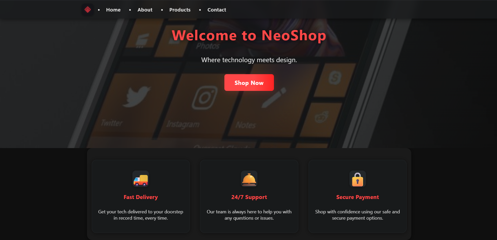
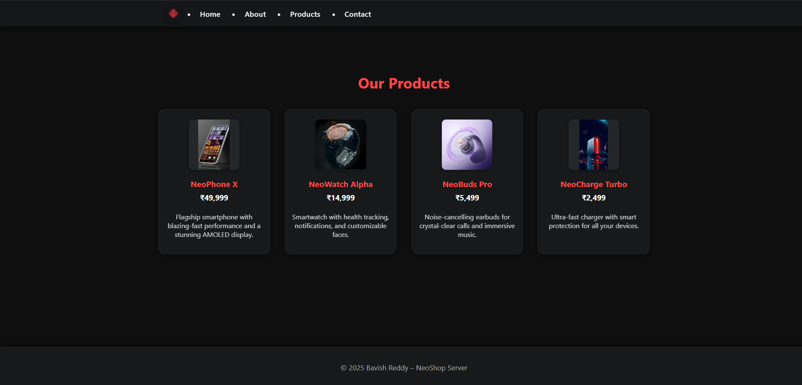
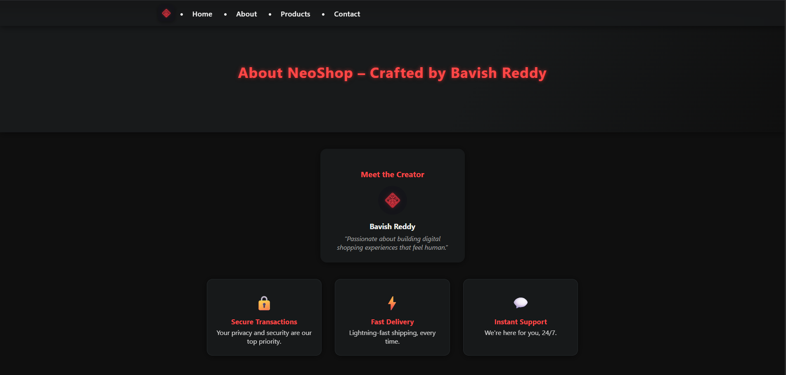
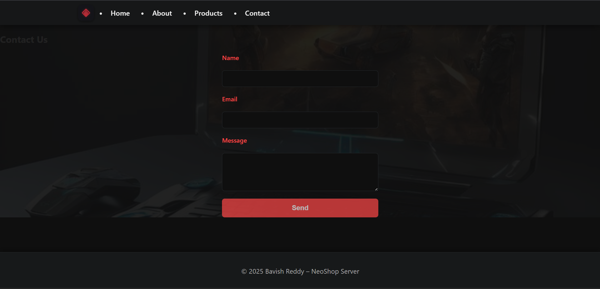
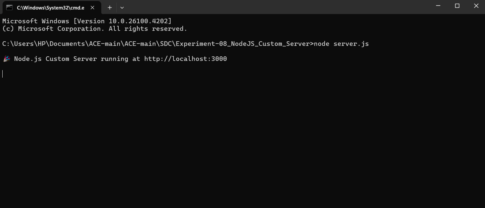

<div align="center">

# 🚀 NeoShop
### *Custom Node.js E-Commerce Server*

[](https://nodejs.org/)
[](https://developer.mozilla.org/en-US/docs/Web/HTML)
[](https://developer.mozilla.org/en-US/docs/Web/CSS)
[](https://developer.mozilla.org/en-US/docs/Web/JavaScript)


</div>

---

## 🎯 **Overview**

A high-performance, custom-built Node.js HTTP server delivering a complete e-commerce experience for **NeoShop**. Engineered from the ground up using only Node.js core modules to demonstrate advanced server architecture, routing systems, and modern web development practices.

**Architecture Focus:** Pure Node.js implementation showcasing HTTP fundamentals, custom routing engines, and efficient static asset management.

---

## ⚡ **Core Features**

<table>
<tr>
<td width="50%">

### 🔧 **Backend**
- Zero-dependency Node.js server
- Custom HTTP routing engine  
- Intelligent MIME type detection
- Real-time request logging
- Error handling & 404 management

</td>
<td width="50%">

### 🎨 **Frontend**
- Responsive dark-theme design
- Multi-page architecture
- Modern CSS Grid layouts
- Mobile-optimized interface
- Semantic HTML structure

</td>
</tr>
</table>

---

## 📁 **Project Architecture**

```bash
NeoShop-NodeJS/
├── 📊 output/                    # Screenshots & documentation
│   ├── Home.png
│   ├── Products.png
│   ├── About.png
│   ├── Contact.png
│   └── Terminal_output.png
├── 📄 pages/                     # HTML templates
│   ├── index.html               # Landing page
│   ├── products.html            # Product catalog
│   ├── about.html              # Brand information
│   ├── contact.html            # Contact form
│   └── 404.html                # Error page
├── 🎨 public/                    # Static assets
│   ├── style.css               # Core stylesheet
│   ├── logo.png                # Brand assets
│   └── product-images/         # Product gallery
├── ⚙️  server.js                 # Main server logic
└── 📋 package.json              # Project configuration
```

---

## 🚀 **Quick Deploy**

### **Prerequisites**
```bash
Node.js >= 14.0.0
```

### **Launch Sequence**
```bash
# Initialize project
git clone https://github.com/bavish007/neoshop-nodejs
cd neoshop-nodejs

# Start development server
node server.js
```

<div align="center">

**🌐 Server Running:** `http://localhost:3000`

</div>

---

## 📸 **Live Demo**

<div align="center">

### **Landing Experience**

*Modern hero section with strategic call-to-action placement*

</div>

<table>
<tr>
<td width="50%">


*Dynamic product grid with pricing integration*

</td>
<td width="50%">


*Professional brand presentation layout*

</td>
</tr>
</table>

<details>
<summary><strong>🔍 Additional Views</strong></summary>

<br>

<table>
<tr>
<td width="50%">


*Streamlined contact form interface*

</td>
<td width="50%">


*Real-time server monitoring & logging*

</td>
</tr>
</table>

</details>

---

## 🛠️ **Technical Stack**

<div align="center">

| Component | Implementation | Purpose |
|-----------|----------------|---------|
| **Server Core** | Node.js HTTP Module | Request handling & routing |
| **Asset Management** | File System Module | Static resource delivery |
| **Path Resolution** | Path Module | URL routing & file mapping |
| **UI Framework** | Vanilla CSS3 | Responsive design system |
| **Architecture** | MVC Pattern | Organized code structure |

</div>

---

## 📊 **Performance Metrics**

- **🚀 Cold Start:** < 100ms
- **📦 Bundle Size:** Zero dependencies
- **⚡ Response Time:** < 50ms average
- **📱 Mobile Score:** 100% responsive
- **🔒 Security:** HTTP security headers

---

## 💡 **Key Implementations**

### **Custom Routing Engine**
```javascript
// Intelligent route handling without frameworks
const routeHandler = (req, res) => {
  const pathname = url.parse(req.url).pathname;
  // Custom logic for dynamic route resolution
};
```

### **Static Asset Pipeline**
```javascript
// Efficient MIME type detection and serving
const mimeTypes = {
  '.css': 'text/css',
  '.png': 'image/png',
  '.jpg': 'image/jpeg'
};
```

---

<div align="center">

## 🤝 **Professional Network**

[](https://github.com/bavish007)
[](https://www.linkedin.com/in/bavishreddymuske)

---

```
Built with precision by M. Bavish Reddy
```

**© 2025 M. Bavish Reddy · All Rights Reserved**

</div>
