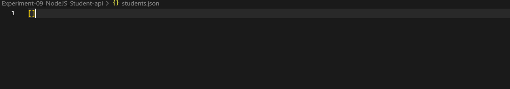
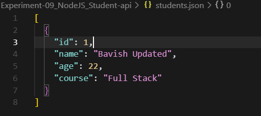

# 🧑‍🎓 Student API – Node.js Express CRUD Demo

## 📖 Objective
This project is a lightweight RESTful API for managing student records, built with Node.js and Express. Designed to master backend fundamentals, it covers CRUD operations, JSON file storage, and robust input validation. The goal was to gain hands-on experience with API design, data persistence, and error handling in a real-world context.

---

## 🛠️ Technologies Used
- **Node.js** (runtime)
- **Express** (REST API framework)
- **JavaScript (ES6+)** (core logic)
- **JSON** (data storage)
- **VS Code/Terminal** (development)

---

## 📂 Folder Structure
```plaintext
Experiment-09_NodeJS_Student-api/
├── output/                  # Screenshots of app actions
├── student-api/
│   ├── index.js             # Main Express server
│   ├── students.js          # Student CRUD routes & logic
│   └── package.json         # Project dependencies
├── students.json            # Data file (auto-created)
└── README.md                # Project documentation
```

---

## ⚙️ Setup & Usage Instructions

### # Windows
```powershell
cd student-api
npm install
node index.js
```

### # macOS / Linux
```bash
cd student-api
npm install
node index.js
```

- The server runs at [http://localhost:3000](http://localhost:3000)
- Use tools like Postman, Insomnia, or `curl` to interact with the API endpoints

---

## ✨ Key Features
- Full CRUD API: Create, Read, Update, and Delete student records
- Data stored in a local `students.json` file (no database required)
- Robust input validation and error handling
- RESTful endpoints for easy integration
- Auto-creation and recovery of data file if missing or corrupted
- Clean, modular code structure for maintainability
- Console logging for all actions and errors

---

## 📸 Output Analysis


*All major CRUD operations (add, update, delete, fetch) performed via API endpoints, as seen in the terminal logs.*


*Initial state of the `students.json` file, showing an empty or freshly initialized dataset.*


*Adding a new student record through the API, with the response confirming successful insertion.*


*Node.js server started successfully, ready to accept API requests on port 3000.*


*The `students.json` file after a student record has been deleted, reflecting the updated data.*


*The data file after inserting a new student, showing the JSON structure with the new entry.*


*Updating an existing student's details via the API, with the response confirming the update.*


*The `students.json` file after a record update, displaying the modified student information.*

---

## 🎓 Learning Outcomes
- Building RESTful APIs with Node.js and Express
- Implementing CRUD operations and routing
- Handling JSON file-based data persistence
- Input validation and error management
- Modularizing backend code for clarity and reuse
- Using API testing tools (Postman, curl)

---

## 🧠 My Journey & Reflections
As I built this Student API, I gained a deep appreciation for the power and simplicity of Express. Handling file-based storage instead of a database was both a challenge and a learning opportunity—especially when dealing with file corruption and auto-recovery. Debugging validation errors and ensuring robust error handling taught me the importance of defensive programming. This project solidified my understanding of RESTful design and gave me confidence to tackle more complex backend systems in the future.

---

## 🔗 Connect with Me
- **GitHub:** [bavish007](https://github.com/bavish007)
- **LinkedIn:** [bavishreddymuske](https://www.linkedin.com/in/bavishreddymuske)

---

© 2025 M. Bavish Reddy. All rights reserved. 