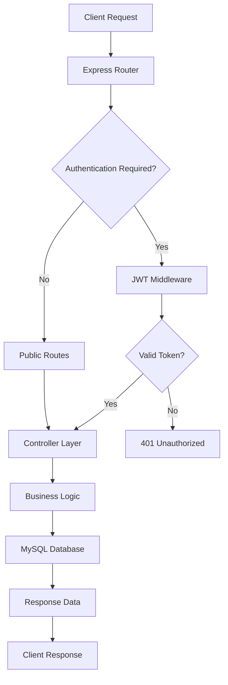

# 🔐 Student Manager API – Enterprise-Grade Node.js JWT Authentication

<div align="center">


**Production-Ready REST API | JWT Authentication | MySQL Integration | Enterprise Security**

</div>

---

## 🎯 Project Overview

A **production-ready REST API** for comprehensive student management featuring enterprise-level JWT authentication, MySQL database integration, and robust security measures. This project showcases modern Node.js architecture patterns with protected routes, secure data handling, and scalable backend development practices suitable for real-world applications.

### 🏆 Key Highlights
- **Stateless Authentication** using JSON Web Tokens
- **Enterprise Security** with bcryptjs password encryption
- **Auto-Setup Database** with MySQL schema initialization
- **Modular MVC Architecture** for scalable development
- **Comprehensive Error Handling** with secure response patterns
- **Environment-Based Configuration** for deployment flexibility

---

## 🔐 Advanced Security Implementation

<details>
<summary><strong>🛡️ Security Architecture Details</strong></summary>

### Authentication Layer
- **JWT Token Strategy**: Stateless authentication with configurable expiration
- **Password Security**: bcryptjs with 10 salt rounds for cryptographic hashing
- **Route Protection**: Middleware-based authorization system
- **Token Verification**: Comprehensive JWT validation and error handling

### Data Protection
- **Input Sanitization**: Comprehensive validation of all incoming requests
- **SQL Injection Prevention**: Parameterized queries and input validation
- **Error Response Security**: Sanitized error messages preventing information leakage
- **Environment Isolation**: Secure credential management with dotenv

### Security Headers & Middleware
```javascript
// Implemented security measures
- JWT verification middleware
- Request validation and sanitization
- Secure error handling
- Environment variable protection
```

</details>

---

## ⚗️ System Architecture



### 📁 Project Structure
```
Experiment-10_NodeJS_JWT_Auth/
├── 📁 output/                     # API demonstration screenshots
│   ├── Start_node.js_server.png   # Server initialization
│   ├── Add_student.png            # Student creation demo
│   ├── List_of_students.png       # Data retrieval demo
│   └── MySQL_DB_contents.png      # Database structure
├── 📁 controllers/
│   ├── authController.js          # Authentication business logic
│   └── studentController.js       # Student CRUD operations
├── 📁 middleware/
│   └── auth.js                    # JWT verification & route protection
├── 📁 models/
│   └── db.js                      # MySQL connection & configuration
├── 📁 routes/
│   ├── authRoutes.js              # Authentication endpoints
│   └── studentRoutes.js           # Student management routes
├── 📁 sql/
│   └── init.sql                   # Database schema & initialization
├── 📄 app.js                      # Express server configuration
├── 📄 package.json                # Dependencies & npm scripts
├── 📄 request.json                # Sample API requests
├── 📄 login_response.json         # JWT response examples
└── 📄 .env.example               # Environment configuration template
```

---

## 🚀 Installation & Setup

### System Requirements
- **Node.js** v14.0.0 or higher
- **MySQL** Server 5.7+ or MySQL 8.0+
- **npm** v6+ or **yarn** v1.22+

### Environment Configuration

Create a `.env` file in the project root:

```bash
# Database Configuration
DB_HOST=localhost
DB_USER=your_mysql_username
DB_PASSWORD=your_mysql_password
DB_NAME=studentdb

# JWT Configuration
JWT_SECRET=your_super_secret_jwt_key_min_32_chars
JWT_EXPIRES_IN=24h

# Server Configuration
PORT=3000
NODE_ENV=development
```

### Quick Start Guide

```bash
# Clone the repository
git clone https://github.com/bavish007/student-manager-api.git
cd student-manager-api

# Install dependencies
npm install

# Configure environment variables
cp .env.example .env
# Edit .env with your configuration

# Start the development server
npm start

# Alternative: Start with nodemon for development
npm run dev
```

**🎉 Server Ready**: API available at `http://localhost:3000`

### Database Auto-Initialization
The application automatically:
- Creates the `studentdb` database if it doesn't exist
- Initializes required tables using `sql/init.sql`
- Sets up proper relationships and indexes

---

## 📋 API Reference

### 🔓 Authentication Endpoints

<details>
<summary><strong>POST /auth/register</strong> - User Registration</summary>

**Request Body:**
```json
{
  "username": "john_doe",
  "email": "john@example.com",
  "password": "securePassword123"
}
```

**Response:**
```json
{
  "success": true,
  "message": "User registered successfully",
  "userId": 123
}
```

**Status Codes:**
- `201 Created` - User registered successfully
- `400 Bad Request` - Validation error or duplicate email
- `500 Internal Server Error` - Server error

</details>

<details>
<summary><strong>POST /auth/login</strong> - User Authentication</summary>

**Request Body:**
```json
{
  "email": "john@example.com",
  "password": "securePassword123"
}
```

**Response:**
```json
{
  "success": true,
  "token": "eyJhbGciOiJIUzI1NiIsInR5cCI6IkpXVCJ9...",
  "user": {
    "id": 123,
    "username": "john_doe",
    "email": "john@example.com"
  }
}
```

**Status Codes:**
- `200 OK` - Authentication successful
- `401 Unauthorized` - Invalid credentials
- `400 Bad Request` - Missing or invalid input

</details>

### 🎓 Student Management Endpoints

| Method | Endpoint | Description | Auth | Request Body |
|--------|----------|-------------|------|-------------|
| `GET` | `/students` | Retrieve all students | ✅ | - |
| `GET` | `/students/:id` | Get student by ID | ✅ | - |
| `POST` | `/students` | Create new student | ✅ | Student object |
| `PUT` | `/students/:id` | Update student data | ✅ | Updated fields |
| `DELETE` | `/students/:id` | Delete student record | ✅ | - |

<details>
<summary><strong>Student Object Schema</strong></summary>

```json
{
  "name": "Jane Smith",
  "email": "jane.smith@university.edu",
  "age": 20,
  "course": "Computer Science",
  "year": 2,
  "gpa": 3.8,
  "enrollment_date": "2023-09-01"
}
```

**Validation Rules:**
- `name`: Required, 2-100 characters
- `email`: Required, valid email format, unique
- `age`: Required, integer 16-100
- `course`: Required, 2-100 characters
- `year`: Required, integer 1-8
- `gpa`: Optional, decimal 0.0-4.0

</details>

---

## 🔑 Authentication Flow & Usage

### Token-Based Authentication Workflow

```bash
# 1. Register a new user
curl -X POST http://localhost:3000/auth/register \
  -H "Content-Type: application/json" \
  -d '{
    "username": "john_doe",
    "email": "john@example.com",
    "password": "securePassword123"
  }'
```

```bash
# 2. Login and receive JWT token
curl -X POST http://localhost:3000/auth/login \
  -H "Content-Type: application/json" \
  -d '{
    "email": "john@example.com",
    "password": "securePassword123"
  }'
```

```bash
# 3. Access protected endpoints
curl -X GET http://localhost:3000/students \
  -H "Authorization: Bearer YOUR_JWT_TOKEN_HERE"
```

### JWT Token Structure
```javascript
// Token Payload Example
{
  "userId": 123,
  "email": "john@example.com",
  "iat": 1640995200,  // Issued at
  "exp": 1641081600   // Expires at
}
```

---

## 📸 Live System Demonstration

<details>
<summary>🖥️ <strong>Server Initialization & Startup</strong></summary>


*Express server initialization showing MySQL connection establishment, middleware loading, and route registration*

**Key Startup Features:**
- Database connection verification
- JWT middleware configuration
- Route handler registration
- Environment validation
- Security header setup

</details>

<details>
<summary>🎓 <strong>Student Management Operations</strong></summary>


*Protected POST endpoint demonstrating student record creation with JWT authentication validation*


*GET request showcasing authenticated data retrieval with comprehensive student information display*

**Demonstrated Features:**
- JWT token validation
- Protected route access
- CRUD operation execution
- JSON response formatting
- Error handling implementation

</details>

<details>
<summary>💾 <strong>Database Schema & Data Structure</strong></summary>


*MySQL database visualization showing normalized table structure with users and students entities, foreign key relationships, and data integrity constraints*

**Database Architecture:**
- Normalized relational design
- Foreign key constraints
- Indexed columns for performance
- Data type optimization
- Referential integrity

</details>

---

## 🛠️ Technical Implementation Deep Dive

### Core Technologies & Dependencies

<details>
<summary><strong>📦 Production Dependencies</strong></summary>

```json
{
  "express": "^4.18.2",          // Web application framework
  "mysql2": "^3.6.0",           // MySQL database driver
  "jsonwebtoken": "^9.0.2",     // JWT token generation/verification
  "bcryptjs": "^2.4.3",         // Password hashing library
  "dotenv": "^16.3.1",          // Environment variable management
  "cors": "^2.8.5",             // Cross-origin resource sharing
  "helmet": "^7.0.0",           // Security headers middleware
  "express-rate-limit": "^6.8.1" // Rate limiting protection
}
```

</details>

### Security Implementation Details

<details>
<summary><strong>🔐 Authentication Middleware</strong></summary>

```javascript
// JWT Verification Process
const authMiddleware = (req, res, next) => {
  // 1. Extract token from Authorization header
  // 2. Verify token signature and expiration
  // 3. Decode user information
  // 4. Attach user context to request
  // 5. Handle token errors gracefully
}
```

**Security Features:**
- Token signature verification
- Expiration time validation
- Malformed token handling
- User context injection
- Secure error responses

</details>

### Database Design & Architecture

<details>
<summary><strong>📊 Entity Relationship Design</strong></summary>

```sql
-- Users Table (Authentication)
CREATE TABLE users (
    id INT PRIMARY KEY AUTO_INCREMENT,
    username VARCHAR(100) UNIQUE NOT NULL,
    email VARCHAR(255) UNIQUE NOT NULL,
    password_hash VARCHAR(255) NOT NULL,
    created_at TIMESTAMP DEFAULT CURRENT_TIMESTAMP,
    updated_at TIMESTAMP DEFAULT CURRENT_TIMESTAMP ON UPDATE CURRENT_TIMESTAMP
);

-- Students Table (Core Entity)
CREATE TABLE students (
    id INT PRIMARY KEY AUTO_INCREMENT,
    name VARCHAR(100) NOT NULL,
    email VARCHAR(255) UNIQUE NOT NULL,
    age INT NOT NULL CHECK (age >= 16 AND age <= 100),
    course VARCHAR(100) NOT NULL,
    year INT NOT NULL CHECK (year >= 1 AND year <= 8),
    gpa DECIMAL(3,2) CHECK (gpa >= 0.0 AND gpa <= 4.0),
    enrollment_date DATE,
    user_id INT,
    created_at TIMESTAMP DEFAULT CURRENT_TIMESTAMP,
    updated_at TIMESTAMP DEFAULT CURRENT_TIMESTAMP ON UPDATE CURRENT_TIMESTAMP,
    FOREIGN KEY (user_id) REFERENCES users(id) ON DELETE CASCADE
);
```

**Database Features:**
- Referential integrity with foreign keys
- Data validation constraints
- Optimized indexes for performance
- Timestamp tracking
- Cascade delete operations

</details>

---

## 🔧 Development & Testing

### API Testing with Sample Data

The project includes comprehensive testing resources:

<details>
<summary><strong>📋 Sample API Requests</strong></summary>

**`request.json`** - Complete API request examples:
```json
{
  "registration": {
    "url": "http://localhost:3000/auth/register",
    "method": "POST",
    "body": {
      "username": "testuser",
      "email": "test@example.com",
      "password": "securepass123"
    }
  },
  "student_creation": {
    "url": "http://localhost:3000/students",
    "method": "POST",
    "headers": {
      "Authorization": "Bearer JWT_TOKEN"
    },
    "body": {
      "name": "Alice Johnson",
      "email": "alice@university.edu",
      "age": 20,
      "course": "Computer Science",
      "year": 2,
      "gpa": 3.7
    }
  }
}
```

</details>

### Error Handling & Status Codes

<details>
<summary><strong>⚠️ Comprehensive Error Management</strong></summary>

**HTTP Status Code Implementation:**

| Status Code | Scenario | Response Format |
|-------------|----------|-----------------|
| `200 OK` | Successful GET, PUT operations | `{ success: true, data: {...} }` |
| `201 Created` | Successful POST operations | `{ success: true, message: "...", id: 123 }` |
| `400 Bad Request` | Validation errors, malformed data | `{ success: false, error: "Validation failed" }` |
| `401 Unauthorized` | Missing/invalid JWT token | `{ success: false, error: "Access denied" }` |
| `403 Forbidden` | Insufficient permissions | `{ success: false, error: "Forbidden access" }` |
| `404 Not Found` | Resource doesn't exist | `{ success: false, error: "Resource not found" }` |
| `409 Conflict` | Duplicate data (email, etc.) | `{ success: false, error: "Email already exists" }` |
| `500 Internal Server Error` | Server-side issues | `{ success: false, error: "Internal server error" }` |

**Error Response Security:**
- No sensitive information exposure
- Consistent error format
- Detailed logging for debugging
- User-friendly error messages

</details>

---

## 🎓 Technical Learning Outcomes & Skills Demonstrated

This project showcases advanced backend development competencies:

### **🔧 Backend Development Skills**
- **RESTful API Design** - Industry-standard endpoint architecture
- **Authentication Systems** - JWT implementation with security best practices  
- **Database Integration** - MySQL with Node.js and connection pooling
- **Middleware Architecture** - Custom authentication and validation layers
- **Error Handling** - Comprehensive error management and logging

### **🔐 Security & Best Practices**
- **Token-Based Authentication** - Stateless JWT implementation
- **Password Security** - bcryptjs hashing with appropriate salt rounds
- **Input Validation** - Comprehensive request sanitization
- **Environment Management** - Secure configuration and credential handling
- **SQL Injection Prevention** - Parameterized queries and input validation

### **🏗️ Software Architecture**
- **MVC Pattern** - Clear separation of concerns and modular design
- **Scalable Code Organization** - Enterprise-ready project structure
- **Database Design** - Normalized relational schema with constraints
- **Deployment Readiness** - Environment-based configuration for multiple stages

### **🛠️ Development & Operations**
- **Automated Setup** - Database initialization and schema management
- **API Documentation** - Comprehensive endpoint documentation
- **Testing Resources** - Sample requests and response examples
- **Error Monitoring** - Structured logging and error tracking

---

<div align="center">

## 🔗 Professional Links

[](https://github.com/bavish007)
[](https://www.linkedin.com/in/bavishreddymuske)

<br/>

© 2025 M. Bavish Reddy  
<sub><i>*Refined and engineered by M. Bavish Reddy*</i></sub>

</div>
