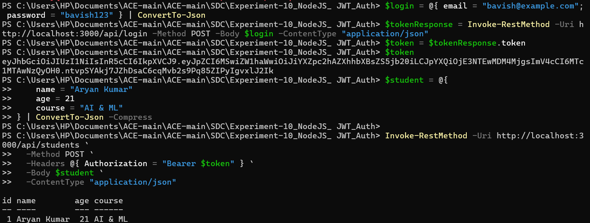
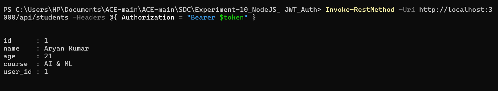
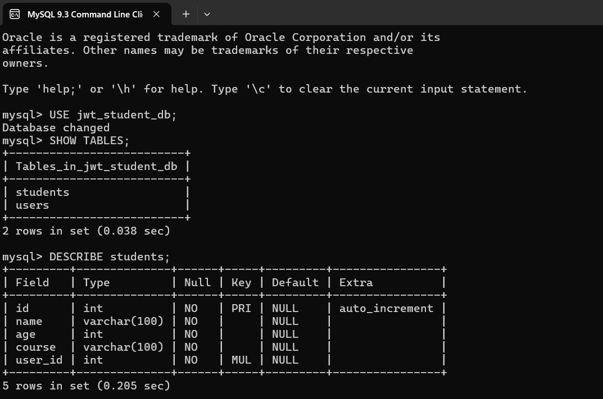
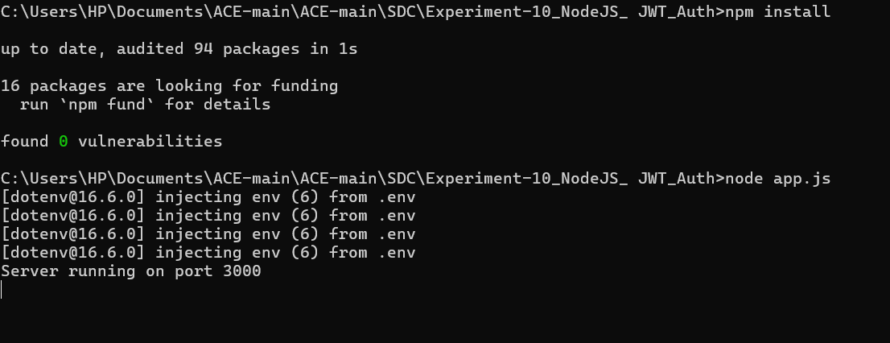

# 🔐 Student Manager API – Node.js JWT Auth Edition

## 📖 Objective
This project is a secure, full-featured REST API for managing student records, built with Node.js, Express, MySQL, and JWT authentication. The goal was to master user authentication, protected routes, and robust CRUD operations, while gaining hands-on experience with real-world backend security and relational data modeling.

---

## 🛠️ Technologies Used
- **Node.js** (runtime)
- **Express** (web framework)
- **MySQL** (relational database)
- **JWT (jsonwebtoken)** (authentication)
- **bcryptjs** (password hashing)
- **dotenv** (environment management)
- **JavaScript (ES6+)** (core logic)

---

## 📂 Folder Structure
```plaintext
Experiment-10_NodeJS_ JWT_Auth/
├── output/                  # Screenshots of app actions
├── controllers/
│   ├── authController.js    # Auth logic (register, login)
│   └── studentController.js # Student CRUD logic
├── middleware/
│   └── auth.js              # JWT verification middleware
├── models/
│   └── db.js                # MySQL connection & setup
├── routes/
│   ├── authRoutes.js        # Auth endpoints
│   └── studentRoutes.js     # Student endpoints
├── sql/
│   └── init.sql             # DB schema (users, students)
├── app.js                   # Main server entry point
├── package.json             # Project dependencies
├── request.json             # Example login request
├── login_response.json      # Example JWT response
└── README.md                # Project documentation
```

---

## ⚙️ Setup & Usage Instructions

### # Prerequisites
- Node.js (v14+ recommended)
- MySQL server

### # Database Setup
1. Create a `.env` file in the root with:
   ```env
   DB_HOST=localhost
   DB_USER=your_mysql_user
   DB_PASSWORD=your_mysql_password
   DB_NAME=studentdb
   JWT_SECRET=your_jwt_secret
   ```
2. Ensure MySQL is running. The app auto-creates the database and tables using `sql/init.sql`.

### # Windows
```powershell
npm install
node app.js
```

### # macOS / Linux
```bash
npm install
node app.js
```

- The server runs at [http://localhost:3000](http://localhost:3000)
- Use Postman, Insomnia, or `curl` to test endpoints (see `request.json` for sample payload)

---

## ✨ Key Features
- Secure JWT-based authentication (register/login)
- Passwords hashed with bcryptjs
- Protected student CRUD endpoints (only accessible with valid JWT)
- MySQL-backed persistent storage
- Modular code: controllers, middleware, routes, models
- Auto database/table creation on first run
- Robust error handling and status codes

---

## 📸 Output Analysis


*Adding a new student record via the protected API endpoint, with a successful response shown in the client.*


*Fetching all students for the authenticated user, displaying the list of records returned by the API.*


*Direct view of the MySQL database, showing the `users` and `students` tables populated with data.*


*Node.js server successfully started, ready to handle authentication and student management requests.*

---

## 🎓 Learning Outcomes
- Implementing JWT authentication and route protection
- Integrating Node.js with MySQL for relational data
- Structuring modular Express applications
- Secure password storage and validation
- Handling environment variables and secrets
- Designing and testing RESTful APIs

---

## 🧠 My Journey & Reflections
Building this secure Student Manager API was a major step up in backend development. Implementing JWT authentication and integrating with MySQL taught me the importance of security, modularity, and real-world data modeling. Debugging authentication flows and database issues was challenging but rewarding. This project gave me the confidence to build and secure more complex APIs, and deepened my understanding of modern web security best practices.

---

## 🔗 Connect with Me
- **GitHub:** [bavish007](https://github.com/bavish007)
- **LinkedIn:** [bavishreddymuske](https://www.linkedin.com/in/bavishreddymuske)

---

© 2025 M. Bavish Reddy. All rights reserved. 