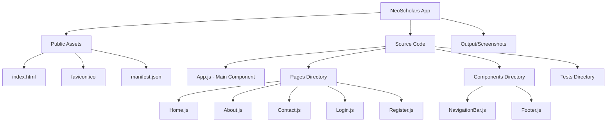
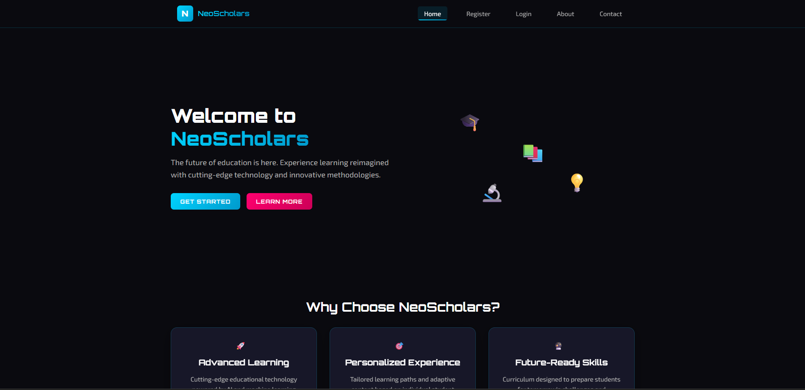
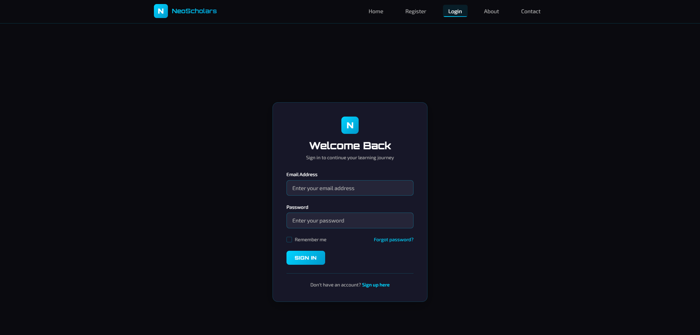
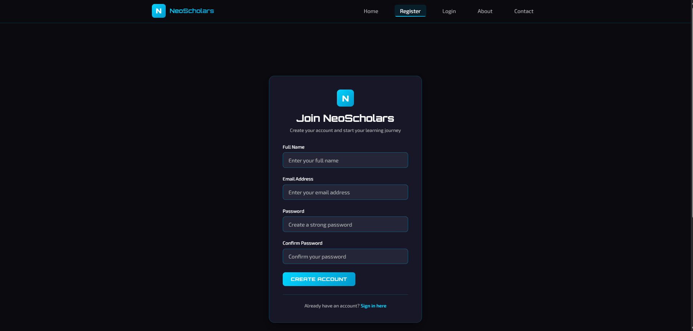
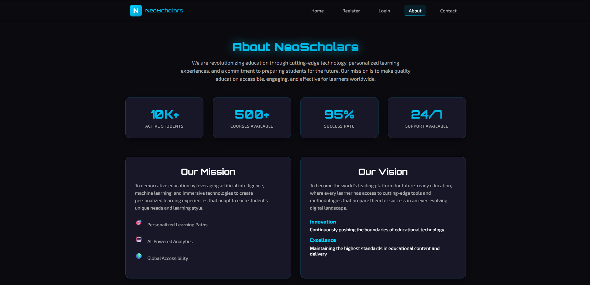
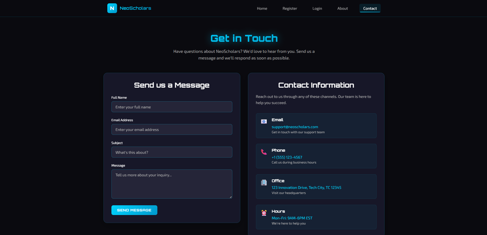

# 🚀 NeoScholars - ReactJS Student Management System

<div align="center">


**Modern Student Management Portal Built with React**


</div>


## 🎯 Overview

NeoScholars is a sleek, responsive single-page application built with **ReactJS** for comprehensive student management. The platform features modern UI/UX design, seamless navigation, and component-driven architecture that delivers an intuitive user experience for educational portals.

### 🎨 Design Philosophy
- **User-Centric**: Intuitive interface prioritizing user experience
- **Performance-First**: Optimized for fast loading and smooth interactions
- **Accessibility-Compliant**: WCAG guidelines implementation
- **Mobile-Responsive**: Cross-device compatibility with mobile-first approach

---

## ⚡ Core Features

<table>
<tr>
<td width="50%">

### 🌐 **Frontend Excellence**
- ✅ Single Page Application architecture
- ✅ Responsive design with mobile-first approach
- ✅ Component-driven development
- ✅ React Router integration with clean URLs
- ✅ Modern CSS with contemporary design patterns

</td>
<td width="50%">

### 🔐 **User Management**
- ✅ Complete authentication flow
- ✅ User registration with validation
- ✅ Secure login system
- ✅ Interactive forms with real-time feedback
- ✅ Session management and persistence

</td>
</tr>
</table>

---

## 🏗️ Project Architecture



<details>
<summary>📁 <strong>Detailed File Structure</strong></summary>

```
Experiment-11_ReactJS_Student-management/
├── 📸 output/                    # Application screenshots & demos
├── 🌐 public/
│   ├── index.html               # HTML template & meta tags
│   ├── favicon.ico              # App branding assets
│   └── manifest.json            # PWA configuration
├── 📦 src/
│   ├── App.js                   # Main application component
│   ├── App.css                  # Global styling & themes
│   ├── index.js                 # React DOM entry point
│   ├── 📄 pages/                # Route-based page components
│   │   ├── Home.js              # Landing page experience
│   │   ├── About.js             # Company & mission info
│   │   ├── Contact.js           # Communication interface
│   │   ├── Login.js             # User authentication
│   │   └── Register.js          # Account creation
│   ├── 🧩 components/           # Reusable UI components
│   │   ├── NavigationBar.js     # Primary navigation
│   │   └── Footer.js            # Site footer
│   └── 🧪 __tests__/            # Unit & integration tests
├── package.json                 # Dependencies & build scripts
└── README.md                    # Project documentation
```

</details>

---

## 🚀 Quick Start

### 📋 Prerequisites
Ensure you have the following installed:
- **Node.js** v14.0.0 or higher
- **npm** v6.0.0 or **yarn** v1.22.0

### ⚙️ Development Setup

```bash
# Clone the repository
git clone https://github.com/bavish007/neoscholars-react-app.git
cd neoscholars-react-app

# Install dependencies
npm install
# OR using yarn
yarn install

# Start development server
npm start
# OR using yarn
yarn start

# Open browser to http://localhost:3000
```

### 🏭 Production Build

```bash
# Create optimized production build
npm run build

# Serve build locally (optional)
npx serve -s build
```

### 🧪 Testing

```bash
# Run test suite
npm test

# Run tests in watch mode
npm test -- --watch

# Generate coverage report
npm test -- --coverage --watchAll=false
```

---

## 🎨 User Interface Showcase

### 🏠 **Landing Experience**
<details>
<summary>View Home Page Screenshots</summary>


*Modern landing page featuring hero section, feature highlights, and clear call-to-action elements with responsive design*

</details>

### 🔐 **Authentication System**
<details>
<summary>View Authentication Interface</summary>


*Clean, intuitive login form with validation feedback and secure authentication flow*


*Comprehensive registration process featuring real-time form validation and guided user experience*

</details>

### 📄 **Information Pages**
<details>
<summary>View Content Pages</summary>


*Engaging about page showcasing mission, values, and team information with structured, professional layout*


*Interactive contact form with multiple communication channels and fully responsive design implementation*

</details>

---

## 🔧 Technical Implementation

### 🏛️ **Frontend Architecture**
- **Component Composition**: Atomic design principles with reusable, maintainable components
- **State Management**: React hooks for efficient local state and form handling
- **Routing Strategy**: React Router DOM for seamless single-page navigation
- **Styling Approach**: Custom CSS with modern design patterns and CSS Grid/Flexbox

### ⚡ **Performance Optimizations**
- **Code Splitting**: Lazy loading implementation for optimal bundle sizes
- **Component Optimization**: React.memo and efficient re-rendering strategies
- **Asset Management**: Optimized images and intelligent resource loading
- **Build Optimization**: Advanced Webpack configuration for production builds

### 🛠️ **Development Best Practices**
- **Testing Strategy**: Comprehensive Jest and React Testing Library integration
- **Code Quality**: ESLint and Prettier for consistent code formatting
- **Accessibility**: WCAG 2.1 guidelines compliance and semantic HTML structure
- **Responsive Design**: Mobile-first CSS with flexible, adaptive layouts

<details>
<summary>🔍 <strong>Technical Stack Deep Dive</strong></summary>

| Category | Technology | Purpose |
|----------|------------|---------|
| **Frontend Framework** | React 18 | Component-based UI development |
| **Routing** | React Router v6 | Client-side navigation |
| **Styling** | CSS3 + Flexbox/Grid | Modern responsive layouts |
| **Testing** | Jest + React Testing Library | Unit and integration testing |
| **Build Tool** | Create React App | Development and build process |
| **Code Quality** | ESLint + Prettier | Code formatting and linting |

</details>

---

## 🎯 Key Learning Outcomes

This project demonstrates comprehensive mastery of modern React development principles:

### 📚 **React Fundamentals Mastery**
- **Component Architecture**: Functional components with hooks
- **State Management**: useState, useEffect, and custom hooks
- **Props & Context**: Data flow and component communication
- **Lifecycle Management**: Modern React lifecycle patterns

### 🌐 **Single Page Application Excellence**
- **Client-Side Routing**: React Router implementation
- **Navigation Patterns**: Programmatic and declarative routing
- **URL Management**: Clean URLs and browser history handling
- **State Persistence**: Cross-route state management

### 🎨 **UI/UX Design Implementation**
- **Responsive Layouts**: Mobile-first design principles
- **User-Centered Design**: Intuitive interface patterns
- **Accessibility**: WCAG compliance and semantic markup
- **Performance**: Optimized rendering and loading strategies

### 🧪 **Testing & Quality Assurance**
- **Unit Testing**: Component isolation and behavior testing
- **Integration Testing**: User interaction and flow testing
- **Test-Driven Development**: Quality-first development approach
- **Code Coverage**: Comprehensive testing metrics

---

## 🛠️ Development Workflow

### 🧩 **Component Development Pattern**
```jsx
// Modern React component structure
import React, { useState, useEffect } from 'react';
import PropTypes from 'prop-types';
import './Component.css';

const Component = ({ title, onAction, ...props }) => {
  const [state, setState] = useState(initialState);
  
  useEffect(() => {
    // Side effects and cleanup
    return () => cleanup();
  }, [dependencies]);
  
  const handleAction = (event) => {
    // Event handling logic
    setState(prevState => ({ ...prevState, updated: true }));
    onAction?.(event);
  };
  
  return (
    <div className="component" {...props}>
      <h2>{title}</h2>
      {/* Component JSX with semantic structure */}
    </div>
  );
};

Component.propTypes = {
  title: PropTypes.string.isRequired,
  onAction: PropTypes.func,
};

export default Component;
```

### 🛣️ **Routing Configuration**
```jsx
// React Router setup with error boundaries
import { BrowserRouter, Routes, Route, Navigate } from 'react-router-dom';
import { Suspense, lazy } from 'react';

// Lazy loading for code splitting
const Home = lazy(() => import('./pages/Home'));
const About = lazy(() => import('./pages/About'));
const Contact = lazy(() => import('./pages/Contact'));
const Login = lazy(() => import('./pages/Login'));
const Register = lazy(() => import('./pages/Register'));

const App = () => (
  <BrowserRouter>
    <Suspense fallback={<div className="loading-spinner">Loading...</div>}>
      <Routes>
        <Route path="/" element={<Home />} />
        <Route path="/about" element={<About />} />
        <Route path="/contact" element={<Contact />} />
        <Route path="/login" element={<Login />} />
        <Route path="/register" element={<Register />} />
        <Route path="*" element={<Navigate to="/" replace />} />
      </Routes>
    </Suspense>
  </BrowserRouter>
);

export default App;
```

### 🧪 **Testing Implementation**
```jsx
// Example test suite structure
import { render, screen, fireEvent, waitFor } from '@testing-library/react';
import { BrowserRouter } from 'react-router-dom';
import Component from './Component';

const renderWithRouter = (component) => {
  return render(
    <BrowserRouter>
      {component}
    </BrowserRouter>
  );
};

describe('Component', () => {
  test('renders correctly with props', () => {
    renderWithRouter(<Component title="Test Title" />);
    expect(screen.getByText('Test Title')).toBeInTheDocument();
  });

  test('handles user interactions', async () => {
    const mockHandler = jest.fn();
    renderWithRouter(<Component onAction={mockHandler} />);
    
    fireEvent.click(screen.getByRole('button'));
    await waitFor(() => {
      expect(mockHandler).toHaveBeenCalledTimes(1);
    });
  });
});
```

---

## 📱 Features & Functionality

### 👥 **User Management System**
- **Registration Flow**: Comprehensive user onboarding with multi-step validation
- **Authentication**: Secure login system with session management
- **Profile Management**: User profile updates and preferences
- **Access Control**: Role-based permissions and route protection

### 🧭 **Navigation & User Experience**
- **Intuitive Navigation**: Clear menu structure with active state indicators
- **Responsive Mobile Menu**: Collapsible navigation for mobile devices
- **Smooth Transitions**: Page transitions and loading states for better UX
- **Accessibility Features**: Keyboard navigation and screen reader support

### 📝 **Content Management**
- **Dynamic Rendering**: Real-time content updates and state management
- **Form Validation**: Client-side validation with user-friendly error messages
- **Interactive Elements**: Contact forms, feedback systems, and user interactions
- **Media Handling**: Responsive images and optimized asset delivery

### 🔧 **Development Features**
- **Hot Reloading**: Instant development feedback with Create React App
- **Error Boundaries**: Graceful error handling and user feedback
- **Performance Monitoring**: Built-in performance metrics and optimization
- **SEO Optimization**: Meta tags, semantic HTML, and search engine friendly URLs

---

<div align="center">

## 🌟 Project Highlights

*This project showcases modern React development practices, clean architecture, and professional UI/UX design principles. Built with attention to detail, performance optimization, and user experience.*

---

## 🔗 Connect & Collaborate

[](https://github.com/bavish007)
[](https://www.linkedin.com/in/bavishreddymuske)

<br/>

© 2025 M. Bavish Reddy  
<sub><i>*Refined and engineered by M. Bavish Reddy*</i></sub>

</div>
