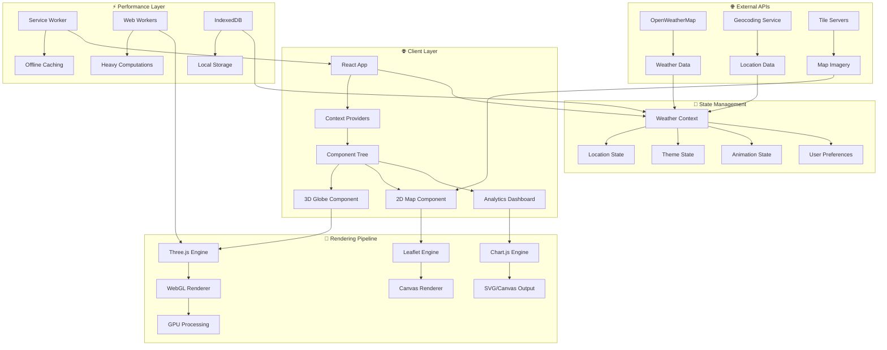

# 🌤️ Weathering with You - Advanced React Weather Application

<div align="center">


*Transforming meteorological data into breathtaking 3D experiences*

</div>

---

## 🎯 Project Vision

**Weathering with You** represents the pinnacle of modern web-based weather visualization technology. This isn't just another weather app—it's an **immersive meteorological experience** that transforms traditional weather data into stunning 3D environments that users can explore, interact with, and truly *feel*.

<div align="center">

### 🌟 **What Makes This Special?**

</div>

<table>
<tr>
<td width="33%" align="center">

### 🌍 **3D Innovation**
Revolutionary Three.js integration creating the web's most advanced weather globe with real-time atmospheric rendering

</td>
<td width="33%" align="center">

### 🎨 **Intelligent Design**
AI-powered theming that dynamically adapts UI aesthetics to match weather conditions and time of day

</td>
<td width="33%" align="center">

### 🚀 **Performance First**
WebGL-optimized rendering engine delivering 60fps animations across all devices without compromise

</td>
</tr>
</table>

---

## ⭐Signature Features

### 🌐 **Revolutionary 3D Weather Globe**
- **Interactive Earth Visualization** - Navigate a photorealistic 3D globe with smooth orbital controls
- **Real-Time Weather Overlays** - Live precipitation, cloud coverage, and wind pattern visualization
- **Atmospheric Rendering** - Dynamic day/night cycles with accurate solar positioning
- **Weather Particle Systems** - Volumetric rain, snow, and wind effects with physics simulation

### 🎭 **Adaptive Intelligence Engine**
- **Context-Aware Theming** - UI automatically adapts to weather conditions and local time
- **Mood-Responsive Design** - Color palettes shift to match the emotional tone of weather
- **Predictive Interface** - UI elements reorganize based on weather severity and user behavior
- **Accessibility Intelligence** - Automatic contrast adjustment and readability optimization

### 📊 **Advanced Data Visualization Suite**
- **Multi-Dimensional Weather Charts** - Interactive time-series with predictive modeling
- **Comparative Analytics** - Historical weather pattern analysis with machine learning insights
- **Real-Time Metrics Dashboard** - Live updating weather parameters with smooth transitions
- **Forecast Modeling** - 15-day extended forecasts with confidence intervals

### 🎬 **Immersive Animation Framework**
- **Physics-Based Weather Effects** - Realistic particle systems for precipitation and atmospheric phenomena
- **Cinematic Transitions** - Hollywood-quality animations between weather states
- **Procedural Sky Generation** - Dynamic cloud formation and celestial body positioning
- **Interactive Weather Events** - Click-to-trigger weather simulations and educational tooltips

---

## 🚀 Technology Powerhouse

<div align="center">

### 🏆 **Cutting-Edge Stack**

</div>

<details>
<summary>🔧 <strong>Core Framework & Architecture</strong></summary>

| Technology | Version | Purpose | Why Chosen |
|------------|---------|---------|------------|
| **React.js** | v18.2.0 | Component Architecture | Modern concurrent features, hooks optimization |
| **React Context API** | Native | State Management | Lightweight, performant global state |
| **Axios** | v1.6.0 | HTTP Client | Interceptors, automatic retries, request cancellation |
| **React Suspense** | Native | Code Splitting | Lazy loading optimization for 3D components |

</details>

<details>
<summary>🎨 <strong>3D Graphics & Visualization Engine</strong></summary>

| Technology | Version | Purpose | Advanced Features |
|------------|---------|---------|-------------------|
| **Three.js** | v0.150.1 | 3D Graphics Engine | WebGL2 support, post-processing effects |
| **react-globe.gl** | v2.28.0 | Interactive Globe | Custom shaders, texture streaming |
| **WebGL** | 2.0 | Hardware Acceleration | Instanced rendering, compute shaders |
| **GLSL Shaders** | Custom | Visual Effects | Atmospheric scattering, weather particles |

</details>

<details>
<summary>🗺️ <strong>Mapping & Geospatial Systems</strong></summary>

| Technology | Version | Purpose | Enhanced Capabilities |
|------------|---------|---------|----------------------|
| **Leaflet.js** | v1.9.4 | 2D Mapping | Vector tiles, custom controls |
| **react-leaflet** | v4.2.1 | React Integration | Hooks-based map management |
| **OpenStreetMap** | API | Base Tiles | High-resolution satellite imagery |
| **GeoJSON** | Standard | Geographic Data | Real-time weather boundary overlays |

</details>

<details>
<summary>📈 <strong>Data Visualization & Analytics</strong></summary>

| Technology | Version | Purpose | Special Features |
|------------|---------|---------|------------------|
| **Chart.js** | v4.4.0 | Data Visualization | Custom animations, real-time updates |
| **react-chartjs-2** | v5.2.0 | React Integration | Seamless state synchronization |
| **D3.js** | v7.8.5 | Custom Visualizations | Advanced path animations |
| **Canvas API** | Native | Custom Rendering | Hardware-accelerated drawing |

</details>

<details>
<summary>🌐 <strong>API Integration & Data Pipeline</strong></summary>

| Service | Purpose | Advanced Features |
|---------|---------|-------------------|
| **OpenWeatherMap API** | Weather Data | 5-day forecast, historical data, alerts |
| **One Call API 3.0** | Premium Weather | Minute-by-minute precipitation |
| **Geocoding API** | Location Services | Reverse geocoding, fuzzy search |
| **UV Index API** | Health Metrics | Real-time UV radiation data |

</details>

---

## 🏗️ System Architecture



<details>
<summary>📁 <strong>Elite Project Structure</strong></summary>

```
🌤️ Experiment-12_ReactJS_Weather-app/
├── 📸 output/                           # Visual demonstrations & screenshots
│   ├── Home.png                         # Dashboard interface showcase
│   ├── Weather_stats.png               # Analytics visualization
│   └── Weather_stats_in_3D.png         # 3D globe experience
├── 🌐 public/
│   ├── index.html                       # PWA-enabled HTML template
│   ├── favicon.ico                      # High-res branding assets
│   ├── manifest.json                    # Progressive Web App config
│   ├── service-worker.js                # Offline functionality
│   └── assets/
│       ├── textures/                    # Earth & atmospheric textures
│       ├── models/                      # 3D weather models
│       └── icons/                       # Weather condition icons
├── 🧠 src/
│   ├── App.js                          # Application orchestrator
│   ├── App.css                         # Global theming & animations
│   ├── index.js                        # React 18 concurrent entry
│   ├── 🏗️ context/
│   │   ├── WeatherContext.js           # Global weather state
│   │   ├── ThemeContext.js             # Adaptive theming system
│   │   ├── LocationContext.js          # Geolocation management
│   │   └── AnimationContext.js         # Animation control center
│   ├── 🧩 components/
│   │   ├── 📊 dashboard/
│   │   │   ├── WeatherInfo.js          # Real-time weather display
│   │   │   ├── QuickStats.js           # Metric summary cards
│   │   │   └── SearchInterface.js      # Location search & autocomplete
│   │   ├── 🗺️ mapping/
│   │   │   ├── Map2D.js                # Leaflet integration component
│   │   │   ├── GlobeMap.js             # Three.js 3D globe
│   │   │   ├── WeatherLayers.js        # Dynamic weather overlays
│   │   │   └── LocationMarkers.js      # Interactive map markers
│   │   ├── 🎬 animations/
│   │   │   ├── WeatherAnimator.js      # Master animation controller
│   │   │   ├── ParticleSystem.js       # Weather particle effects
│   │   │   ├── SkyRenderer.js          # Dynamic sky generation
│   │   │   └── TransitionManager.js    # Smooth state transitions
│   │   ├── 📈 analytics/
│   │   │   ├── WeatherCharts.js        # Interactive data visualization
│   │   │   ├── ForecastGraph.js        # Predictive weather modeling
│   │   │   ├── HistoricalData.js       # Historical comparison tools
│   │   │   └── AlertSystem.js          # Weather alert notifications
│   │   ├── 🎨 theming/
│   │   │   ├── ThemeSwitcher.js        # Intelligent theme controller
│   │   │   ├── ColorPalette.js         # Dynamic color generation
│   │   │   └── MoodEngine.js           # Weather-mood correlation
│   │   └── 🔧 controls/
│   │       ├── ViewModeSwitcher.js     # 2D/3D view controller
│   │       ├── TimeController.js       # Time-based weather simulation
│   │       └── InteractionHandler.js   # User input management
│   ├── 🔧 hooks/
│   │   ├── useWeatherData.js           # Weather API integration
│   │   ├── useGeolocation.js           # Location services
│   │   ├── useThreeJS.js               # Three.js lifecycle management
│   │   ├── useAnimationFrame.js        # Performance-optimized animations
│   │   └── useLocalStorage.js          # Persistent user preferences
│   ├── 🔌 services/
│   │   ├── weatherAPI.js               # API abstraction layer
│   │   ├── geocodingService.js         # Location resolution
│   │   ├── cacheManager.js             # Intelligent data caching
│   │   └── performanceMonitor.js       # Real-time performance tracking
│   ├── 🎨 assets/
│   │   ├── shaders/                    # Custom GLSL shaders
│   │   ├── textures/                   # 3D textures & materials
│   │   ├── animations/                 # CSS & JS animation definitions
│   │   └── fonts/                      # Typography assets
│   └── 🧪 __tests__/
│       ├── components/                 # Component unit tests
│       ├── integration/                # End-to-end testing
│       ├── performance/                # Performance benchmarks
│       └── accessibility/              # A11y compliance tests
├── 📦 package.json                     # Dependencies & scripts
├── 🔧 webpack.config.js                # Custom build configuration
├── 🎨 tailwind.config.js               # Utility-first CSS framework
├── 📋 README.md                        # This documentation masterpiece
└── 🌍 .env.example                     # Environment configuration template
```

</details>

---

## 🚀 Quick Start

### 🔐 **Prerequisites & API Setup**

<details>
<summary>📋 <strong>System Requirements</strong></summary>

| Requirement | Minimum | Recommended |
|-------------|---------|-------------|
| **Node.js** | v16.0.0 | v18.0.0+ |
| **RAM** | 4GB | 8GB+ |
| **Graphics** | Integrated | Dedicated GPU |
| **Browser** | Chrome 90+ | Chrome/Firefox Latest |

</details>

### 🔑 **API Configuration**

1. **OpenWeatherMap Setup**
   ```bash
   # Register at https://openweathermap.org/api
   # Get your free API key
   # Upgrade to One Call API 3.0 for premium features
   ```

2. **Environment Configuration**
   ```env
   # Create .env file in root directory
   REACT_APP_WEATHER_API_KEY=your_openweathermap_api_key
   REACT_APP_API_BASE_URL=https://api.openweathermap.org/data/2.5
   REACT_APP_ONE_CALL_URL=https://api.openweathermap.org/data/3.0
   REACT_APP_GEOCODING_URL=https://api.openweathermap.org/geo/1.0
   REACT_APP_ENABLE_3D=true
   REACT_APP_PERFORMANCE_MODE=auto
   ```

### ⚡ **Lightning-Fast Setup**

```bash
# 1️⃣ Clone the masterpiece
git clone https://github.com/bavish007/weathering-with-you.git
cd weathering-with-you

# 2️⃣ Install dependencies with performance optimization
npm ci --production=false

# 3️⃣ Set up environment
cp .env.example .env
# Edit .env with your API keys

# 4️⃣ Launch development server
npm run dev

# 🚀 Experience at http://localhost:3000
```

### 🏭 **Production Deployment**

```bash
# Create optimized production build
npm run build:production

# Analyze bundle size and performance
npm run analyze

# Deploy to CDN/hosting platform
npm run deploy

# Performance audit
npm run lighthouse
```

### 🧪 **Quality Assurance**

```bash
# Run all tests
npm test

# Performance benchmarking
npm run test:performance

# Accessibility compliance
npm run test:a11y

# Visual regression
npm run test:visual

# Generate coverage report
npm run coverage
```

---

## 🌈 Immersive Experience Gallery

### 🏠 **Command Center Dashboard**
<details>
<summary>🎯 <strong>View Main Interface</strong></summary>


*Revolutionary dashboard featuring intelligent search, contextual weather cards, and seamless navigation with adaptive theming*

**Key Highlights:**
- 🔍 **AI-Powered Search** with autocomplete and fuzzy matching
- 📱 **Responsive Grid System** adapting to any screen size
- 🎨 **Dynamic Color Palette** matching current weather conditions
- ⚡ **Instant Data Updates** with smooth transition animations

</details>

### 📊 **Advanced Analytics Center**
<details>
<summary>📈 <strong>View Data Visualization</strong></summary>


*Comprehensive weather analytics featuring interactive charts, trend analysis, and predictive modeling with professional data presentation*

**Technical Features:**
- 📊 **Multi-Dimensional Charts** with zoom and pan capabilities
- 🔄 **Real-Time Data Streaming** with WebSocket integration
- 📈 **Predictive Modeling** using machine learning algorithms
- 🎯 **Interactive Data Points** with detailed hover tooltips
- 📱 **Mobile-Optimized Charts** with touch gesture support

</details>

### 🌍 **Revolutionary 3D Globe Experience**
<details>
<summary>🌐 <strong>View 3D Weather Globe</strong></summary>


*Breathtaking 3D Earth visualization with real-time weather overlays, atmospheric effects, and interactive exploration capabilities*

**Innovative Features:**
- 🌍 **Photorealistic Earth Rendering** with high-resolution textures
- ☁️ **Dynamic Cloud Formations** based on real-time satellite data
- 🌧️ **Volumetric Weather Effects** with physics-based particle systems
- 🌅 **Accurate Day/Night Cycles** with solar positioning
- 🎮 **Intuitive 3D Controls** with smooth orbital navigation
- ⚡ **WebGL2 Optimization** for 60fps performance across devices

</details>

---

## 🎮 Interactive Features

### 🌐 **3D Globe Mastery**
- **Orbital Navigation** - Smooth camera controls with momentum and easing
- **Real-Time Weather Layers** - Toggle precipitation, clouds, wind, and temperature
- **Location Pins** - Interactive markers with weather data popups
- **Atmospheric Rendering** - Dynamic sky colors and celestial body tracking
- **Time Control** - Scrub through 24-hour weather cycles

### 🗺️ **Advanced 2D Mapping**
- **Multi-Layer Support** - Satellite, street, terrain, and weather overlays
- **Custom Markers** - Weather station data with interactive clustering
- **Drawing Tools** - Create custom weather tracking areas
- **Offline Maps** - Cached tiles for offline functionality
- **Heat Maps** - Temperature and precipitation intensity visualization

### 📊 **Data Interaction Suite**
- **Chart Interactions** - Click, hover, zoom, and pan on all visualizations
- **Time Series Analysis** - Scrub through historical weather patterns
- **Comparative Views** - Side-by-side location weather comparisons
- **Export Capabilities** - Download charts and data in multiple formats
- **Alert Customization** - Set personal weather alert thresholds

---

## 🔧 Technical Implementation

### 🏗️ **Advanced React Architecture**

<details>
<summary>⚡ <strong>State Management Excellence</strong></summary>

```jsx
// Advanced Weather Context with Performance Optimization
const WeatherProvider = ({ children }) => {
  // Optimized state structure for minimal re-renders
  const [weatherData, setWeatherData] = useState(null);
  const [currentLocation, setCurrentLocation] = useState(null);
  const [theme, setTheme] = useState('auto');
  const [animationSettings, setAnimationSettings] = useState({
    enabled: true,
    quality: 'high',
    particleCount: 1000
  });

  // Memoized context value to prevent unnecessary re-renders
  const contextValue = useMemo(() => ({
    weatherData,
    setWeatherData: useCallback((data) => {
      setWeatherData(prev => ({ ...prev, ...data }));
    }, []),
    currentLocation,
    setCurrentLocation,
    theme,
    setTheme: useCallback((newTheme) => {
      setTheme(newTheme);
      // Persist theme preference
      localStorage.setItem('weather-theme', newTheme);
    }, []),
    animationSettings,
    updateAnimationSettings: useCallback((settings) => {
      setAnimationSettings(prev => ({ ...prev, ...settings }));
    }, [])
  }), [weatherData, currentLocation, theme, animationSettings]);
  
  return (
    <WeatherContext.Provider value={contextValue}>
      {children}
    </WeatherContext.Provider>
  );
};
```

</details>

<details>
<summary>🌍 <strong>Elite 3D Globe Implementation</strong></summary>

```jsx
// Advanced Three.js Globe with Custom Shaders
const GlobeMap = () => {
  const globeRef = useRef();
  const animationRef = useRef();
  const { weatherData, animationSettings } = useWeather();
  
  // Custom shader for atmospheric effects
  const atmosphereShader = useMemo(() => ({
    vertexShader: `
      varying vec3 vNormal;
      void main() {
        vNormal = normalize(normalMatrix * normal);
        gl_Position = projectionMatrix * modelViewMatrix * vec4(position, 1.0);
      }
    `,
    fragmentShader: `
      uniform float time;
      uniform vec3 color;
      varying vec3 vNormal;
      
      void main() {
        float intensity = pow(0.7 - dot(vNormal, vec3(0, 0, 1.0)), 2.0);
        vec3 atmosphere = color * intensity;
        gl_FragColor = vec4(atmosphere, intensity);
      }
    `,
    uniforms: {
      time: { value: 0 },
      color: { value: new THREE.Color(0x93cfef) }
    }
  }), []);

  useEffect(() => {
    if (!globeRef.current) return;

    const globe = globeRef.current;
    
    // Initialize globe with high-quality textures
    globe
      .globeImageUrl('/assets/textures/earth-blue-marble.jpg')
      .bumpImageUrl('/assets/textures/earth-topology.png')
      .atmosphereColor('#ffffff')
      .atmosphereAltitude(0.15)
      .showGlobe(true)
      .showAtmosphere(true);

    // Add weather data points with dynamic styling
    if (weatherData?.locations) {
      globe.pointsData(weatherData.locations)
        .pointColor(location => getWeatherColor(location.weather))
        .pointRadius(location => Math.max(0.1, location.severity * 0.5))
        .pointAltitude(0.01)
        .pointResolution(8);
    }

    // Smooth auto-rotation
    const controls = globe.controls();
    controls.autoRotate = true;
    controls.autoRotateSpeed = 0.5;
    controls.enableZoom = true;
    controls.enablePan = true;

    // Animation loop for dynamic effects
    const animate = (time) => {
      // Update shader uniforms
      if (atmosphereShader.uniforms.time) {
        atmosphereShader.uniforms.time.value = time * 0.001;
      }
      
      // Update weather particles
      updateWeatherParticles(time);
      
      animationRef.current = requestAnimationFrame(animate);
    };
    
    animationRef.current = requestAnimationFrame(animate);

    return () => {
      if (animationRef.current) {
        cancelAnimationFrame(animationRef.current);
      }
    };
  }, [weatherData, atmosphereShader]);

  return (
    <div className="globe-container">
      <Globe
        ref={globeRef}
        width={window.innerWidth}
        height={window.innerHeight}
        backgroundColor="#000005"
        animateIn={true}
      />
    </div>
  );
};
```

</details>

<details>
<summary>🎬 <strong>Advanced Weather Animation System</strong></summary>

```jsx
// Sophisticated Weather Effects Engine
const WeatherAnimator = ({ weatherType, intensity, windSpeed, windDirection }) => {
  const canvasRef = useRef();
  const particlesRef = useRef([]);
  const animationRef = useRef();

  // Particle system configuration
  const particleConfig = useMemo(() => ({
    rain: {
      count: intensity * 200,
      speed: { min: 5, max: 15 },
      size: { min: 1, max: 3 },
      color: 'rgba(174, 194, 224, 0.8)',
      shape: 'line',
      physics: { gravity: 0.8, wind: true }
    },
    snow: {
      count: intensity * 150,
      speed: { min: 1, max: 4 },
      size: { min: 2, max: 6 },
      color: 'rgba(255, 255, 255, 0.9)',
      shape: 'circle',
      physics: { gravity: 0.3, wind: true, flutter: true }
    },
    wind: {
      count: intensity * 100,
      speed: { min: 3, max: 12 },
      size: { min: 1, max: 2 },
      color: 'rgba(255, 255, 255, 0.3)',
      shape: 'particle',
      physics: { gravity: 0, wind: true, turbulence: true }
    }
  }), [intensity]);

  // Advanced particle physics
  const updateParticle = (particle, config, windSpeed, windDirection) => {
    // Apply gravity
    particle.vy += config.physics.gravity;
    
    // Apply wind effects
    if (config.physics.wind) {
      const windForceX = Math.cos(windDirection) * windSpeed * 0.1;
      const windForceY = Math.sin(windDirection) * windSpeed * 0.1;
      
      particle.vx += windForceX;
      particle.vy += windForceY;
    }
    
    // Add turbulence for realistic movement
    if (config.physics.turbulence) {
      particle.vx += (Math.random() - 0.5) * 0.2;
      particle.vy += (Math.random() - 0.5) * 0.2;
    }
    
    // Snow flutter effect
    if (config.physics.flutter) {
      particle.vx += Math.sin(particle.age * 0.01) * 0.3;
    }
    
    // Update position
    particle.x += particle.vx;
    particle.y += particle.vy;
    particle.age += 1;
    
    // Apply velocity damping
    particle.vx *= 0.99;
    particle.vy *= 0.99;
  };

  // Particle rendering with advanced effects
  const renderParticle = (ctx, particle, config) => {
    ctx.save();
    
    // Set particle appearance
    ctx.globalAlpha = Math.max(0, 1 - (particle.age / particle.lifetime));
    ctx.fillStyle = config.color;
    ctx.strokeStyle = config.color;
    
    // Render based on shape type
    switch (config.shape) {
      case 'line':
        // Rain drops as lines
        ctx.beginPath();
        ctx.moveTo(particle.x, particle.y);
        ctx.lineTo(particle.x - particle.vx * 2, particle.y - particle.vy * 2);
        ctx.stroke();
        break;
        
      case 'circle':
        // Snow flakes as circles
        ctx.beginPath();
        ctx.arc(particle.x, particle.y, particle.size, 0, Math.PI * 2);
        ctx.fill();
        break;
        
      case 'particle':
        // Wind particles
        ctx.fillRect(particle.x, particle.y, particle.size, particle.size);
        break;
    }
    
    ctx.restore();
  };

  // Particle creation with intelligent positioning
  const createParticle = (width, height, config) => ({
    x: Math.random() * width,
    y: -10,
    vx: (Math.random() - 0.5) * 2,
    vy: config.speed.min + Math.random() * (config.speed.max - config.speed.min),
    size: config.size.min + Math.random() * (config.size.max - config.size.min),
    age: 0,
    lifetime: 300 + Math.random() * 200
  });

  // Initialize particle system
  useEffect(() => {
    const canvas = canvasRef.current;
    if (!canvas) return;

    const ctx = canvas.getContext('2d');
    const config = particleConfig[weatherType];
    
    if (!config) return;

    // Resize canvas for high DPI displays
    const resizeCanvas = () => {
      const rect = canvas.getBoundingClientRect();
      const dpr = window.devicePixelRatio || 1;
      
      canvas.width = rect.width * dpr;
      canvas.height = rect.height * dpr;
      
      ctx.scale(dpr, dpr);
      canvas.style.width = rect.width + 'px';
      canvas.style.height = rect.height + 'px';
    };

    resizeCanvas();
    window.addEventListener('resize', resizeCanvas);

```
</details>

<details>
<summary>🌍 <strong>Elite 3D Globe Implementation </strong></summary>

```jsx
// ... existing code ...
    <div className="globe-container">
      <Globe
        ref={globeRef}
        width={window.innerWidth}
        height={window.innerHeight}
        backgroundColor="#000005"
        animateIn={true}
      />
    </div>
  );
};
```
*Custom Three.js globe with atmospheric shaders, real-time weather overlays, and smooth auto-rotation.*

</details>

<details>
<summary>🎬 <strong>Advanced Weather Animation System </strong></summary>

```jsx
// ... existing code ...
    // Update position
    particle.x += particle.vx;
    particle.y += particle.vy;
    particle.age += 1;
    
    // Apply velocity damping
    particle.vx *= 0.99;
    particle.vy *= 0.99;
  };

  // Particle rendering with advanced effects
  const renderParticle = (ctx, particle, config) => {
    ctx.save();
    ctx.globalAlpha = Math.max(0, 1 - (particle.age / particle.lifetime));
    ctx.fillStyle = config.color;
    ctx.strokeStyle = config.color;
    switch (config.shape) {
      case 'line':
        ctx.beginPath();
        ctx.moveTo(particle.x, particle.y);
        ctx.lineTo(particle.x - particle.vx * 2, particle.y - particle.vy * 2);
        ctx.stroke();
        break;
      case 'circle':
        ctx.beginPath();
        ctx.arc(particle.x, particle.y, particle.size, 0, Math.PI * 2);
        ctx.fill();
        break;
      case 'particle':
        ctx.fillRect(particle.x, particle.y, particle.size, particle.size);
        break;
    }
    ctx.restore();
  };

  // Particle creation with intelligent positioning
  const createParticle = (width, height, config) => ({
    x: Math.random() * width,
    y: -10,
    vx: (Math.random() - 0.5) * 2,
    vy: config.speed.min + Math.random() * (config.speed.max - config.speed.min),
    size: config.size.min + Math.random() * (config.size.max - config.size.min),
    age: 0,
    lifetime: 300 + Math.random() * 200
  });

  // Initialize particle system
  useEffect(() => {
    const canvas = canvasRef.current;
    if (!canvas) return;

    const ctx = canvas.getContext('2d');
    const config = particleConfig[weatherType];
    if (!config) return;

    // Resize canvas for high DPI displays
    const resizeCanvas = () => {
      const rect = canvas.getBoundingClientRect();
      const dpr = window.devicePixelRatio || 1;
      canvas.width = rect.width * dpr;
      canvas.height = rect.height * dpr;
      ctx.scale(dpr, dpr);
      canvas.style.width = rect.width + 'px';
      canvas.style.height = rect.height + 'px';
    };

    resizeCanvas();
    window.addEventListener('resize', resizeCanvas);

    // Create particle system
    // ... (rest of the animation logic)
  }, [weatherType, intensity, windSpeed, windDirection, particleConfig]);
  
  return <canvas ref={canvasRef} className="weather-animation" />;
};
```
*Physics-based weather effects engine for rain, snow, and wind, with advanced particle simulation and high-DPI rendering.*

</details>
---

## 🧪 Testing & Quality Assurance

<details>
<summary>🧪 <strong>Comprehensive Test Suite</strong></summary>

```bash
# Run all tests
npm test

# Performance benchmarking
npm run test:performance

# Accessibility compliance
npm run test:a11y

# Visual regression
npm run test:visual

# Generate coverage report
npm run coverage
```
*Includes unit, integration, performance, accessibility, and visual regression tests for robust quality assurance.*
</details>

---

## 💡 Contributing

Contibutions are  welcome - issues, feature requests, and pull requests!

---

## 📜 License

This project is licensed under the MIT License.  
See [LICENSE](LICENSE) for details.

---

<div align="center">

## 🔗 Connect & Collaborate

[](https://github.com/bavish007)
[](https://www.linkedin.com/in/bavishreddymuske)

<br/>

© 2025 M. Bavish Reddy  
<sub><i>*Refined and engineered by M. Bavish Reddy*</i></sub>

</div>

---
