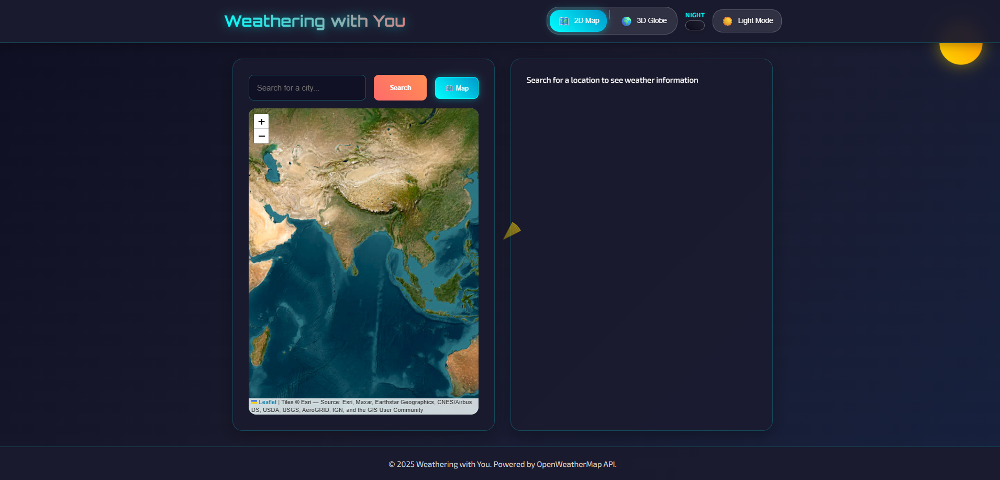
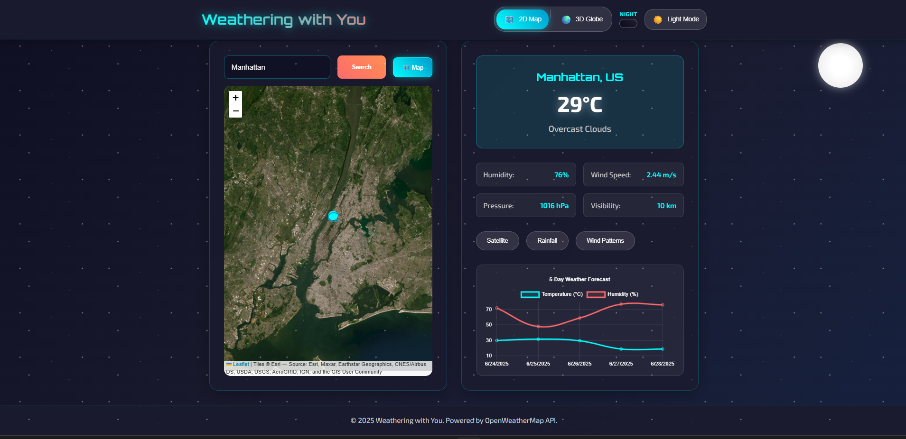
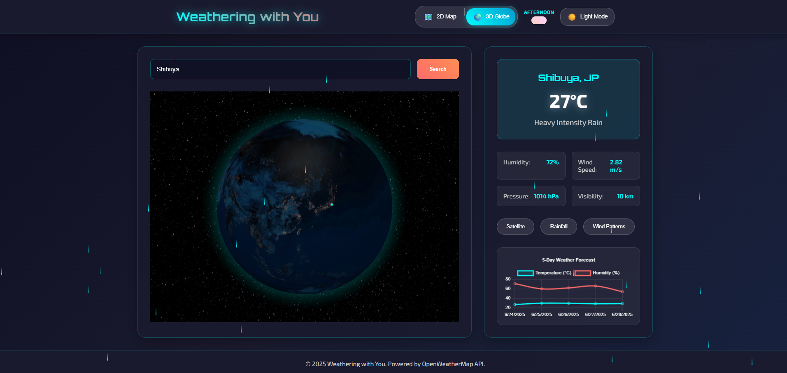

# 🌤️ Weathering with You - Advanced React Weather Application

## 📖 Objective
This project is a visually immersive, interactive weather dashboard built with ReactJS. Designed to master API integration, data visualization, and advanced UI/UX, it enables users to explore real-time weather data, animated stats, and global weather patterns in both 2D and 3D. The goal was to push the boundaries of frontend development with modern libraries and responsive design.

---

## 📄 DESCRIPTION

This project is an advanced weather visualization app built with React.js and OpenWeatherMap API. It includes an interactive 3D globe, 2D map view, weather overlays (rain, wind, satellite), and real-time visual animations (rainfall, snow, clouds, night sky) based on current conditions. The app dynamically adjusts themes based on time and weather, creating an emotional and engaging experience that goes beyond traditional weather apps.

### 🌟 Key Highlights
- **Immersive 3D Experience**: Interactive globe with auto-rotation and location-based navigation
- **Dynamic Weather Animations**: Real-time visual effects that match current weather conditions
- **Intelligent Theming**: Automatic theme switching based on time of day and weather conditions
- **Advanced Data Visualization**: Interactive charts and weather forecasting
- **Responsive Design**: Seamless experience across all devices and screen sizes

## ⚙️ TECHNOLOGIES USED

- **React.js** (v18.2.0) - Frontend framework
- **Three.js** (v0.150.1) - 3D graphics library
- **react-globe.gl** (v2.28.0) - Interactive 3D globe component
- **Leaflet.js** (v1.9.4) - 2D map visualization
- **react-leaflet** (v4.2.1) - React wrapper for Leaflet
- **Chart.js** (v4.4.0) - Data visualization and forecasting charts
- **react-chartjs-2** (v5.2.0) - React wrapper for Chart.js
- **Axios** (v1.6.0) - HTTP client for API requests
- **CSS3 & Canvas** - Advanced styling and animations
- **OpenWeatherMap API** - Real-time weather data

## 🌟 FEATURES

### 🌍 Interactive Maps & Visualization
- **3D Interactive Globe**: Auto-rotating globe with location markers and atmospheric effects
- **2D World Map**: Leaflet-based map with multiple overlay options
- **Location Search**: Geocoding with real-time location suggestions
- **Weather Overlays**: Satellite, rainfall, and wind pattern overlays
- **Zoom & Navigation**: Smooth camera controls and location-based navigation

### 🌈 Dynamic Weather Animations
- **Rain Animation**: Realistic raindrop effects with varying intensity
- **Snow Animation**: Gentle snowfall with unique snowflake patterns
- **Wind Effects**: Dynamic wind particles and cloud movement
- **Cloud Systems**: Layered cloud animations with realistic opacity
- **Day/Night Transitions**: Smooth gradient changes and celestial animations
- **Starfield Effects**: Animated stars and moon for night scenes

### 🎨 Intelligent Theming System
- **Time-Based Gradients**: Automatic background changes based on time of day
- **Weather-Responsive Themes**: Theme adaptation to current weather conditions
- **Manual Theme Switcher**: User-controlled light/dark mode toggle
- **Mood-Based Styling**: Visual atmosphere that matches weather mood
- **Smooth Transitions**: Fluid animations between different themes

### 📊 Advanced Weather Data
- **Real-Time Weather**: Current conditions with detailed metrics
- **5-Day Forecast**: Extended weather predictions with trend analysis
- **Interactive Charts**: Temperature and humidity forecasting graphs
- **Weather Metrics**: Temperature, humidity, wind speed, pressure, visibility
- **Location Management**: Multiple location support with search functionality

### 🧩 Component Architecture
- **Modular Design**: Reusable components for maintainability
- **Context API**: Global state management for weather data
- **Error Handling**: Comprehensive error states and user feedback
- **Loading States**: Smooth loading animations and progress indicators
- **Responsive Layout**: Mobile-first design with adaptive components

## 🧱 PROJECT STRUCTURE

```
Experiment-12_ReactJS_Weather-app/
├── output/                  # Screenshots of app features
├── public/
│   ├── index.html           # Main HTML template
│   ├── favicon.ico, logos   # App icons
│   └── manifest.json        # PWA manifest
├── src/
│   ├── App.js, App.css      # Main app logic & styles
│   ├── index.js, index.css  # Entry point & global styles
│   ├── context/
│   │   └── WeatherContext.js# Global weather state/context
│   ├── components/
│   │   ├── WeatherInfo.js   # Weather data display
│   │   ├── Map2D.js         # 2D weather map
│   │   ├── GlobeMap.js      # 3D globe visualization
│   │   ├── WeatherAnimator.js # Animated weather visuals
│   │   ├── ThemeSwitcher.js # Light/dark mode toggle
│   │   └── ViewModeSwitcher.js # 2D/3D toggle
│   └── ...                  # Other assets & tests
├── package.json             # Project dependencies
└── README.md                # Project documentation
```

---

## ⚙️ Setup & Usage Instructions

### # Windows
```powershell
npm install
npm start
```

### # macOS / Linux
```bash
npm install
npm start
```

- The app runs at [http://localhost:3000](http://localhost:3000)
- For a production build:
  ```bash
  npm run build
  ```

---

## ✨ Key Features
- Real-time weather data via public APIs
- Animated weather stats and charts
- Interactive 2D map (Leaflet) and 3D globe (Three.js)
- Toggle between 2D and 3D world views
- Theme switcher (light/dark mode)
- Responsive, mobile-first design
- Modular, reusable React components
- Smooth transitions and engaging UI/UX

---

## 📸 Output Analysis


*The landing page introduces the app with a modern dashboard, search bar, and quick access to weather features.*


*Detailed weather statistics and animated charts provide a visual breakdown of temperature, humidity, and more.*


*Explore global weather patterns on an interactive 3D globe, with real-time data visualized in a stunning format.*

---

## 🎓 Learning Outcomes
- Integrating third-party APIs in React
- Visualizing data with Chart.js and custom animations
- Building interactive maps with Leaflet and Three.js
- Managing global state with React Context
- Designing for accessibility and responsiveness
- Modularizing complex UIs with reusable components

---

## 🧠 My Journey & Reflections
Building Atmos was a deep dive into advanced frontend engineering. Integrating multiple visualization libraries and handling real-time data challenged me to think modularly and design for performance. Debugging 3D rendering and ensuring a seamless user experience across devices was both tough and rewarding. This project expanded my skills in data-driven UI and inspired me to keep exploring the intersection of design and technology.

---

## 🔗 Connect with Me
- **GitHub:** [bavish007](https://github.com/bavish007)
- **LinkedIn:** [bavishreddymuske](https://www.linkedin.com/in/bavishreddymuske)

---

© 2025 M. Bavish Reddy. All rights reserved.
