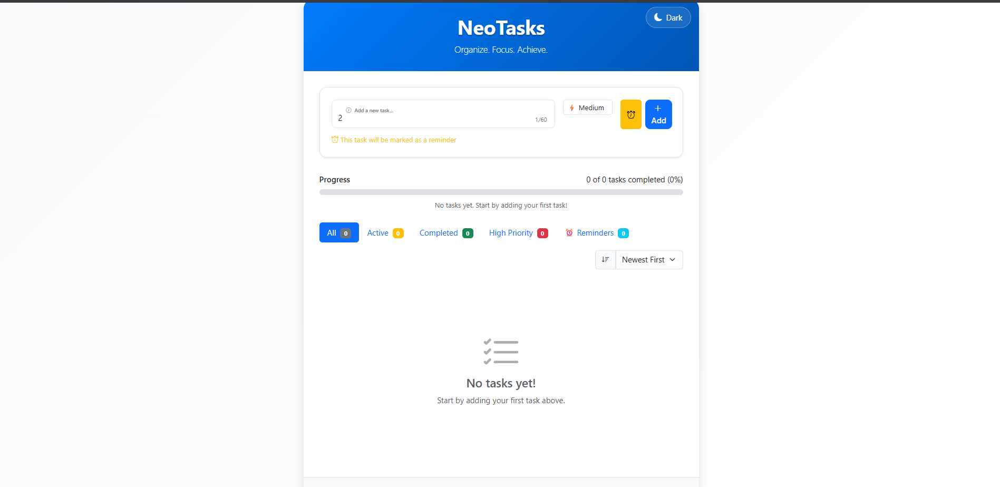
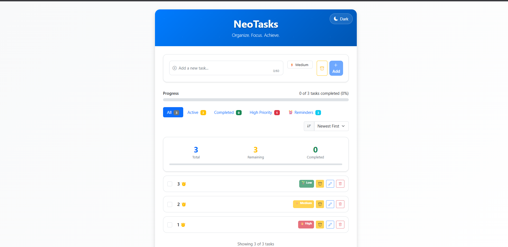
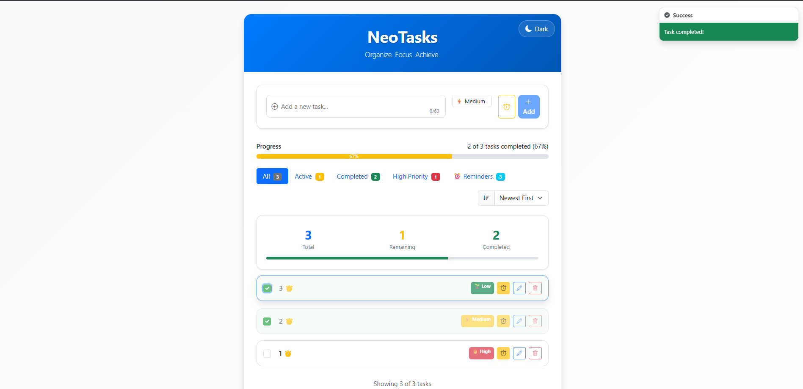
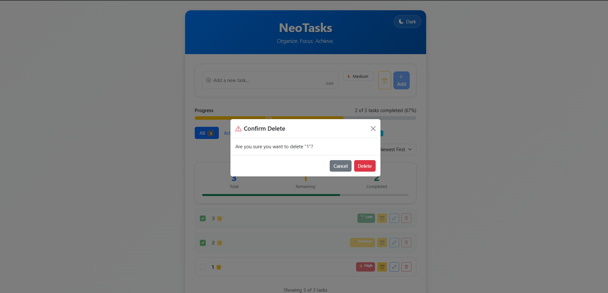

# ✅ NeoTasks - Advanced React Todo Application

## 📖 Objective
This project is a sleek, productivity-focused Todo application built with ReactJS and Bootstrap. Designed to master state management, component architecture, and user-centric UI, it enables users to efficiently manage, filter, and track their daily tasks. The goal was to create a visually appealing, interactive, and accessible app that streamlines task management for modern users.

---

## 🛠️ Technologies Used
- **ReactJS** (v19+)
- **Bootstrap 5** (UI framework)
- **Bootstrap Icons** (iconography)
- **CSS3** (custom styles, dark mode)
- **Jest & React Testing Library** (unit testing)
- **JavaScript (ES6+)**

---

## 📂 Folder Structure
```plaintext
Experiment-13_ReactJS_Todo-app/
├── output/                  # Screenshots of app features
├── public/
│   ├── index.html           # Main HTML template
│   ├── favicon.ico, logos   # App icons
│   └── manifest.json        # PWA manifest
├── src/
│   ├── App.js               # Main app logic
│   ├── index.js, index.css  # Entry point & global styles
│   ├── styles/
│   │   ├── App.css          # Main styles
│   │   └── DarkMode.css     # Dark mode styles
│   ├── components/
│   │   ├── TaskList.js      # Task list display
│   │   ├── TaskItem.js      # Individual task item
│   │   ├── TaskForm.js      # Add/edit task form
│   │   ├── Filters.js       # Task filtering controls
│   │   ├── ProgressBar.js   # Visual progress indicator
│   │   ├── Modal.js         # Confirmation modal
│   │   ├── ToastManager.js  # Toast notifications
│   │   └── ThemeToggle.js   # Light/dark mode toggle
│   └── ...                  # Other assets & tests
├── package.json             # Project dependencies
└── README.md                # Project documentation
```

---

## ⚙️ Setup & Usage Instructions

### # Windows
```powershell
npm install
npm start
```

### # macOS / Linux
```bash
npm install
npm start
```

- The app runs at [http://localhost:3000](http://localhost:3000)
- For a production build:
  ```bash
  npm run build
  ```

---

## ✨ Key Features
- Add, edit, complete, and delete tasks with ease
- Filter tasks by status (all, active, completed)
- Progress bar visualizes completion rate
- Confirmation modal for safe deletions
- Toast notifications for user feedback
- Responsive, mobile-first design
- Dark mode toggle for comfortable viewing
- Modular, reusable React components

---

## 📸 Output Analysis


*The main dashboard displays all tasks, quick actions, and a progress bar for visual productivity tracking.*


*Adding a new task with instant feedback and smooth UI transitions.*


*Marking tasks as complete updates the progress bar and moves them to the completed section.*


*A confirmation modal ensures tasks are not deleted accidentally, enhancing user safety.*

---

## 🎓 Learning Outcomes
- Managing state and props in React
- Building modular, maintainable UI components
- Implementing responsive layouts with Bootstrap
- Handling user input, validation, and feedback
- Integrating dark mode and accessibility features
- Writing and running unit tests with Jest

---

## 🧠 My Journey & Reflections
Building TaskFlow was a rewarding exercise in balancing functionality and user experience. Designing for both light and dark modes, and ensuring smooth task management, deepened my understanding of React's component model. Debugging state updates and perfecting the UI flow taught me the value of attention to detail. This project has made me more confident in building polished, user-friendly web apps.

---

## 🔗 Connect with Me
- **GitHub:** [bavish007](https://github.com/bavish007)
- **LinkedIn:** [bavishreddymuske](https://www.linkedin.com/in/bavishreddymuske)

---

© 2025 M. Bavish Reddy. All rights reserved.
