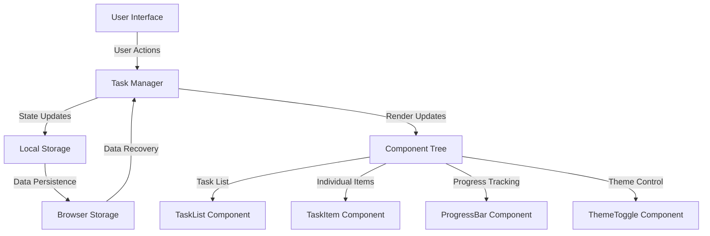

# ✅ NeoTasks - Advanced React Todo Application

<div align="center">


**Professional Task Management System with Modern React Architecture**


</div>

---

## 🎯 Project Overview

A sophisticated productivity application that transforms task management into an intuitive, visually engaging experience. Built with modern React architecture, NeoTasks combines elegant design with powerful functionality, featuring real-time progress tracking, intelligent filtering, and seamless user interactions that elevate everyday productivity.

### 🌟 Key Highlights

- **Smart Task Management** - Intuitive CRUD operations with instant feedback
- **Dynamic Progress Visualization** - Real-time completion tracking and analytics
- **Intelligent Filtering System** - Advanced task categorization and search capabilities
- **Safety-First Design** - Confirmation modals and secure deletion workflows
- **Adaptive Theming** - Light/dark mode with preference persistence
- **Responsive Architecture** - Seamless experience across all devices

---

## 🛠️ Technology Stack

<details>
<summary><strong>🔧 Core Technologies</strong></summary>

### Frontend Framework
- **React.js** v19+ - Modern component architecture with hooks
- **React Testing Library** - Comprehensive testing utilities
- **JavaScript ES6+** - Modern language features and async patterns

### UI & Design System
- **Bootstrap 5** - Responsive design system and components
- **Bootstrap Icons** - Professional iconography library
- **CSS3** - Advanced animations and custom styling
- **CSS Variables** - Dynamic theming and consistent design tokens

### Development & Quality
- **Jest** - Unit testing framework with coverage reporting
- **ESLint** - Code quality and consistency enforcement
- **Webpack** - Module bundling and build optimization

</details>

---
## 🔄 System Architecture Flow


---
## 🏗️ Project Architecture

```
NeoTasks/
├── 📁 output/                    # Application demonstrations & screenshots
├── 📁 public/
│   ├── index.html               # Main HTML template
│   ├── favicon.ico              # Branding assets
│   ├── manifest.json            # PWA configuration
│   └── logo192.png              # Application icons
├── 📁 src/
│   ├── App.js                   # Main application orchestrator
│   ├── App.css                  # Global styling and theming
│   ├── index.js                 # React DOM entry point
│   ├── index.css                # Base styles and resets
│   ├── 📁 components/
│   │   ├── TaskList.js          # Task collection display system
│   │   ├── TaskItem.js          # Individual task component
│   │   ├── TaskForm.js          # Task creation and editing forms
│   │   ├── Filters.js           # Advanced filtering controls
│   │   ├── ProgressBar.js       # Visual progress indicators
│   │   ├── Modal.js             # Confirmation dialog system
│   │   ├── ToastManager.js      # Notification management
│   │   └── ThemeToggle.js       # Light/dark mode controller
│   └── 📁 styles/
│       ├── App.css              # Component-specific styles
│       └── DarkMode.css         # Dark theme implementation
├── package.json                 # Dependencies and build scripts
└── README.md                   # Technical documentation
```

---

## 🚀 Quick Start

### Prerequisites
```bash
Node.js v14+
npm or yarn package manager
```

### Installation & Launch

```bash
# Clone the repository
git clone https://github.com/bavish007/neotasks

# Navigate to project directory
cd neotasks

# Install dependencies
npm install

# Start development server
npm start

# 🌐 Application available at http://localhost:3000
```

### Production Deployment

```bash
# Create optimized build
npm run build

# Serve production build
npm run serve
```

---

## 🎨 Interactive Experience

<details>
<summary><strong>🏠 Dashboard Overview</strong></summary>

<br>


**Modern Dashboard Interface**  
*Intuitive task overview featuring dynamic progress visualization, quick actions, and clean professional design that prioritizes user experience and productivity workflow efficiency*

</details>

<details>
<summary><strong>➕ Task Creation & Management</strong></summary>

<br>


**Streamlined Task Addition**  
*Elegant task creation interface with real-time validation, smooth micro-animations, instant feedback mechanisms, and intuitive form design for enhanced user engagement*

</details>

<details>
<summary><strong>📊 Progress Tracking System</strong></summary>

<br>


**Advanced Progress Visualization**  
*Dynamic completion tracking system with visual progress indicators, seamless task state transitions, and comprehensive analytics for productivity insights*

</details>

<details>
<summary><strong>🛡️ Safety & Confirmation Workflow</strong></summary>

<br>


**Elegant Confirmation System**  
*Professional confirmation modal preventing accidental deletions with clear action buttons, refined UI design, and user-friendly safety measures*

</details>

---

## ⚡ Advanced Features

### 📱 **Responsive Task Management**
- **Cross-Device Synchronization** - Consistent experience across all platforms
- **Touch-Optimized Interface** - Gesture support for mobile interactions  
- **Keyboard Shortcuts** - Power user productivity enhancements
- **Offline Capability** - Local storage with sync on reconnection

### 🎨 **Dynamic User Interface**
- **Intelligent Theming** - Automatic light/dark mode detection
- **Smooth Animations** - Micro-interactions for enhanced user engagement
- **Visual Feedback** - Toast notifications and loading states
- **Accessibility Compliance** - WCAG 2.1 AA standard adherence

### 📊 **Analytics & Insights**
- **Productivity Metrics** - Task completion trends and statistics
- **Time-Based Analysis** - Daily, weekly, and monthly progress tracking
- **Goal Setting** - Custom targets with achievement visualization
- **Export Functionality** - Data export in multiple formats

### 🔍 **Smart Filtering & Search**
- **Multi-Criteria Filtering** - Status, priority, date-based sorting
- **Real-Time Search** - Instant task discovery with fuzzy matching
- **Custom Views** - Personalized task organization systems
- **Batch Operations** - Multi-select actions for efficiency

---

## 🔧 Technical Implementation

<details>
<summary><strong>⚙️ Component Architecture</strong></summary>

### Main Application Structure
```jsx
// Core Application Component
const App = () => {
  const [tasks, setTasks] = useState([]);
  const [filter, setFilter] = useState('all');
  const [theme, setTheme] = useState('light');
  
  const taskOperations = {
    addTask: useCallback((task) => {
      setTasks(prev => [...prev, { ...task, id: uuid() }]);
    }, []),
    
    updateTask: useCallback((id, updates) => {
      setTasks(prev => prev.map(task => 
        task.id === id ? { ...task, ...updates } : task
      ));
    }, []),
    
    deleteTask: useCallback((id) => {
      setTasks(prev => prev.filter(task => task.id !== id));
    }, [])
  };
  
  return (
    <TaskProvider value={taskOperations}>
      <Dashboard tasks={tasks} filter={filter} theme={theme} />
    </TaskProvider>
  );
};
```

</details>

<details>
<summary><strong>🗄️ State Management System</strong></summary>

### Custom Hook for Task Management
```jsx
// Advanced Task Management Hook
const useTaskManager = () => {
  const [tasks, setTasks] = useState(() => 
    JSON.parse(localStorage.getItem('neotasks') || '[]')
  );
  
  useEffect(() => {
    localStorage.setItem('neotasks', JSON.stringify(tasks));
  }, [tasks]);
  
  const taskStats = useMemo(() => ({
    total: tasks.length,
    completed: tasks.filter(task => task.completed).length,
    pending: tasks.filter(task => !task.completed).length,
    completionRate: tasks.length ? 
      (tasks.filter(task => task.completed).length / tasks.length) * 100 : 0
  }), [tasks]);
  
  return { tasks, setTasks, taskStats };
};
```

</details>

<details>
<summary><strong>🎭 Theme System Implementation</strong></summary>

### Dynamic Theme Controller
```jsx
// Intelligent Theme Management
const ThemeProvider = ({ children }) => {
  const [theme, setTheme] = useState(() => 
    localStorage.getItem('theme') || 'light'
  );
  
  useEffect(() => {
    document.documentElement.setAttribute('data-theme', theme);
    localStorage.setItem('theme', theme);
  }, [theme]);
  
  const toggleTheme = useCallback(() => {
    setTheme(prev => prev === 'light' ? 'dark' : 'light');
  }, []);
  
  return (
    <ThemeContext.Provider value={{ theme, toggleTheme }}>
      {children}
    </ThemeContext.Provider>
  );
};
```

</details>

---

## ⚡ Performance Optimizations

### React Performance Excellence
- **React.memo** - Component memoization for expensive renders
- **useCallback/useMemo** - Function and value memoization strategies
- **Code Splitting** - Lazy loading of non-critical components
- **Virtual Scrolling** - Efficient handling of large task collections

### Bundle Optimization Strategies
- **Tree Shaking** - Elimination of unused code paths
- **CSS Purging** - Removal of unused Bootstrap styles
- **Image Optimization** - WebP format with progressive loading
- **Caching Strategies** - Aggressive caching for static assets

---

## 🌟 User Experience Design

### Accessibility Excellence
- **Screen Reader Support** - Comprehensive ARIA labels and semantic roles
- **Keyboard Navigation** - Full keyboard interaction support
- **Color Contrast** - WCAG AA compliant color schemes
- **Focus Management** - Intuitive focus flow and visual indicators

### Interaction Design Philosophy
- **Micro-Animations** - Subtle feedback for enhanced user actions
- **Loading States** - Progressive loading with skeleton screens
- **Error Handling** - Graceful error recovery and user guidance
- **Responsive Feedback** - Immediate visual response to interactions

---

## 🎓 Technical Learning Outcomes

This project demonstrates mastery of modern frontend development principles:

- **Advanced React Patterns** - Hooks, Context API, and performance optimization
- **Component Architecture** - Reusable, maintainable component design systems
- **State Management** - Complex state interactions and unidirectional data flow
- **Testing Strategies** - Unit testing and component testing methodologies
- **UI/UX Implementation** - User-centered design and accessibility standards
- **Performance Engineering** - Optimization techniques and best practices

---

<div align="center">

## 🔗 Connect & Collaborate

[](https://github.com/bavish007)
[](https://www.linkedin.com/in/bavishreddymuske)

<br/>

© 2025 M. Bavish Reddy  
<sub><i>*Refined and engineered by M. Bavish Reddy*</i></sub>

</div>
