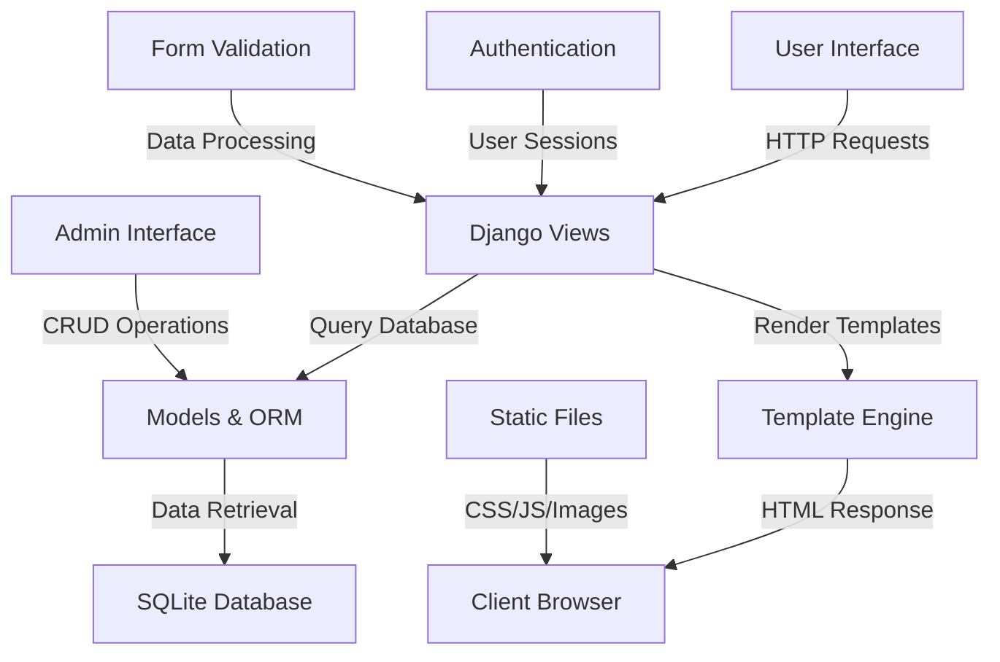
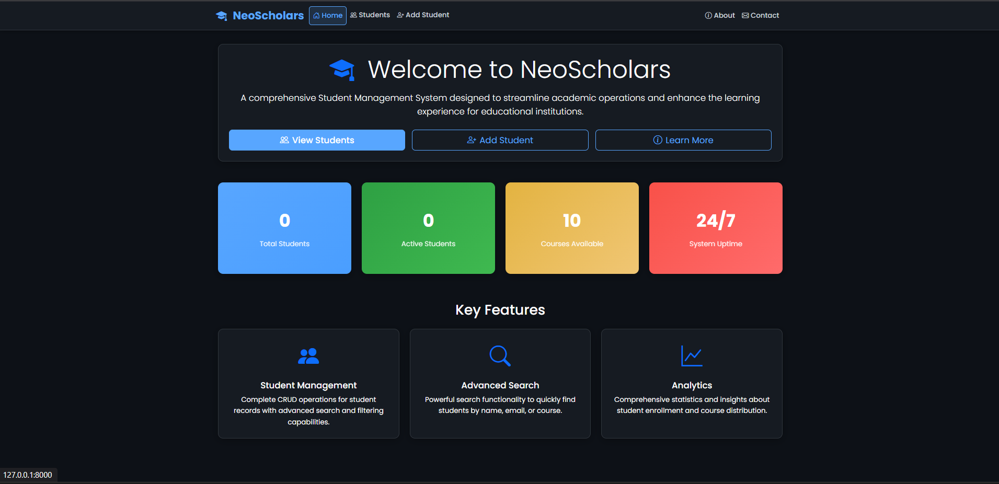
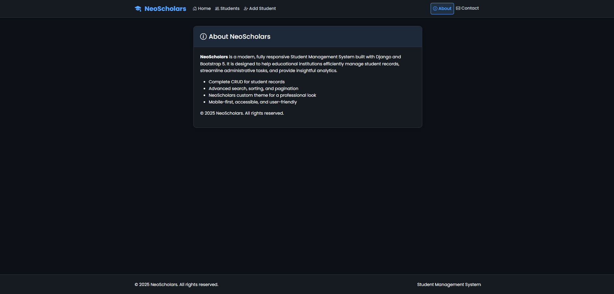
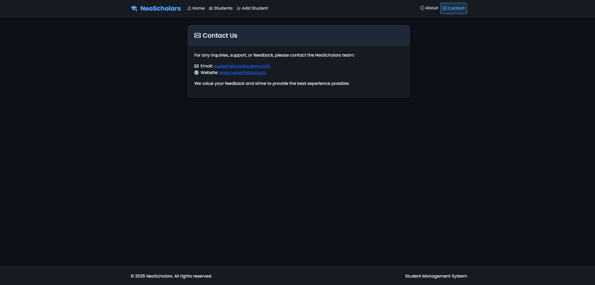
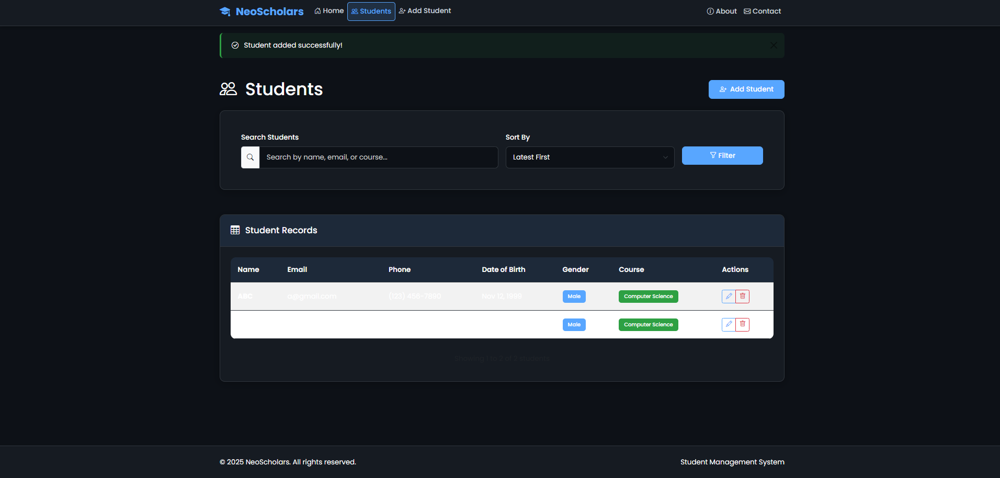
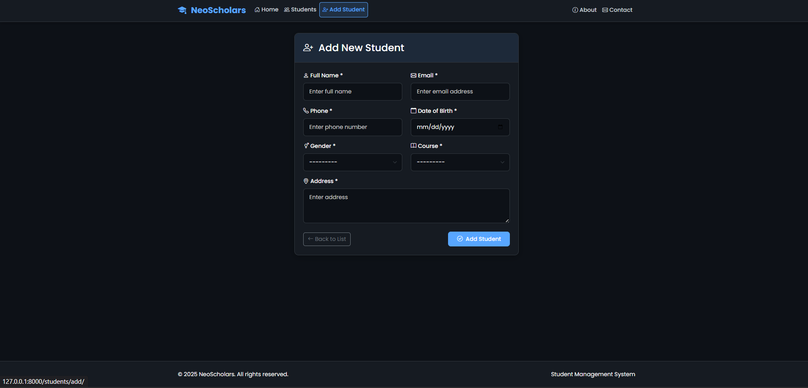
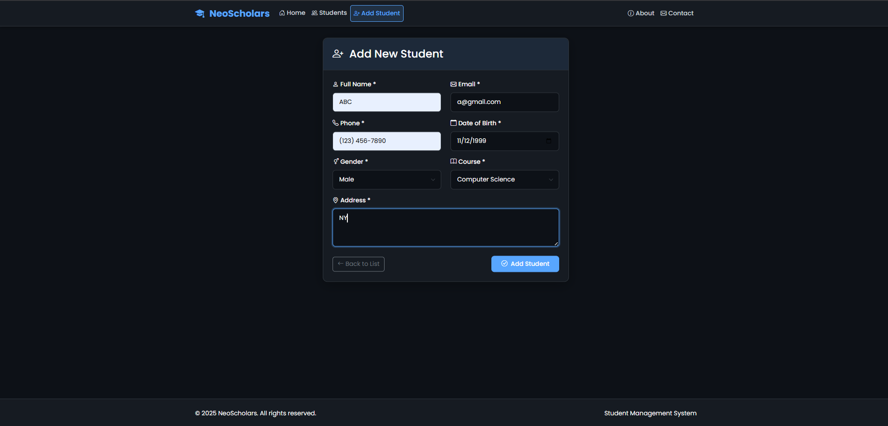
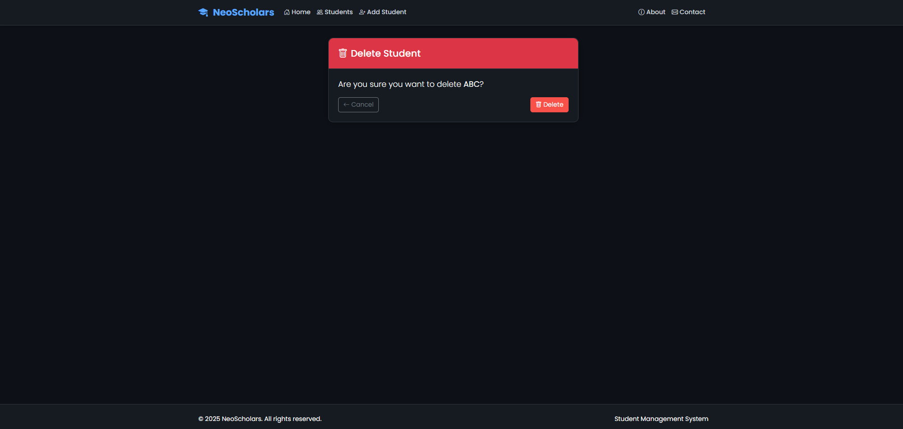

# 🎓 NeoScholars - Django Student Management System

<div align="center">


**Robust Web-Based Student Management Platform**

[🚀 Quick Start](#-quick-start) • [📱 Features](#-core-features) • [🏗️ Architecture](#-project-architecture) • [📸 Demo](#-application-showcase)

</div>

---

## 🎯 Project Overview

A sophisticated, web-based student management system built with Django framework. Designed to master full-stack web development principles, NeoScholars enables efficient management of student records, robust user authentication, and comprehensive data validation. This scalable, secure, and user-friendly platform streamlines student data handling and administrative workflows for educational institutions.

### 🎯 Development Objectives
- **Master Full-Stack Development** - Complete Django web application lifecycle
- **Implement Secure Authentication** - User registration and login systems
- **Design Scalable Architecture** - Modular Django project structure
- **Create Responsive UI/UX** - Mobile-first design with Bootstrap integration
- **Ensure Data Integrity** - Comprehensive validation and error handling

---

## 🛠️ Technology Stack

<details>
<summary><strong>🐍 Backend Technologies</strong></summary>

### Core Framework
- **Python 3.x** - Modern programming language with robust ecosystem
- **Django 4.x** - High-level web framework for rapid development
- **SQLite** - Lightweight, serverless database engine

### Database & ORM
- **Django ORM** - Object-relational mapping for database interactions
- **SQLite Database** - Default database with migration support
- **Model Relationships** - Foreign keys and database constraints

</details>

<details>
<summary><strong>🎨 Frontend Technologies</strong></summary>

### UI Framework & Styling
- **HTML5** - Semantic markup and modern web standards
- **CSS3** - Advanced styling with custom properties
- **Bootstrap 5** - Responsive design system and components
- **JavaScript ES6+** - Modern client-side scripting for form enhancements

### Design System
- **Custom Theming** - Consistent visual identity
- **Responsive Layout** - Mobile-first responsive design
- **Icon Library** - Professional iconography integration

</details>

---

## 🏗️ Project Architecture

```
NeoScholars/
├── 📸 output/                    # Application demonstrations & screenshots
├── 📁 main/                      # Core application module
│   ├── 📁 templates/
│   │   ├── about.html           # About page template
│   │   ├── contact.html         # Contact page template
│   │   ├── home.html            # Landing page template
│   │   ├── login.html           # User authentication template
│   │   └── register.html        # User registration template
│   ├── 📁 static/               # Main application assets
│   │   └── css/                 # Core stylesheets
│   ├── views.py                 # Main application views
│   ├── models.py                # Core data models
│   ├── admin.py                 # Admin interface configuration
│   └── urls.py                  # URL routing patterns
├── 📁 students/                  # Student management module
│   ├── 📁 templates/students/
│   │   ├── list.html            # Student listing template
│   │   ├── form.html            # Student data entry form
│   │   ├── delete.html          # Deletion confirmation template
│   │   ├── about.html           # Student module about page
│   │   └── contact.html         # Student module contact page
│   ├── 📁 static/css/
│   │   └── theme.css            # Student module custom styling
│   ├── models.py                # Student data models
│   ├── views.py                 # Student CRUD operations
│   ├── forms.py                 # Form definitions and validation
│   ├── admin.py                 # Student admin configuration
│   ├── urls.py                  # Student URL patterns
│   └── tests.py                 # Unit tests and test cases
├── 📁 studentmgmt/              # Project configuration
│   ├── settings.py              # Django project settings
│   ├── urls.py                  # Root URL configuration
│   ├── wsgi.py                  # WSGI application entry point
│   ├── asgi.py                  # ASGI application entry point
│   └── __init__.py              # Python package initialization
├── 🗄️ db.sqlite3               # SQLite database file
├── ⚙️ manage.py                 # Django management command interface
└── 📋 requirements.txt          # Python dependency specifications
```

---

## 🔄 System Architecture Flow



---

## 🚀 Quick Start

### Prerequisites
```bash
Python 3.8+ installed
pip package manager
Git version control
```

### Installation & Setup

<details>
<summary><strong>🪟 Windows Setup</strong></summary>

```powershell
# Clone the repository
git clone https://github.com/bavish007/neoscholars

# Navigate to project directory
cd neoscholars

# Create virtual environment
python -m venv venv

# Activate virtual environment
venv\Scripts\activate

# Install dependencies
pip install -r requirements.txt

# Apply database migrations
python manage.py migrate

# Create superuser account
python manage.py createsuperuser

# Start development server
python manage.py runserver
```

</details>

<details>
<summary><strong>🐧 macOS / Linux Setup</strong></summary>

```bash
# Clone the repository
git clone https://github.com/bavish007/neoscholars

# Navigate to project directory
cd neoscholars

# Create virtual environment
python3 -m venv venv

# Activate virtual environment
source venv/bin/activate

# Install dependencies
pip install -r requirements.txt

# Apply database migrations
python manage.py migrate

# Create superuser account
python manage.py createsuperuser

# Start development server
python manage.py runserver
```

</details>

### 🌐 Access Application
- **Main Application**: [http://localhost:8000](http://localhost:8000)
- **Admin Dashboard**: [http://localhost:8000/admin](http://localhost:8000/admin)

---

## ✨ Core Features

### 🎓 **Student Record Management**
- **Complete CRUD Operations** - Add, view, edit, and delete student records
- **Data Validation** - Comprehensive form validation and error handling
- **Search & Filter** - Advanced student record discovery and sorting
- **Bulk Operations** - Efficient multi-record management capabilities

### 🔐 **Authentication & Security**
- **User Registration** - Secure account creation with validation
- **Login System** - Session-based authentication with security measures
- **Permission Management** - Role-based access control and authorization
- **Admin Dashboard** - Advanced administrative interface for superusers

### 🎨 **User Interface & Experience**
- **Responsive Design** - Mobile-first responsive layout with Bootstrap
- **Custom Theming** - Professional visual identity and consistent styling
- **Intuitive Navigation** - Clean, user-friendly interface design
- **Form Enhancements** - JavaScript-powered interactive form elements

### 📊 **Data Management**
- **Relational Database** - SQLite with Django ORM integration
- **Model Relationships** - Structured data models with foreign key constraints
- **Migration System** - Database schema versioning and updates
- **Data Integrity** - Comprehensive validation and sanitization

---

## 📸 Application Showcase

<details>
<summary><strong>🏠 Landing Page & Navigation</strong></summary>

<br>


**Professional Landing Interface**  
*Welcoming homepage featuring intuitive navigation, quick access to core features, and modern design elements that create an engaging first impression for users*

</details>

<details>
<summary><strong>ℹ️ About & Information Pages</strong></summary>

<br>


**System Overview & Mission**  
*Comprehensive about page outlining the system's mission, core values, development background, and educational objectives with professional presentation*

</details>

<details>
<summary><strong>📞 Contact & Support</strong></summary>

<br>


**User Support & Communication**  
*Professional contact interface featuring user-friendly contact forms, support channels, and feedback mechanisms for enhanced user engagement*

</details>

<details>
<summary><strong>📋 Student Record Management</strong></summary>

<br>


**Comprehensive Student Directory**  
*Advanced student listing interface displaying all records with intuitive options to view detailed information, edit existing entries, or safely delete records*

</details>

<details>
<summary><strong>📝 Data Entry & Forms</strong></summary>

<br>


**Intelligent Data Entry System**  
*Sophisticated student information form with real-time validation, user-friendly input fields, and comprehensive error handling for seamless data entry*


**Entry Confirmation & Review**  
*Professional confirmation interface displaying successfully entered student details with options for review, editing, and final submission verification*

</details>

<details>
<summary><strong>🛡️ Safety & Confirmation</strong></summary>

<br>


**Secure Deletion Workflow**  
*Elegant confirmation dialog ensuring safe deletion of student records with clear action buttons and user-friendly safety measures to prevent accidental data loss*

</details>

---

## 🔧 Technical Implementation

<details>
<summary><strong>🏗️ Django Architecture</strong></summary>

### Model Design
```python
# Student Data Model
class Student(models.Model):
    student_id = models.CharField(max_length=20, unique=True)
    first_name = models.CharField(max_length=50)
    last_name = models.CharField(max_length=50)
    email = models.EmailField(unique=True)
    phone_number = models.CharField(max_length=15)
    date_of_birth = models.DateField()
    enrollment_date = models.DateTimeField(auto_now_add=True)
    
    class Meta:
        ordering = ['last_name', 'first_name']
        verbose_name_plural = "Students"
    
    def __str__(self):
        return f"{self.first_name} {self.last_name}"
```

### View Implementation
```python
# Student Management Views
class StudentListView(ListView):
    model = Student
    template_name = 'students/list.html'
    context_object_name = 'students'
    paginate_by = 10
    
    def get_queryset(self):
        queryset = Student.objects.all()
        search_query = self.request.GET.get('search')
        if search_query:
            queryset = queryset.filter(
                Q(first_name__icontains=search_query) |
                Q(last_name__icontains=search_query) |
                Q(student_id__icontains=search_query)
            )
        return queryset

class StudentCreateView(CreateView):
    model = Student
    form_class = StudentForm
    template_name = 'students/form.html'
    success_url = reverse_lazy('student_list')
```

</details>

<details>
<summary><strong>📝 Form Validation</strong></summary>

### Custom Form Implementation
```python
# Student Form with Validation
class StudentForm(forms.ModelForm):
    class Meta:
        model = Student
        fields = ['student_id', 'first_name', 'last_name', 
                 'email', 'phone_number', 'date_of_birth']
        widgets = {
            'date_of_birth': forms.DateInput(attrs={'type': 'date'}),
            'email': forms.EmailInput(attrs={'class': 'form-control'}),
            'phone_number': forms.TextInput(attrs={'pattern': '[0-9]{10}'})
        }
    
    def clean_student_id(self):
        student_id = self.cleaned_data['student_id']
        if not student_id.isalnum():
            raise forms.ValidationError("Student ID must be alphanumeric")
        return student_id
    
    def clean_email(self):
        email = self.cleaned_data['email']
        if Student.objects.filter(email=email).exists():
            raise forms.ValidationError("Email already exists")
        return email
```

</details>

<details>
<summary><strong>🔐 Authentication System</strong></summary>

### User Authentication Views
```python
# Custom Authentication Views
class CustomLoginView(LoginView):
    template_name = 'registration/login.html'
    redirect_authenticated_user = True
    
    def get_success_url(self):
        return reverse_lazy('student_list')

class CustomRegistrationView(CreateView):
    form_class = UserCreationForm
    template_name = 'registration/register.html'
    success_url = reverse_lazy('login')
    
    def form_valid(self, form):
        user = form.save()
        username = form.cleaned_data.get('username')
        messages.success(self.request, f'Account created for {username}!')
        return super().form_valid(form)
```

</details>

---

## 🎓 Learning Outcomes & Technical Skills

This project demonstrates comprehensive mastery of full-stack web development:

### **Django Framework Expertise**
- **MVC Architecture** - Model-View-Controller pattern implementation
- **ORM Proficiency** - Database operations and query optimization
- **Template System** - Dynamic HTML generation with Django templates
- **URL Routing** - Clean URL patterns and namespace organization

### **Database Management**
- **Relational Design** - Normalized database schema design
- **Migration System** - Database versioning and schema updates
- **Data Validation** - Model-level and form-level validation strategies
- **Query Optimization** - Efficient database queries and indexing

### **Security & Authentication**
- **User Management** - Registration, login, and session handling
- **Permission Systems** - Role-based access control implementation
- **Data Protection** - Input sanitization and CSRF protection
- **Admin Interface** - Secure administrative dashboard configuration

### **Frontend Integration**
- **Responsive Design** - Mobile-first Bootstrap implementation
- **Form Enhancement** - JavaScript-powered interactive elements
- **UI/UX Design** - User-centered interface design principles
- **Cross-Browser Compatibility** - Consistent experience across platforms

---

## 🌟 Professional Development Journey

Developing NeoScholars provided an immersive experience in Django's comprehensive ecosystem and full-stack development principles. The implementation of robust form validation, user authentication workflows, and administrative features reinforced the critical importance of clean architectural patterns and exceptional user experience design.

The challenge of debugging complex model relationships, optimizing database queries, and perfecting responsive UI flows proved both demanding and highly rewarding. This project has established a solid foundation for building scalable, production-ready web applications with enterprise-level quality and security standards.

Key technical achievements include mastering Django's ORM for efficient database operations, implementing secure authentication systems, and creating intuitive user interfaces that prioritize accessibility and user engagement.

---

<div align="center">

## 🔗 Connect & Collaborate

[](https://github.com/bavish007)
[](https://www.linkedin.com/in/bavishreddymuske)

<br/>

© 2025 M. Bavish Reddy  
<sub><i>*Refined and engineered by M. Bavish Reddy*</i></sub>

</div>
