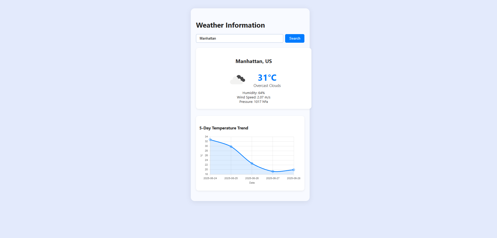

# ⛅ Weatherly – Django Weather Dashboard

<div align="center">


*A clean, interactive weather dashboard built with Django featuring real-time API integration and modern responsive design*

</div>

---

## 🎯 Project Overview

**Weatherly** is a full-stack weather dashboard that demonstrates mastery of API integration, form handling, and dynamic data visualization. Users can search for any city worldwide and instantly view comprehensive weather data through a modern, responsive interface powered by the OpenWeatherMap API.

### 🔑 Core Objectives
- Master Django API integration patterns
- Implement robust form handling and validation  
- Create dynamic, data-driven UI components
- Build responsive, professional web interfaces
- Strengthen full-stack development skills

---

## 🛠️ Technology Stack

<details>
<summary><strong>📋 Complete Tech Breakdown</strong></summary>

| Category | Technology | Purpose |
|----------|------------|---------|
| **Backend** | Python 3 | Core application language |
| **Framework** | Django | Web framework & ORM |
| **Frontend** | HTML5 & CSS3 | Template structure & styling |
| **UI Framework** | Bootstrap | Responsive design system |
| **Interactivity** | JavaScript (ES6+) | Form enhancements & UX |
| **API Integration** | OpenWeatherMap API | Real-time weather data |
| **Database** | SQLite | Development database |

</details>

---

## 📂 Project Architecture

```plaintext
Experiment-15_Django_WeatherApp/
├── output/                      # 📸 Application screenshots
├── main/                        # 🏠 Main application module
│   ├── templates/               #     HTML templates (index)
│   ├── static/                  #     CSS stylesheets
│   ├── views.py                 #     View controllers
│   ├── models.py                #     Data models
│   └── admin.py                 #     Admin configuration
├── weather/                     # 🌤️ Weather-specific module
│   ├── templates/weather/       #     Weather app templates
│   ├── static/                  #     Module-specific assets
│   ├── views.py                 #     Weather view logic
│   └── models.py                #     Weather data models
├── weatherapp/                  # ⚙️ Project configuration
│   ├── settings.py              #     Django settings
│   ├── urls.py                  #     URL routing
│   ├── wsgi.py                  #     WSGI configuration
│   └── asgi.py                  #     ASGI configuration
├── db.sqlite3                   # 🗄️ SQLite database
├── manage.py                    # 🔧 Django management script
└── requirements.txt             # 📦 Python dependencies
```

---

## 🚀 Quick Start Guide

<details>
<summary><strong>🪟 Windows Setup</strong></summary>

```powershell
# Clone and navigate to project
git clone <repository-url>
cd Experiment-15_Django_WeatherApp

# Create virtual environment
python -m venv venv
venv\Scripts\activate

# Install dependencies
pip install -r requirements.txt

# Database setup
python manage.py migrate

# Launch development server
python manage.py runserver
```

</details>

<details>
<summary><strong>🐧 macOS / Linux Setup</strong></summary>

```bash
# Clone and navigate to project
git clone <repository-url>
cd Experiment-15_Django_WeatherApp

# Create virtual environment
python3 -m venv venv
source venv/bin/activate

# Install dependencies
pip install -r requirements.txt

# Database setup
python manage.py migrate

# Launch development server
python manage.py runserver
```

</details>

### 🔐 Environment Configuration

> **Note:** Add your OpenWeatherMap API key to your environment variables or Django settings:
> ```python
> OPENWEATHER_API_KEY = "your_api_key_here"
> ```

**🌍 Access the application:** [http://localhost:8000](http://localhost:8000)

---

## ✨ Feature Showcase

### 🎯 Core Functionality
- **🔍 City Search** – Search for weather data from any city worldwide
- **🌡️ Real-time Data** – Live weather information via OpenWeatherMap API
- **📱 Responsive Design** – Optimized for desktop, tablet, and mobile devices
- **⚠️ Error Handling** – Graceful handling of invalid cities and API errors
- **🎨 Dynamic UI** – Weather icons and data that update based on conditions
- **🏗️ Modular Architecture** – Clean, maintainable Django app structure

### 🔧 Technical Highlights
- **API Integration** – Robust third-party API consumption patterns
- **Form Validation** – Secure user input handling and sanitization
- **Template Rendering** – Dynamic data presentation with Django templates
- **Static Asset Management** – Optimized CSS/JS delivery
- **Database Integration** – SQLite for development with production-ready patterns

---

## 📸 Application Gallery

<details>
<summary><strong>🖥️ View Screenshots</strong></summary>


*Main dashboard interface featuring the city search functionality with clean, modern design and intuitive user experience*

</details>

---

## 🎓 Learning Outcomes & Technical Growth

<details>
<summary><strong>📚 Key Skills Developed</strong></summary>

### Backend Development
- **API Integration** – Mastered third-party API consumption in Django
- **Error Handling** – Implemented robust exception handling for external services
- **Data Processing** – Learned to parse and transform API responses
- **Django Architecture** – Understood modular app design patterns

### Frontend Development  
- **Responsive Design** – Created mobile-first layouts with Bootstrap
- **Dynamic Content** – Implemented JavaScript for enhanced user interactions
- **Template Engineering** – Optimized Django template inheritance and context

### Professional Development
- **Code Organization** – Structured projects for maintainability and scalability
- **Documentation** – Created comprehensive project documentation
- **Version Control** – Applied Git best practices for feature development

</details>

---

## 🧠 Development Journey & Insights

Building **Weatherly** provided invaluable experience in combining backend API logic with polished frontend presentation. The project challenged me to:

- **Master API Integration** – Learning to handle asynchronous data fetching, parse JSON responses, and implement proper error handling for network failures
- **Perfect User Experience** – Balancing functionality with intuitive design, ensuring the interface remains responsive and user-friendly
- **Debug Complex Interactions** – Troubleshooting API rate limits, handling edge cases, and optimizing performance for real-world usage

This project significantly strengthened my confidence in building practical, data-driven web applications and reinforced the importance of clean architecture in full-stack development.


---

## 🤝 Contributing

Contributions are welcome! Please feel free to submit pull requests or open issues for bugs and feature requests.

1. Fork the repository
2. Create your feature branch (`git checkout -b feature/AmazingFeature`)
3. Commit your changes (`git commit -m 'Add some AmazingFeature'`)
4. Push to the branch (`git push origin feature/AmazingFeature`)
5. Open a Pull Request

---

<div align="center">

[](https://github.com/bavish007)
[](https://www.linkedin.com/in/bavishreddymuske)

<br/>

© 2025 M. Bavish Reddy  
<sub><i>*Refined and engineered by M. Bavish Reddy*</i></sub>

</div>
