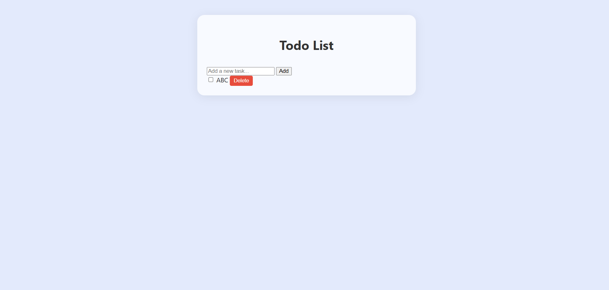
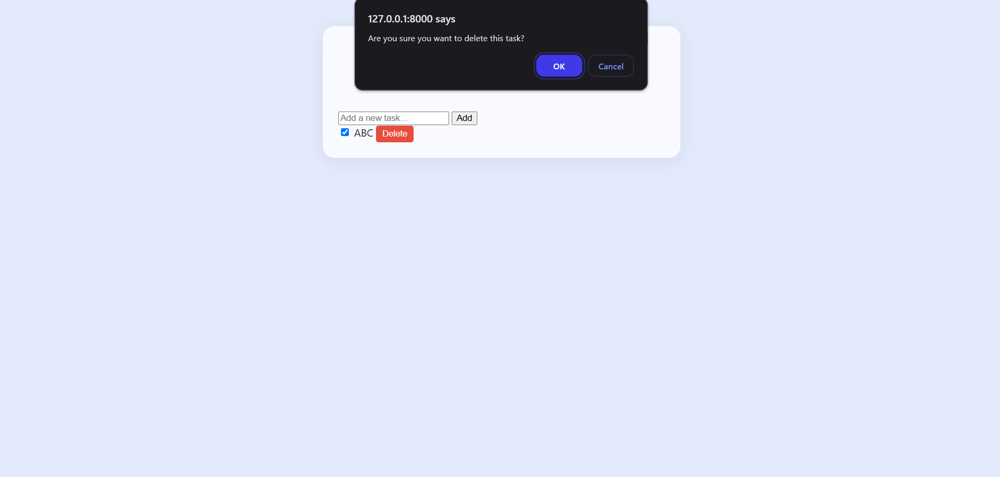
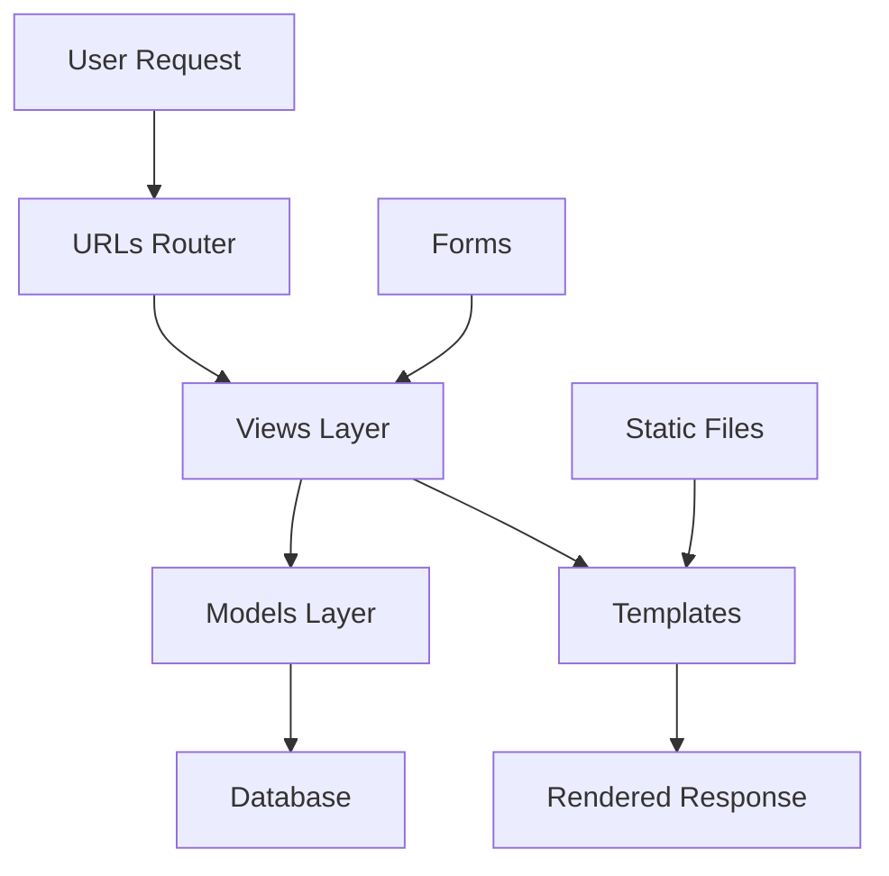

# 📝 TaskMate – Django Todo App

<div align="center">


*A minimalist, web-based Todo application showcasing Django CRUD mastery with clean, responsive design*

</div>

---

## 🎯 Project Overview

**TaskMate** is a streamlined productivity application that demonstrates comprehensive CRUD operations, secure form handling, and dynamic UI updates within Django's framework. Built with a focus on user experience and code quality, it provides an intuitive platform for task management while showcasing modern web development practices.

### 🔑 Core Objectives
- Master Django CRUD operations and data persistence
- Implement secure form handling and validation
- Create responsive, user-centric interfaces
- Develop dynamic UI components with real-time updates
- Strengthen full-stack integration capabilities

---

## 🛠️ Technology Stack

<details>
<summary><strong>📋 Complete Tech Breakdown</strong></summary>

| Category | Technology | Purpose |
|----------|------------|---------|
| **Backend** | Python 3 | Core application language |
| **Framework** | Django | Web framework & ORM |
| **Frontend** | HTML5 & CSS3 | Template structure & styling |
| **UI Framework** | Bootstrap | Responsive design system |
| **Interactivity** | JavaScript (ES6+) | Form enhancements & UX |
| **Database** | SQLite | Development database |
| **Architecture** | MTV Pattern | Model-Template-View structure |

</details>

---

## 📂 Project Architecture

```plaintext
Experiment-16_Django_Todo-app/
├── output/                      # 📸 Application screenshots
├── main/                        # 🏠 Main application module
│   ├── templates/               #     HTML templates (index)
│   ├── static/                  #     CSS stylesheets & assets
│   ├── views.py                 #     View controllers & logic
│   ├── models.py                #     Task data models
│   ├── forms.py                 #     Form definitions & validation
│   ├── urls.py                  #     URL routing patterns
│   └── admin.py                 #     Admin interface config
├── todoapp/                     # ⚙️ Project configuration
│   ├── settings.py              #     Django settings & config
│   ├── urls.py                  #     Root URL routing
│   ├── wsgi.py                  #     WSGI configuration
│   └── asgi.py                  #     ASGI configuration
├── db.sqlite3                   # 🗄️ SQLite database
├── manage.py                    # 🔧 Django management script
└── requirements.txt             # 📦 Python dependencies
```

---

## 🚀 Quick Start Guide

<details>
<summary><strong>🪟 Windows Setup</strong></summary>

```powershell
# Clone and navigate to project
git clone <repository-url>
cd Experiment-16_Django_Todo-app

# Create virtual environment
python -m venv venv
venv\Scripts\activate

# Install dependencies
pip install -r requirements.txt

# Database setup
python manage.py migrate

# Launch development server
python manage.py runserver
```

</details>

<details>
<summary><strong>🐧 macOS / Linux Setup</strong></summary>

```bash
# Clone and navigate to project
git clone <repository-url>
cd Experiment-16_Django_Todo-app

# Create virtual environment
python3 -m venv venv
source venv/bin/activate

# Install dependencies
pip install -r requirements.txt

# Database setup
python manage.py migrate

# Launch development server
python manage.py runserver
```

</details>

**🌍 Access the application:** [http://localhost:8000](http://localhost:8000)

---

## ✨ Feature Showcase

### 🎯 Core Functionality
- **➕ Task Creation** – Intuitive form-based task addition with validation
- **✅ Task Completion** – One-click task marking with visual feedback
- **🗑️ Safe Deletion** – Confirmation dialogs prevent accidental data loss
- **🔄 Real-time Updates** – Dynamic UI changes without page refreshes
- **📱 responsive Design** – Seamless experience across all device sizes
- **🎨 Minimalist Interface** – Distraction-free, productivity-focused design

### 🔧 Technical Highlights
- **CRUD Mastery** – Complete Create, Read, Update, Delete operations
- **Form Security** – CSRF protection and input sanitization
- **Data Persistence** – Robust SQLite integration with Django ORM
- **User Safety** – Confirmation dialogs and error handling
- **Modular Architecture** – Clean separation of concerns

---

## 📸 Application Gallery

<details>
<summary><strong>🖥️ View Screenshots</strong></summary>


*Main dashboard interface displaying all tasks with intuitive options to add new tasks and mark existing ones as complete*


*Safety-first confirmation dialog that prevents accidental task deletions, enhancing user experience and data protection*

</details>

---

## 🎓 Learning Outcomes & Technical Growth

<details>
<summary><strong>📚 Key Skills Developed</strong></summary>

### Backend Development
- **CRUD Operations** – Mastered Django's ORM for data manipulation
- **Form Handling** – Implemented secure form processing and validation
- **Database Design** – Structured efficient data models and relationships
- **View Logic** – Created clean, maintainable view controllers

### Frontend Development
- **Dynamic UI** – Built responsive interfaces with real-time updates
- **User Experience** – Designed intuitive, accessibility-focused interactions
- **Bootstrap Integration** – Leveraged modern CSS frameworks effectively
- **JavaScript Enhancement** – Added interactive elements for better UX

### Professional Development
- **Code Quality** – Applied Django best practices and design patterns
- **Error Handling** – Implemented comprehensive exception management
- **Testing Mindset** – Developed systematic debugging approaches
- **Documentation** – Created clear, maintainable code documentation

</details>

---

## 🧠 Development Journey & Insights

Building **TaskMate** was an enlightening experience in balancing backend functionality with frontend simplicity. The project challenged me to:

- **Perfect CRUD Implementation** – Learning Django's ORM patterns, understanding database relationships, and implementing efficient data operations
- **Prioritize User Safety** – Designing confirmation dialogs, implementing proper error handling, and ensuring data integrity throughout the application lifecycle
- **Master Form Security** – Understanding Django's CSRF protection, implementing input validation, and creating secure user interactions

This project significantly enhanced my confidence in building practical, user-focused web applications and reinforced the importance of combining robust backend logic with intuitive frontend design.

---

## 🏗️ Architecture Patterns

<details>
<summary><strong>🔧 Django Design Patterns Used</strong></summary>



- **MTV Pattern** – Model-Template-View architecture
- **URL Routing** – Clean, RESTful URL patterns
- **Template Inheritance** – DRY template structure
- **Form Validation** – Server-side input sanitization
- **Static File Management** – Optimized asset delivery

</details>

---

## 🧪 Testing & Quality Assurance

<details>
<summary><strong>🔬 Quality Measures</strong></summary>

- **Unit Testing** – Comprehensive model and view testing
- **Form Validation** – Input sanitization and error handling
- **Cross-browser Testing** – Compatibility across major browsers
- **Responsive Testing** – Mobile and tablet optimization
- **Security Testing** – CSRF protection and SQL injection prevention

</details>

---

## 🤝 Contributing

Contributions are welcome! Please feel free to submit pull requests or open issues for bugs and feature requests.

1. Fork the repository
2. Create your feature branch (`git checkout -b feature/AmazingFeature`)
3. Commit your changes (`git commit -m 'Add some AmazingFeature'`)
4. Push to the branch (`git push origin feature/AmazingFeature`)
5. Open a Pull Request

---

<div align="center">

[](https://github.com/bavish007)
[](https://www.linkedin.com/in/bavishreddymuske)

<br/>

© 2025 M. Bavish Reddy  
<sub><i>*Crafted with precision by M. Bavish Reddy*</i></sub>

</div>
