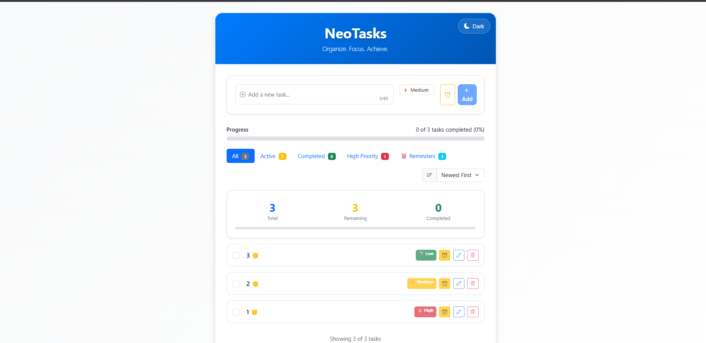

# 🚀 Featured Projects – Full Stack Experiments by M. Bavish Reddy

---

**This is a curated portfolio of my most polished full-stack experiments, built individually to master modern web development. Each project below demonstrates a unique real-world use case, advanced UI, and robust engineering across JavaScript, Node.js, React, and Django.**

---

## 🛠️ Technologies Used

---

## 👨‍💻 Featured Experiments

### Experiment 03: ✅ Form Validation

A modern e-commerce UI with cyberpunk-inspired design, built using HTML, CSS, and JavaScript. Features real-time client-side validation for login, registration, and checkout forms, ensuring a seamless and error-free user experience. This project deepened my understanding of DOM manipulation, validation logic, and accessible UI design.

*Landing page with bold cyberpunk design and featured products.*

*Shopping cart with real-time validation for quantity and prices.*

---

### Experiment 08: 🟢 Node.js Custom Server

A custom Node.js HTTP server that serves static HTML pages and assets without any frameworks. Demonstrates low-level server logic, routing, and file handling. This project strengthened my backend fundamentals and gave me hands-on experience with Node.js core modules.

*Home page served by the custom Node.js HTTP server.*

*Products page listing available items, rendered by the server.*

*Terminal output showing server startup and request logs.*

---

### Experiment 11: 🧑‍🎓 React Student Management App

A single-page application (SPA) for managing student records, built with React. Includes registration, login, and CRUD operations for students, all with a clean, responsive UI. This project taught me about React Router, component design, and state management.

*Landing page with navigation to student management features.*

*Student registration form with validation and smooth onboarding.*

*Login page for secure access to the portal.*

---

### Experiment 12: 🌦️ React Weather App

An advanced weather dashboard built with React, Chart.js, and OpenWeatherMap API. Features real-time weather data, animated stats, and interactive 2D/3D visualizations. This project pushed my skills in API integration, data visualization, and responsive design.

*Dashboard showing current weather and navigation to visualizations.*

*Animated charts visualizing temperature, humidity, and more.*

*Explore global weather patterns on an interactive 3D globe, with real-time data visualized in a stunning format.*
---

### Experiment 13: 📝 React TODO App

A modular, mobile-friendly TODO app built with React. Includes task creation, completion, filtering, and a progress bar. Features dark mode and confirmation modals for safe deletions. This project improved my skills in React hooks, component reuse, and UI/UX best practices.

*Main dashboard for managing tasks and tracking progress.*

*Adding a new task with instant feedback and smooth UI transitions.*

---

### Experiment 14: 🐍 Django Student Management App

A full-stack student management system built with Django and Bootstrap. Supports adding, editing, and deleting student records, with authentication and admin dashboard. This project gave me hands-on experience with Django models, forms, and secure web app deployment.

*Home page with quick navigation to student management features.*

*Table view of all student records with edit/delete options.*

*Form for adding new student records with validation.*

---

## 🧠 My Journey

Building these projects has been a transformative experience—each one challenged me to learn new frameworks, debug complex issues, and think like a true software engineer. From frontend design to backend logic and full-stack deployment, I now have a deep appreciation for both creative UI and robust architecture. This portfolio is just the beginning!

---

## 🔗 Connect With Me

---

© 2025 M. Bavish Reddy. All rights reserved.
