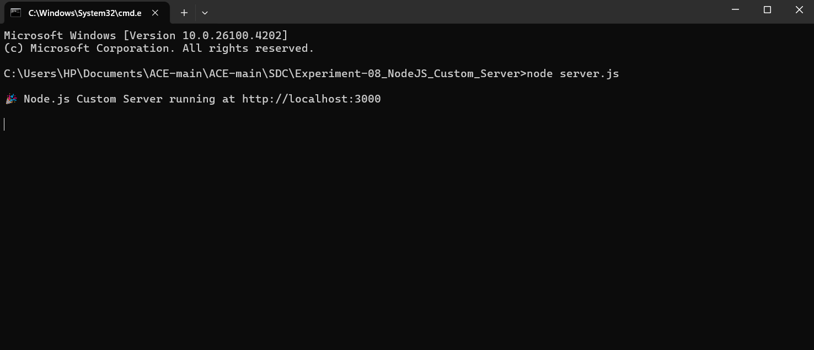
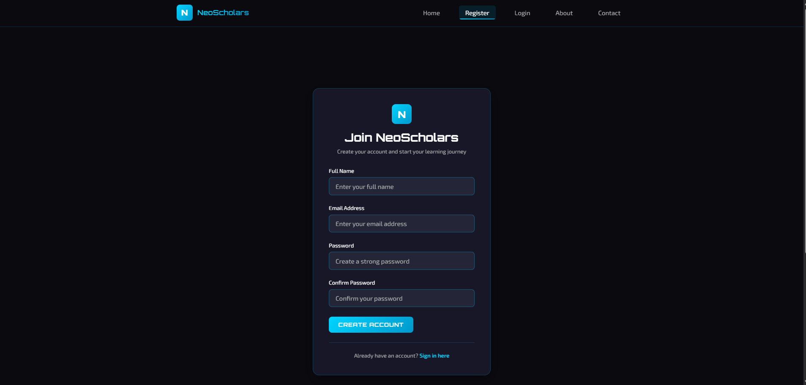
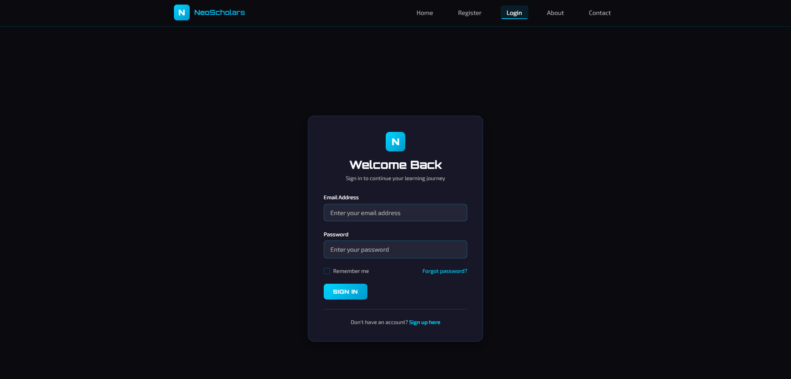
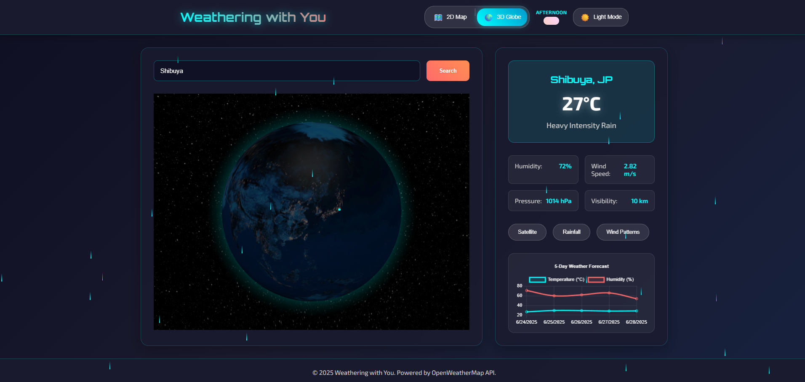
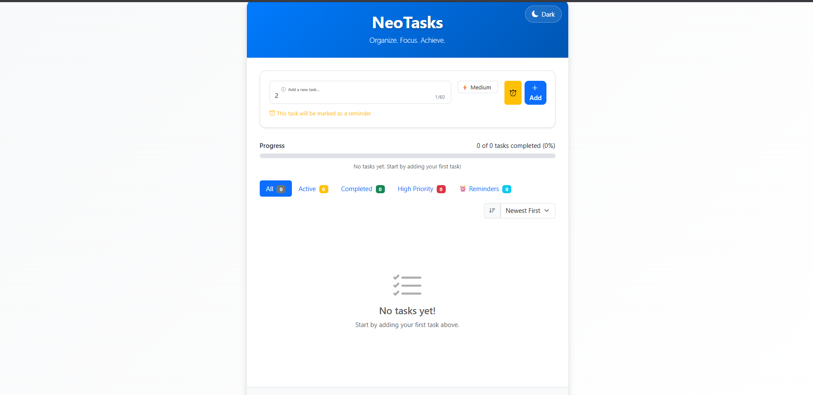
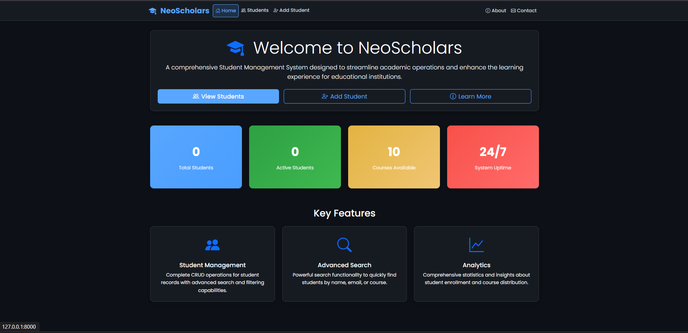

# 🚀 Skill Development Lab – 16 Full Stack Experiments

<div align="center">

[](https://github.com/bavish007)
[](https://www.linkedin.com/in/bavishreddymuske)

*A curated portfolio of 16 full-stack experiments showcasing frontend, backend, APIs, and full-stack engineering with React, Django, Node.js, Java, and more.*

</div>

---

## 🛠️ Technology Stack

<div align="center">


</div>

---

## 🧪 Full Experiment List

### **Frontend Development**

| S.no | Experiment | Description | Technology |
|------|------------|-------------|------------|
| 01 | Shopping Cart – CSS | Basic shopping cart using Flex & Grid | HTML, CSS3 |
| 02 | Shopping Cart – Bootstrap | Responsive cart using Bootstrap | HTML, Bootstrap |
| 03 | **Form Validation** | Client-side form validation with cyberpunk design | JavaScript, CSS3 |
| 04 | Weather Info App | Fetch weather data & show graph | ES6, Fetch API, Chart.js |

### **Java + MySQL Backend**

| S.no | Experiment | Description | Technology |
|------|------------|-------------|------------|
| 05 | Java CRUD | Perform Create, Read, Update, Delete operations | Java, JDBC, MySQL |
| 06 | Servlet Controller | Connect frontend to DB using Servlet | Java Servlets, JSP |
| 07 | Session Management | User session tracking and management | Cookies, HTTP Session |

### **Node.js + API Projects**

| S.no | Experiment | Description | Technology |
|------|------------|-------------|------------|
| 08 | **NodeJS Custom Server** | Custom server implementation using core modules | Node.js, HTTP, OS, path |
| 09 | Student API | RESTful API to manage student records | Node.js, Express |
| 10 | Auth API | JWT-based secure authentication endpoints | Node.js, Express, JWT |

### **React Projects**

| S.no | Experiment | Description | Technology |
|------|------------|-------------|------------|
| 11 | **React Student Management** | SPA with routing & comprehensive forms | React.js, React Router |
| 12 | **React Weather App** | Advanced weather visualization with 3D globe | React, Chart.js, OpenWeatherMap |
| 13 | **React TODO App** | Feature-rich task management with dark mode | React.js, Hooks |

### **Django Projects**

| S.no | Experiment | Description | Technology |
|------|------------|-------------|------------|
| 14 | **Django Student Management** | Full-stack app with authentication & admin | Django (Python), Bootstrap |
| 15 | Django Weather App | Fetch & graph weather information | Django, Chart.js |
| 16 | Django TODO App | Basic TODO app using Django framework | Django (Python) |

---

## 🌟 Featured Projects

### 🛒 Experiment 03: Advanced Form Validation System

> **Modern e-commerce UI with cyberpunk-inspired design and bulletproof validation**

A sophisticated shopping experience built with vanilla JavaScript, featuring real-time client-side validation for login, registration, and checkout workflows.

<details>
<summary>📸 Visual Showcase</summary>

  
*Landing page with bold cyberpunk design and featured products*

  
*Shopping cart with real-time validation for quantity and price calculations*

</details>

**🔧 Technical Highlights:**
- Dynamic form validation with instant feedback
- Cyberpunk aesthetic with CSS animations
- Real-time cart calculations and error handling
- Accessible form design patterns

---

### 🖥️ Experiment 08: Custom Node.js HTTP Server

> **Pure Node.js server implementation without frameworks – back to fundamentals**

A custom HTTP server built from scratch using Node.js core modules, serving static HTML pages and assets with manual routing and file handling.

<details>
<summary>📸 Server Showcase</summary>

  
*Home page served by the custom Node.js HTTP server*

  
*Products page listing available items, rendered server-side*

  
*Terminal output showing server startup and request logs*

</details>

**🔧 Technical Highlights:**
- Pure Node.js implementation without Express
- Manual routing and request handling
- Static file serving with proper MIME types
- Comprehensive logging and error handling

---

### 🎓 Experiment 11: React Student Management Portal

> **Single-page application with comprehensive CRUD operations and authentication**

A complete student management system built with React, featuring user authentication, student record management, and responsive design.

<details>
<summary>📸 Application Flow</summary>

  
*Landing page with navigation to student management features*

  
*Student registration form with validation and smooth onboarding*

  
*Secure login portal with form validation*

</details>

**🔧 Technical Highlights:**
- React Router for seamless navigation
- Component-based architecture with reusable UI elements
- Form validation and error handling
- Responsive design for mobile compatibility

---

### 🌦️ Experiment 12: Advanced Weather Visualization Dashboard

> **Real-time weather data with 2D/3D visualizations and interactive charts**

An immersive weather dashboard that combines React, Chart.js, and OpenWeatherMap API to deliver stunning data visualizations with breakthrough 3D globe rendering.

<details>
<summary>📸 Data Visualization Gallery</summary>

  
*Dashboard showing current weather and navigation to visualizations*

  
*Animated charts visualizing temperature, humidity, and atmospheric data*

  
*Interactive 3D globe visualization with real-time global weather patterns*

</details>

**🔧 Technical Highlights:**
- OpenWeatherMap API integration with error handling
- Chart.js for dynamic data visualization
- 3D globe rendering for global weather exploration
- Responsive design with smooth animations
- Real-time data updates and caching strategies

---

### ✅ Experiment 13: React TODO Application with Advanced Features

> **Modular task management with dark mode, progress tracking, and intuitive UX**

A feature-rich TODO application showcasing modern React development practices with task management, filtering, progress visualization, and dark mode support.

<details>
<summary>📸 Task Management Interface</summary>

  
*Main dashboard for managing tasks and tracking progress*

  
*Task creation interface with instant feedback and smooth transitions*

</details>

**🔧 Technical Highlights:**
- React Hooks for state management
- Task filtering and search functionality
- Progress tracking with visual indicators
- Dark mode implementation
- Confirmation modals for safe task deletion
- Mobile-first responsive design

---

### 🐍 Experiment 14: Django Full-Stack Student Management System

> **Complete web application with authentication, admin dashboard, and database integration**

A robust student management platform built with Django and Bootstrap, featuring comprehensive CRUD operations, user authentication, and admin capabilities.

<details>
<summary>📸 System Architecture</summary>

  
*Home page with quick navigation to student management features*

  
*Comprehensive table view of student records with action controls*

  
*Form interface for adding new student records with server-side validation*

</details>

**🔧 Technical Highlights:**
- Django ORM for database operations
- User authentication and session management
- Bootstrap integration for responsive UI
- Server-side form validation and error handling
- Admin dashboard with comprehensive controls
- RESTful URL patterns and clean architecture

---

## 🧠 Development Journey

Each of these 16 projects was built individually to explore core web development concepts — from frontend UI to full-stack deployment. The structure, scalability, and responsiveness of each app were crafted with industry practices in mind. This methodical approach demonstrates mastery across the JavaScript ecosystem, Python frameworks, and Java backend technologies.

---

## 📦 How to Run Projects

### **1. Clone the Repository**
```bash
git clone https://github.com/bavish007/Skill-Development-Lab.git
cd Skill-Development-Lab
```

### **2. Frontend Projects (HTML/CSS/JavaScript)**
```bash
# Navigate to any frontend experiment
cd Experiment-01_Shopping-cart-CSS
# Open index.html directly in browser
open index.html
```

### **3. Node.js Projects**
```bash
# Navigate to Node.js experiment
cd Experiment-08_NodeJS_Custom_Server
# Install dependencies (if package.json exists)
npm install
# Run the server
node server.js
```

### **4. React Projects**
```bash
# Navigate to React experiment
cd Experiment-11_ReactJS_Student-management
# Install dependencies
npm install
# Start development server
npm start
```

### **5. Django Projects**
```bash
# Navigate to Django experiment
cd Experiment-14_Django_Student-management
# Install Python dependencies
pip install -r requirements.txt
# Run migrations
python manage.py migrate
# Start Django server
python manage.py runserver
```

### **6. Java Projects**
```bash
# Navigate to Java experiment
cd Experiment-05_Java_CRUD
# Compile Java files
javac *.java
# Run main class
java MainClass
```

---

## 🔧 Tools & API Integrations

<details>
<summary>🌐 External Services & Libraries</summary>

- 🌤️ **OpenWeatherMap API** – Real-time weather data integration
- 📊 **Chart.js** – Interactive data visualization library
- 🗄️ **MySQL/Oracle Database** – Backend data persistence
- 🔐 **JWT (JSON Web Tokens)** – Secure API authentication
- 🎨 **Bootstrap** – Responsive UI framework
- ⚛️ **React Router** – Single-page application routing
- 🐍 **Django ORM** – Python database abstraction layer

</details>

---

<div align="center">

## 🔗 Let's Connect

[](https://github.com/bavish007)
[](https://www.linkedin.com/in/bavishreddymuske)

<br/>


© 2025 M. Bavish Reddy  
<sub><i>*Refined and engineered with purpose – Skill meets craft.*</i></sub>

---

*"Code is poetry written in logic"*

</div>
